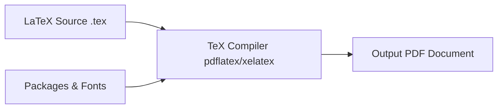

# LaTeX Mastery: A Complete Beginner-to-Advanced Guide
## ការរៀន LaTeX ពីមូលដ្ឋានដល់កម្រិតខ្ពស់

> **A Comprehensive Bilingual English–Khmer Textbook for Academic Writing, Mathematics, Scientific Publishing, and Professional Document Typesetting.**
> 
> សៀវភៅសិក្សាទ្វេភាសា (អង់គ្លេស-ខ្មែរ) ពេញលេញសម្រាប់រៀបចំឯកសារសិក្សា ស្រាវជ្រាវ គណិតវិទ្យា និងឯកសារបោះពុម្ពកម្រិតវិជ្ជាជីវៈ។

---

## 📖 About This Book / អំពីសៀវភៅនេះ

Welcome to **LaTeX Mastery: A Complete Beginner-to-Advanced Guide** (*ការរៀន LaTeX ពីមូលដ្ឋានដល់កម្រិតខ្ពស់*). This book is specifically crafted for university students, researchers, engineers, mathematicians, and educators who wish to master LaTeX from zero to professional proficiency.

សូមស្វាគមន៍មកកាន់សៀវភៅ **LaTeX Mastery**។ សៀវភៅនេះត្រូវបានរៀបចំឡើងយ៉ាងផ្ចិតផ្ចង់ជាពីរភាសា (អង់គ្លេស និងខ្មែរ) ដើម្បីជួយសិស្ស និស្សិត អ្នកស្រាវជ្រាវ និងលោកគ្រូអ្នកគ្រូ អាចយល់ដឹងពីប្រព័ន្ធ LaTeX ចាប់ពីកម្រិតដំបូងបំផុតរហូតដល់កម្រិតអាជីព ងាយស្រួលយល់ និងអនុវត្តជាក់ស្ដែងលើកិច្ចការសាលា សារណា និងឯកសារស្រាវជ្រាវ។

### Book Design & Methodology / រចនាសម្ព័ន្ធនិងវិធីសាស្ត្របង្រៀន
Every chapter follows a rigorous pedagogical framework:
1. **Learning Objectives** (*គោលបំណងមេរៀន*)
2. **English Explanation** (*ការពន្យល់លម្អិតជាភាសាអង់គ្លេស*)
3. **Khmer Explanation** (*ការពន្យល់ធម្មជាតិជាភាសាខ្មែរ*)
4. **Syntax Specification** (*ទម្រង់វេយ្យាករណ៍និងកូដ*)
5. **Code Examples** (*ឧទាហរណ៍កូដដែលដំណើរការបានពិតប្រាកដ*)
6. **Line-by-Line Breakdown** (*ការពន្យល់កូដមួយបន្ទាត់ៗ*)
7. **Expected Visual Output** (*លទ្ធផលរំពឹងទុកលើទំព័រ PDF*)
8. **Common Mistakes & Pitfalls** (*កំហុសទូទៅនិងវិធីជៀសវាង*)
9. **Industry Best Practices** (*ការអនុវត្តល្អបំផុតកម្រិតស្តង់ដារ*)
10. **Practical Application Examples** (*គម្រោងអនុវត្តជាក់ស្តែង*)
11. **Hands-On Exercises** (*លំហាត់អនុវត្តដោយខ្លួនឯង*)
12. **Chapter Summary** (*សង្ខេបខ្លឹមសារសំខាន់ៗ*)

Visual labels used throughout:
- `[NOTE]` (*ចំណាំសំខាន់*)
- `[TIP]` (*គន្លឹះមានប្រយោជន៍*)
- `[WARNING]` (*ការប្រុងប្រយ័ត្ន*)
- `[EXAMPLE]` (*ឧទាហរណ៍កូដ*)
- `[EXERCISE]` (*លំហាត់អនុវត្ត*)
- `[IMPORTANT]` (*ចំណុចចាំបាច់បំផុត*)

---

## 📚 Table of Contents / មាតិកាសៀវភៅ

### [PART 1 — Introduction to LaTeX (សេចក្ដីផ្ដើម)](file:///home/phirom/Documents/code/learn-latex/book/part1-introduction.md)
- **Chapter 1: What is LaTeX?** (*តើ LaTeX ជាអ្វី? ហេតុអ្វីត្រូវប្រើ LaTeX? ភាពខុសគ្នារវាង LaTeX និង Word*)
- **Chapter 2: Installing and Setting Up LaTeX** (*ការដំឡើងលើ Windows, macOS, Linux និង Overleaf*)
- **Chapter 3: Your First LaTeX Document** (*រចនាសម្ព័ន្ធឯកសារដំបូង: documentclass, Preamble, និង document environment*)

### [PART 2 — LaTeX Fundamentals (មូលដ្ឋានគ្រឹះ)](file:///home/phirom/Documents/code/learn-latex/book/part2-fundamentals.md)
- **Chapter 4: Text Formatting & Typography** (*អក្សរដិត ទ្រេត បន្ទាត់ក្រោម ទំហំអក្សរ ការតម្រឹម និងតួអក្សរពិសេស*)
- **Chapter 5: Document Structure** (*ការរៀបចំជំពូក ផ្នែក មាតិកាស្វ័យប្រវត្តិ និងលេខទំព័រ*)
- **Chapter 6: Lists** (*បញ្ជីចំណុច itemize, enumerate, description, និងបញ្ជីជាន់គ្នា*)
- **Chapter 7: Tables & Professional Tabulars** (*តារាង tabular, បន្ទាត់ស្អាត booktabs, ក្បាលតារាង និងចំណងជើង*)

### [PART 3 — Mathematics (គណិតវិទ្យាក្នុង LaTeX)](file:///home/phirom/Documents/code/learn-latex/book/part3-mathematics.md)
- **Chapter 8: Mathematical Expressions** (*Inline math, Display math, ប្រភាគ សន្ទស្សន៍ ស័ក្ដិ អក្សរក្រិក និងប្រតិបត្តិករបឋម*)
- **Chapter 9: Advanced Mathematics** (*សមីការ align, ម៉ាទ្រីស ប្រព័ន្ធសមីការ លីមីត ដេរីវេ អាំងតេក្រាល ផលបូក ផលគុណ សំណុំ និងប្រូបាប*)
- **Chapter 10: Mathematical Theorems & Proofs** (*ទ្រឹស្ដីបទ និយមន័យ បទពិសោធ បំណកស្រាយ amsthm និងការផ្ដល់លេខ*)

### [PART 4 — Images and Figures (រូបភាពនិងដ្យាក្រាម)](file:///home/phirom/Documents/code/learn-latex/book/part4-images-and-figures.md)
- **Chapter 11: Working with Images** (*ការបញ្ចូលរូបភាព includegraphics, ទំហំ ទីតាំង ចំណងជើង និងស្លាកយោង*)
- **Chapter 12: Figures and Diagrams with TikZ** (*បរិស្ថាន figure, សេចក្តីផ្តើមអំពី TikZ, គំនូសតាង និង Flowcharts*)

### [PART 5 — References and Academic Writing (ការស្រាវជ្រាវនិងឯកសារសិក្សា)](file:///home/phirom/Documents/code/learn-latex/book/part5-references-and-academic.md)
- **Chapter 13: Cross-References** (*ការភ្ជាប់យោង label, ref, pageref ទៅកាន់រូបភាព តារាង និងសមីការ*)
- **Chapter 14: Citations and Bibliography** (*ការគ្រប់គ្រងឯកសារយោងជាមួយ BibTeX និង biblatex, ទម្រង់ APA, IEEE*)
- **Chapter 15: Writing Academic Documents** (*រចនាសម្ព័ន្ធរបាយការណ៍ សារណា និក្ខេបបទ និងសារព័ត៌មានវិទ្យាសាស្ត្រ*)

### [PART 6 — Advanced LaTeX (កម្រិតខ្ពស់)](file:///home/phirom/Documents/code/learn-latex/book/part6-advanced.md)
- **Chapter 17: Packages & Package Management** (*ការប្រើប្រាស់និងជ្រើសរើស packages សំខាន់ៗ*)
- **Chapter 17: Custom Commands & Environments** (*ការបង្កើតពាក្យបញ្ជាថ្មី newcommand និងបរិស្ថាន newenvironment*)
- **Chapter 18: Page Layout & Geometry** (*ការកំណត់គម្លាតគែមក្រដាស margins, ក្បាលទំព័រ និងបាតទំព័រ fancyhdr*)
- **Chapter 19: Colors, Fonts & Modern Typography** (*ការប្រើប្រាស់ពណ៌ xcolor, ពុម្ពអក្សរ និងរចនាប័ទ្មសម័យទំនើប*)
- **Chapter 20: Creating Professional Front & Back Matter** (*ទំព័រក្រប, Abstract, មាតិកា, បញ្ជីរូបភាព, បញ្ជីតារាង, ឧបសម្ព័ន្ធ*)

### [PART 7 — Practical Projects (គម្រោងជាក់ស្ដែងចំនួន ៧)](file:///home/phirom/Documents/code/learn-latex/book/part7-projects.md)
- **Project 1: Simple Student Report** (*របាយការណ៍សិស្ស/និស្សិតទូទៅ*)
- **Project 2: Mathematics Assignment** (*កិច្ចការស្រាវជ្រាវគណិតវិទ្យាមានទ្រឹស្ដីបទនិងដំណោះស្រាយ*)
- **Project 3: Computer Science Report with Code Listings** (*របាយការណ៍វិទ្យាសាស្ត្រកុំព្យូទ័រមានកូដប្រភព*)
- **Project 4: Peer-Reviewed Research Paper** (*អត្ថបទស្រាវជ្រាវកម្រិតទស្សនាវដ្ដី IEEE/ACM*)
- **Project 5: Complete University Thesis Template** (*គំរូសារណាបញ្ចប់ការសិក្សាថ្នាក់បរិញ្ញាបត្រ/អនុបណ្ឌិត*)
- **Project 6: Modern Professional CV/Resume** (*ប្រវត្តិរូបសង្ខេបស្អាតប្រណីតសម្រាប់ដាក់ពាក្យធ្វើការ*)
- **Project 7: Academic Presentation with Beamer** (*ស្លាយបទបង្ហាញសិក្ខាសាលាដោយប្រើ Beamer*)

### [APPENDICES (ឧបសម្ព័ន្ធជំនួយស្មារតី)](file:///home/phirom/Documents/code/learn-latex/book/appendices.md)
- **Appendix A**: Complete LaTeX Command Cheat Sheet
- **Appendix B**: Essential Math Symbols & Greek Alphabet
- **Appendix C**: Essential LaTeX Packages Directory
- **Appendix D**: Troubleshooting & Common Errors Guide
- **Appendix E**: 8-Week Beginner-to-Advanced Study Roadmap
- **Appendix F**: Comprehensive English–Khmer LaTeX Glossary

---

## 🛠 How to Use and Compile / របៀបប្រើប្រាស់និងបកប្រែជា PDF

### Option 1: Overleaf (Recommended for Beginners / ងាយស្រួលបំផុតសម្រាប់អ្នកចាប់ផ្តើម)
1. Go to [Overleaf.com](https://www.overleaf.com) and create a free account.
2. Click **New Project** -> **Blank Project**.
3. Copy any of the LaTeX project codes in this book and paste into `main.tex`.
4. Click **Recompile** to view the resulting PDF instantly.

### Option 2: Local Installation (ការដំឡើងលើកុំព្យូទ័រផ្ទាល់ខ្លួន)
- **Windows**: Install [MiKTeX](https://miktex.org/) or [TeX Live](https://tug.org/texlive/) along with [TeXstudio](https://www.texstudio.org/) or VS Code (with LaTeX Workshop).
- **macOS**: Install [MacTeX](https://tug.org/mactex/) with TeXShop or VS Code.
- **Linux (Ubuntu/Debian)**:
  ```bash
  sudo apt update
  sudo apt install texlive-full texstudio
  ```
- Compile directly from the terminal:
  ```bash
  pdflatex document.tex
  biber document       # if using biblatex
  pdflatex document.tex
  ```

---
*Created with academic precision for the ROM LATEX learning ecosystem.*


<div style="page-break-after: always;"></div>

# PART 1 — Introduction to LaTeX
## ផ្នែកទី ១ — សេចក្ដីផ្ដើមអំពីប្រព័ន្ធ LaTeX

---

# Chapter 1: What is LaTeX?
## ជំពូកទី ១: តើ LaTeX ជាអ្វី?

### 1. Learning Objectives / គោលបំណងមេរៀន
By the end of this chapter, you will be able to:
- Understand what LaTeX and TeX are, including their historical origins and architectural purpose.
- Contrast the document preparation paradigm of LaTeX (WYSIWYM) with word processors like Microsoft Word (WYSIWYG).
- Evaluate the advantages and trade-offs of using LaTeX for university and research work.
- Identify common industry and academic use cases where LaTeX is the de facto standard.

បន្ទាប់ពីបញ្ចប់ជំពូកនេះ អ្នកនឹងអាច៖
- យល់ច្បាស់ថាអ្វីទៅជា LaTeX និង TeX ព្រមទាំងប្រវត្តិនិងគោលបំណងនៃការបង្កើតវាឡើង។
- ប្រៀបធៀបភាពខុសគ្នារវាងទស្សនទាននៃការរៀបចំឯកសាររបស់ LaTeX (WYSIWYM) និងកម្មវិធី Word (WYSIWYG)។
- វាយតម្លៃពីគុណសម្បត្តិ និងគុណវិបត្តិនៃការប្រើប្រាស់ LaTeX ក្នុងកិច្ចការសិក្សានិងស្រាវជ្រាវ។
- កំណត់វិស័យ និងការងារជាក់ស្ដែងដែលចាំបាច់ត្រូវប្រើប្រាស់ LaTeX។

---

### 2. English Explanation
LaTeX (pronounced **"Lay-tech"** or **"Lah-tech"**) is a high-quality document preparation and typesetting system designed by Leslie Lamport in 1984, built on top of Donald Knuth's TeX typesetting engine (created in 1978).

Unlike typical desktop word processors such as Microsoft Word or Google Docs, which follow the **WYSIWYG** (*"What You See Is What You Get"*) model, LaTeX operates on the **WYSIWYM** (*"What You See Is What You Mean"*) paradigm. In LaTeX, you write plain text combined with declarative markup instructions. You describe the logical structure of your document—such as titles, sections, footnotes, equations, and citations—while an automated compiler handles all aesthetic layout details, kerning, line-breaking algorithms, and mathematical typography.

#### Why Use LaTeX?
1. **Mathematical Perfection**: Knuth designed TeX specifically to typeset mathematical equations with peerless aesthetic balance, consistent spacing, and precise typographic rules.
2. **Structural Consistency**: Formatting rules are defined globally. Modifying an entire book's font or margin takes a single command line change in the preamble.
3. **Automated Document Architecture**: Cross-references, citations, lists of figures, tables of contents, and indices are generated deterministically without manual numbering.
4. **Longevity & Portability**: Documents are written in standard UTF-8 plain text files (`.tex`). They will remain readable and compilable decades into the future and integrate seamlessly with Git version control.

#### LaTeX vs. Microsoft Word
| Feature | LaTeX | Microsoft Word |
| :--- | :--- | :--- |
| **Philosophy** | WYSIWYM (Focus on content & logic) | WYSIWYG (Focus on immediate appearance) |
| **Math Formatting** | Industry standard, native, elegant | Clunky equation editor, variable spacing |
| **Large Documents** | Effortlessly handles 500+ page books/theses | Prone to lag, corruption, formatting shifts |
| **Reference Management** | Seamless with BibTeX & biblatex | Requires clunky third-party plugins |
| **File Format** | Plain text (`.tex`) tracked with Git | Binary / zipped XML (`.docx`) |
| **Learning Curve** | Steeper initially; rapid mastery | Low barrier initially; hard to maintain consistency |

[NOTE]
LaTeX was built so that the author can focus 100% on **writing content**, while typography algorithms created by master printers handle document aesthetics.

---

### 3. Khmer Explanation (ការពន្យល់ជាភាសាខ្មែរ)
**LaTeX** (អានថា «ឡាតិច» ឬ «ឡាថិក») គឺជាប្រព័ន្ធរៀបចំនិងបោះពុម្ពឯកសារកម្រិតវិជ្ជាជីវៈខ្ពស់ (Typesetting System) ដែលត្រូវបានបង្កើតឡើងដោយលោក Leslie Lamport ក្នុងឆ្នាំ ១៩៨៤ ដោយផ្អែកលើម៉ាស៊ីន TeX របស់សាស្ត្រាចារ្យ Donald Knuth។

ភាពខុសគ្នាដ៏ធំបំផុតរវាង LaTeX និងកម្មវិធី Microsoft Word ឬ Google Docs គឺ៖
- **Microsoft Word** ដំណើរការតាមបែប **WYSIWYG** (*What You See Is What You Get* ឬ «ឃើញយ៉ាងណា បានលទ្ធផលយ៉ាងនោះ»)៖ អ្នកត្រូវចុច Mouse ដើម្បីកែប្រែទំហំអក្សរ ដាក់ពណ៌ ឬតម្រឹមបន្ទាត់ដោយដៃភ្លាមៗ។ នៅពេលឯកសារមានទំព័រច្រើន (៥០ ទៅ ១០០+ ទំព័រ) ទម្រង់ឯកសារច្រើនតែរត់ខុសជួរ ឬពិបាកគ្រប់គ្រង។
- **LaTeX** ដំណើរការតាមបែប **WYSIWYM** (*What You See Is What You Mean* ឬ «សរសេរតាមអត្ថន័យនៃរចនាសម្ព័ន្ធ»)៖ អ្នកសរសេរអត្ថបទធម្មតា (Plain Text) ជាមួយពាក្យបញ្ជា (Commands) ដើម្បីប្រាប់ម៉ាស៊ីនថាតើផ្នែកណាជាចំណងជើងធំ ផ្នែកណាជាសមីការ ផ្នែកណាជារូបភាព ឬជាឯកសារយោង។ បន្ទាប់មក កម្មវិធី Compiler នឹងគណនាទំហំចន្លោះបន្ទាត់ តម្រឹមអក្សរ និងរៀបចំទំព័រ PDF ចេញមកប្រកបដោយភាពប្រណីតកម្រិតសៀវភៅបោះពុម្ពអន្តរជាតិ។

#### ហេតុអ្វីបានជាត្រូវរៀន និងប្រើប្រាស់ LaTeX?
1. **រូបមន្តគណិតវិទ្យាឥតខ្ចោះ**៖ LaTeX គឺជាស្តង់ដារពិភពលោកលេខ ១ សម្រាប់សរសេររូបមន្តគណិតវិទ្យា រូបវិទ្យា និងវិស្វកម្ម។
2. **ការគ្រប់គ្រងឯកសារធំៗ**៖ សម្រាប់សារណា (Thesis) ឬសៀវភៅដែលមានរាប់រយទំព័រ LaTeX មិនដែលគាំង ឬរត់ទម្រង់ឡើយ។
3. **ការភ្ជាប់យោងស្វ័យប្រវត្តិ**៖ លេខជំពូក លេខសមីការ លេខរូបភាព និងឯកសារយោង (Citations) ត្រូវបានបង្កើតនិងធ្វើបច្ចុប្បន្នភាពដោយស្វ័យប្រវត្តិ។
4. **ឯកសារមានស្ថេរភាពខ្ពស់**៖ ឯកសារកូដ `.tex` ជាអត្ថបទសុទ្ធ ងាយស្រួលរក្សាទុក មិនខូច format និងអាចប្រើប្រាស់ជាមួយ Git និង GitHub បានយ៉ាងងាយស្រួល។

---

### 4. Syntax & Mental Model
In LaTeX, all instructions begin with a backslash `\`.
- **Command structure**: `\commandname[optional_arguments]{mandatory_arguments}`
- **Environment structure**:
  ```latex
  \begin{environment_name}
      ... contents ...
  \end{environment_name}
  ```

---

### 5. Code Example
Here is a minimal conceptual comparison of how an author declares a document in LaTeX:

```latex
\documentclass{article}

\title{Introduction to Modern Science}
\author{Sokha Chan}
\date{\today}

\begin{document}
\maketitle

\section{Introduction}
Science is the systematic study of the physical world. 
Einstein expressed the equivalence of mass and energy as:
\begin{equation}
    E = mc^2
\end{equation}

\end{document}
```

---

### 6. Line-by-Line Explanation
1. `\documentclass{article}`: Declares that the document is an academic article.
2. `\title{...}`, `\author{...}`, `\date{\today}`: Define document metadata in the preamble.
3. `\begin{document}`: The boundary marker where printable content begins.
4. `\maketitle`: Instructs LaTeX to format and print the title banner automatically.
5. `\section{Introduction}`: Automatically generates a numbered section heading.
6. `\begin{equation} ... \end{equation}`: Centers the math equation and numbers it `(1)`.
7. `\end{document}`: Terminates the document; any text after this is ignored.

---

### 7. Expected Output
The compiled document displays:
- A beautifully centered title header: **Introduction to Modern Science**, with author name and current date.
- A bold, numbered section heading: **1 Introduction**.
- A paragraph of justified text with professional hyphenation and kerning.
- A centered mathematical formula with a right-aligned equation number `(1)`:
$$E = mc^2$$

---

### 8. Common Mistakes / កំហុសទូទៅ
[WARNING]
- **Treating LaTeX like Microsoft Word**: Trying to manually press `Enter` ten times to create vertical space or pressing `Spacebar` repeatedly. LaTeX collapses multiple spaces into a single space and uses commands like `\vspace{1cm}` for spacing.
- **Mispronouncing LaTeX**: It is not pronounced "Lay-teks" like rubber latex; the final "X" is the Greek letter Chi ($\chi$).

---

### 9. Best Practices / ការអនុវត្តល្អបំផុត
[TIP]
- Always separate your document's **content** from its **styling**. Do not manually format every paragraph; define document styles in the preamble and let LaTeX enforce them across the document.
- Use meaningful section titles and label your equations logically right from day one.

---

### 10. Practical Example: Who Uses LaTeX?
- **Computer Scientists & Software Engineers**: Writing research papers for IEEE, ACM conferences, or documentation with syntax-highlighted code.
- **Mathematicians & Physicists**: Publishing equations, proofs, and matrices.
- **University Students**: Writing lab reports, graduation theses, and academic assignments.
- **Authors & Publishers**: Typesetting entire technical books and manuals.

---

### 11. Exercises / លំហាត់អនុវត្ត
1. Explain in your own words the difference between WYSIWYG and WYSIWYM.
2. (*ជាភាសាខ្មែរ*) ចូរពន្យល់ពីអត្ថប្រយោជន៍ចម្បង ៣ យ៉ាងដែលធ្វើឱ្យនិស្សិតគួរជ្រើសរើសប្រើប្រាស់ LaTeX ក្នុងការសរសេរសារណាបញ្ចប់ការសិក្សា។
3. Identify three types of documents for which Microsoft Word is sufficient, and three types for which LaTeX is strictly superior.

---

### 12. Chapter Summary / សង្ខេបជំពូក
- LaTeX is a programmatic typesetting engine prioritizing structure, typography, and automated referencing.
- In LaTeX, the writer writes plain text and declares what the text represents; the compiler handles professional formatting.
- LaTeX is the universal standard for technical, scientific, and mathematical publication.

---
---

# Chapter 2: Installing and Setting Up LaTeX
## ជំពូកទី ២: ការដំឡើង និងការកំណត់បរិស្ថាន LaTeX

### 1. Learning Objectives / គោលបំណងមេរៀន
By the end of this chapter, you will be able to:
- Distinguish between a **TeX Distribution** (the compiler engine) and a **LaTeX Editor** (the IDE).
- Install and configure LaTeX on Windows, macOS, and Linux.
- Use **Overleaf**, the cloud-based LaTeX collaborative editor, for zero-installation setup.
- Select the optimal workflow tailored to your computational environment.

---

### 2. English Explanation
To work with LaTeX on your computer, you need two complementary components:
1. **TeX Distribution**: The compiler engine containing TeX binaries, fonts, hyphenation patterns, and thousands of LaTeX packages (e.g., TeX Live, MiKTeX, MacTeX).
2. **LaTeX Editor (IDE)**: The application where you write code, preview PDFs, and inspect compilation logs (e.g., TeXstudio, VS Code, Overleaf).



#### Option A: Cloud-Based Setup (Overleaf) — Recommended for Absolute Beginners
- **What it is**: A browser-based LaTeX editor with real-time PDF compilation, automatic package management, and Google Docs-style collaboration.
- **Website**: [https://www.overleaf.com](https://www.overleaf.com)
- **Advantage**: Zero installation required, access from any computer or tablet, zero package conflict headaches.

#### Option B: Windows Setup
1. **Install TeX Distribution**: Download and install **MiKTeX** ([miktex.org](https://miktex.org/)) or **TeX Live** ([tug.org/texlive/](https://tug.org/texlive/)). MiKTeX is popular on Windows because it downloads missing packages on-the-fly.
2. **Install Editor**: Install **TeXstudio** ([texstudio.org](https://www.texstudio.org/)) or install **Visual Studio Code** with the *LaTeX Workshop* extension.

#### Option C: macOS Setup
1. Download **MacTeX** from [tug.org/mactex/](https://tug.org/mactex/) (approx. 5 GB full distribution).
2. Use the bundled **TeXShop** or install **TeXstudio** / **VS Code**.

#### Option D: Linux / Ubuntu Setup
Open your terminal and install TeX Live and TeXstudio:
```bash
sudo apt update
sudo apt install texlive-latex-base texlive-latex-extra texlive-fonts-recommended texlive-science
sudo apt install texstudio
```
For complete package availability without missing file warnings:
```bash
sudo apt install texlive-full
```

---

### 3. Khmer Explanation (ការពន្យល់ជាភាសាខ្មែរ)
ដើម្បីអាចប្រើប្រាស់ LaTeX នៅលើកុំព្យូទ័របាន យើងត្រូវស្គាល់សមាសភាគសំខាន់ពីរ៖
1. **TeX Distribution (កញ្ចប់ម៉ាស៊ីនបកប្រែ)**៖ ជាបណ្ដុំកម្មវិធី Compiler រួមមានពុម្ពអក្សរ ក្បួនវេយ្យាករណ៍ និង packages រាប់ពាន់សម្រាប់បំលែងកូដ `.tex` ទៅជាឯកសារ `.pdf`។
2. **LaTeX Editor (កម្មវិធីសរសេរកូដ)**៖ ជាផ្ទាំងសរសេរកូដ (Editor) ដែលមានប៊ូតុង Run/Compile និងផ្ទាំងមើលលទ្ធផល PDF ភ្លាមៗ។

#### ១. ជម្រើសងាយស្រួលបំផុតសម្រាប់អ្នកទើបចាប់ផ្ដើម៖ ប្រើប្រាស់ Overleaf (Cloud)
- អ្នកមិនចាំបាច់ដំឡើងអ្វីទាំងអស់លើកុំព្យូទ័រ!
- គ្រាន់តែចូលទៅកាន់ [www.overleaf.com](https://www.overleaf.com) រួចចុះឈ្មោះដោយឥតគិតថ្លៃ។
- អ្នកអាចសរសេរកូដពីគ្រប់ទីកន្លែង រក្សាទុកលើ Cloud ដោយសុវត្ថិភាព និងអាចធ្វើការរួមគ្នា (Collaborate) ជាមួយមិត្តភក្ដិក្នុងពេលដំណាលគ្នាបាន។

#### ២. ការដំឡើងលើ Windows
- ទាញយក **MiKTeX** ពី [miktex.org](https://miktex.org) ហើយដំឡើងវា (វាមានសមត្ថភាពទាញយក package ដោយស្វ័យប្រវត្តិនៅពេលកូដត្រូវការ)។
- ទាញយកកម្មវិធីសរសេរកូដ **TeXstudio** ពី [texstudio.org](https://www.texstudio.org)។

#### ៣. ការដំឡើងលើ macOS
- ទាញយកកញ្ចប់ **MacTeX** ពី [tug.org/mactex](https://tug.org/mactex)។

#### ៤. ការដំឡើងលើ Linux (Ubuntu/Debian)
- វាយពាក្យបញ្ជាក្នុង Terminal៖
```bash
sudo apt update && sudo apt install texlive-full texstudio -y
```

[IMPORTANT]
ប្រសិនបើអ្នកទើបតែរៀន LaTeX ជាលើកដំបូង សូមប្រើប្រាស់ **Overleaf** ជាមុនសិន។ វិធីនេះជួយឱ្យអ្នកផ្ដោតលើការរៀនកូដ ដោយមិនបាច់បារម្ភរឿងបញ្ហាដំឡើងលើប្រព័ន្ធប្រតិបត្តិការឡើយ!

---

### 4. Comparison of Popular Editors
| Editor | Platform | Cost | Best For |
| :--- | :--- | :--- | :--- |
| **Overleaf** | Web Browser | Free / Paid tier | Beginners, collaboration, zero-setup |
| **TeXstudio** | Windows, Mac, Linux | Free (Open Source) | Dedicated LaTeX authoring, offline work |
| **VS Code + LaTeX Workshop**| Windows, Mac, Linux | Free | Programmers, Git integration, power users |
| **TeXShop** | macOS | Free (Bundled) | Mac users wanting lightweight native app |

---

### 5. Exercises / លំហាត់អនុវត្ត
1. Create a free account on [Overleaf.com](https://www.overleaf.com).
2. Create your first "Blank Project" named `My-First-LaTeX`.
3. Locate the `main.tex` editor pane, the compilation log pane, and the PDF preview pane.

---

### 6. Chapter Summary / សង្ខេបជំពូក
- Working with LaTeX requires a compiler (TeX distribution) and an editor.
- Overleaf provides an instant, zero-configuration cloud environment ideal for learning.
- Offline desktop power users typically install TeX Live / MiKTeX alongside TeXstudio or VS Code.

---
---

# Chapter 3: Your First LaTeX Document
## ជំពូកទី ៣: ឯកសារ LaTeX ដំបូងរបស់អ្នក

### 1. Learning Objectives / គោលបំណងមេរៀន
By the end of this chapter, you will be able to:
- Identify and construct the two fundamental sections of every LaTeX file: the **Preamble** and the **Document Body**.
- Select the appropriate document class (`article`, `report`, `book`).
- Compile your first `.tex` file into a pristine PDF document.
- Read and interpret compiler messages and output logs.

---

### 2. English Explanation
Every LaTeX source file (`.tex`) is divided into two distinct zones:
1. **The Preamble**: Everything from line 1 up to `\begin{document}`. Here, you define global document configurations, import packages with `\usepackage`, define custom macros, and declare document metadata (title, author, date).
2. **The Document Body**: Everything enclosed within the `\begin{document} ... \end{document}` environment. This is the printable content of your work.

```
+-------------------------------------------------------+
|  \documentclass{article}                              |
|  \usepackage{amsmath}         <-- PREAMBLE            |
|  \title{My Title}                 (Setup & Settings)  |
|  \author{My Name}                                     |
+-------------------------------------------------------+
|  \begin{document}                                     |
|  \maketitle                                           |
|                               <-- DOCUMENT BODY       |
|  Content, sections, formulas      (Printable Content) |
|  and text appear here...                              |
|                                                       |
|  \end{document}                                       |
+-------------------------------------------------------+
```

#### Standard Document Classes
- `article`: For short academic papers, journal submissions, assignment solutions, and reports without separate chapters.
- `report`: For longer university documents, lab reports, and bachelor/master theses containing `\chapter` divisions.
- `book`: For complete published books, including two-sided page layouts, front matter, main matter, and back matter.
- `beamer`: For digital slide presentations and conference lectures.

---

### 3. Khmer Explanation (ការពន្យល់ជាភាសាខ្មែរ)
រាល់ឯកសារកូដ LaTeX ទាំងអស់ត្រូវបានបែងចែកជាពីរផ្នែកដាច់ដោយឡែកពីគ្នា៖

1. **Preamble (ផ្នែកក្បាលឯកសារ)**៖
   - គឺជាបន្ទាត់កូដទាំងអស់ដែលនៅពីលើ `\begin{document}`។
   - ផ្នែកនេះមិនបង្ហាញអក្សរលើក្រដាស PDF ផ្ទាល់ទេ ប៉ុន្តែវាជាកន្លែងកំណត់ទំហំក្រដាស ប្រភេទឯកសារ (`\documentclass`) ការទាញយកកញ្ចប់បន្ថែម (`\usepackage`) ព្រមទាំងការកំណត់ឈ្មោះអ្នកនិពន្ធនិងចំណងជើង។
2. **Document Body (តួឯកសារ)**៖
   - គឺជាខ្លឹមសារដែលស្ថិតនៅចន្លោះ `\begin{document}` និង `\end{document}`។
   - អ្វីទាំងអស់ដែលអ្នកសរសេរនៅត្រង់នេះ នឹងត្រូវបានបំប្លែងទៅជាទំព័រ PDF សម្រាប់អាន ឬបោះពុម្ព។

#### ប្រភេទឯកសារទូទៅ (Document Classes)
- `article`៖ ប្រើសម្រាប់អត្ថបទស្រាវជ្រាវខ្លីៗ កិច្ចការសាលា ឬរបាយការណ៍ដែលគ្មានជំពូក (`\chapter`)។
- `report`៖ ប្រើសម្រាប់របាយការណ៍ធំៗ សារណាបញ្ចប់ការសិក្សា (Theses) ដែលមានការបែងចែកជាជំពូកធំៗ។
- `book`៖ ប្រើសម្រាប់សៀវភៅពេញលេញដែលមានទំព័រមុខ ទំព័រមាតិកា និងសន្ទស្សន៍។
- `beamer`៖ ប្រើសម្រាប់ធ្វើស្លាយបទបង្ហាញ (Presentation Slides)។

---

### 4. Syntax Specification
```latex
\documentclass[options]{class_name}
% Preamble commands go here
\usepackage{package_name}

\begin{document}
% Content goes here
\end{document}
```

---

### 5. Code Example: Hello World in LaTeX
Save this file as `first_document.tex`:

```latex
\documentclass[12pt, a4paper]{article}

% Preamble: Package imports and metadata
\usepackage[utf8]{inputenc}
\usepackage{amsmath}

\title{My Very First LaTeX Document}
\author{Borey Sok}
\date{\today}

\begin{document}

\maketitle

\section{Introduction}
Welcome to the world of professional typesetting! LaTeX allows us to write structured 
documents with ease.

Here is an inline mathematical expression: $a^2 + b^2 = c^2$.

\section{Conclusion}
Learning LaTeX step by step makes academic writing fast, precise, and enjoyable.

\end{document}
```

---

### 6. Line-by-Line Breakdown
- `\documentclass[12pt, a4paper]{article}`: Tells LaTeX to format this as an `article`, setting the base font size to 12 points on standard international A4 paper.
- `\usepackage[utf8]{inputenc}`: Ensures full UTF-8 character encoding support.
- `\usepackage{amsmath}`: Loads the American Mathematical Society's standard math enhancement suite.
- `\title{...}`, `\author{...}`, `\date{\today}`: Prepares the title information. `\today` automatically evaluates to the current date of compilation.
- `\begin{document}`: Signals the start of the visible PDF output.
- `\maketitle`: Typesets the title, author, and date cleanly at the top of the page.
- `\section{Introduction}`: Creates a bold, numbered section header (`1 Introduction`).
- `$a^2 + b^2 = c^2$`: The dollar signs `$...$` switch into inline mathematics mode.
- `\end{document}`: Finalizes the PDF output generation.

---

### 7. Expected Output
When compiled, the resulting document will display:
- A standardized university-grade title block:
  - Title: **My Very First LaTeX Document** (Large bold text)
  - Author: Borey Sok
  - Date: (Current system date, e.g., September 13, 2026)
- **1 Introduction**
- A justified paragraph describing the document.
- The Pythagorean theorem typeset in mathematical italic typography ($a^2 + b^2 = c^2$).
- **2 Conclusion**
- A final concluding statement.

---

### 8. Common Mistakes / កំហុសទូទៅ
[WARNING]
1. **Missing `\end{document}`**: If you omit `\end{document}`, the compiler will throw an `Emergency stop: unexpected end of file` error.
2. **Writing text before `\begin{document}`**: Placing regular text in the preamble causes a fatal compilation error: `LaTeX Error: Missing \begin{document}`.
3. **Mismatched curly braces `{}`**: Every opening brace `{` must have a corresponding closing brace `}`.

---

### 9. Best Practices / ការអនុវត្តល្អបំផុត
[TIP]
- Always specify your document paper size explicitly (`a4paper` or `letterpaper`) in `\documentclass[...]`.
- Keep the preamble tidy. Group package imports by category (e.g., math packages, graphics packages, layout packages).

---

### 10. Practical Exercises / លំហាត់អនុវត្ត
1. Create a new document in Overleaf or your local editor using the `report` document class instead of `article`. Add a `\chapter{Getting Started}` before the first section. Observe how LaTeX numbers and renders the chapter.
2. Change the font size in `\documentclass` from `12pt` to `11pt` or `10pt`. Recompile and observe the automatic recalculation of margins and line heights.
3. Add a third section titled `Acknowledgments` expressing thanks to your university advisor.

---

### 11. Chapter Summary / សង្ខេបជំពូក
- A `.tex` file is divided into the **Preamble** (configuration before `\begin{document}`) and the **Body** (printable content between `\begin{document}` and `\end{document}`).
- Document classes determine the overall layout rules (`article`, `report`, `book`).
- Inline mathematics is written between dollar signs `$ ... $`.


<div style="page-break-after: always;"></div>

# PART 2 — LaTeX Fundamentals
## ផ្នែកទី ២ — មូលដ្ឋានគ្រឹះនៃ LaTeX

---

# Chapter 4: Text Formatting & Typography
## ជំពូកទី ៤: ទម្រង់អក្សរ និងសិល្បៈនៃការរៀបតួអក្សរ

### 1. Learning Objectives / គោលបំណងមេរៀន
By the end of this chapter, you will be able to:
- Apply font styles (bold, italic, slanted, small caps, monospace, underline).
- Control relative font sizes dynamically from `\tiny` to `\Huge`.
- Manage text alignment (center, flushleft, flushright).
- Master paragraph breaks, explicit line breaks, and whitespace rules.
- Escape reserved special characters safely in LaTeX source code.

---

### 2. English Explanation
In LaTeX, text styling is declared semantically using commands. Rather than highlighting words with a mouse, you wrap words in commands that describe how they should be rendered.

#### 1. Font Styling Commands
| Style | Command | Visual Result |
| :--- | :--- | :--- |
| **Bold** | `\textbf{text}` | **text** |
| *Italic* | `\textit{text}` | *text* |
| *Emphasis* | `\emph{text}` | Context-aware emphasis (italic in roman, upright in italic) |
| Monospace / Code | `\texttt{text}` | `text` (Typewriter font) |
| Small Capitals | `\textsc{text}` | <span style="font-variant: small-caps">Small Caps</span> |
| Underline | `\underline{text}` | <u>text</u> (Note: use sparingly in typography) |
| Sans-Serif | `\textsf{text}` | Sans-serif font family |

#### 2. Relative Font Sizes
Font sizes in LaTeX scale proportionately according to the base document font size (e.g., `10pt`, `11pt`, or `12pt` declared in `\documentclass`):
- `\tiny` — Extremely small
- `\scriptsize` — Footnote sub-indices
- `\footnotesize` — Standard footnote size
- `\small` — Slightly smaller than normal
- `\normalsize` — Default document body size
- `\large` — Minor section headings
- `\Large` — Major section headings
- `\LARGE` — Chapter titles
- `\huge` — Title banners
- `\Huge` — Maximum prominent headings

#### 3. Paragraphs and Line Breaks
- **New Paragraph**: Leave one completely blank line in your source code. LaTeX will automatically indent the first line of the new paragraph according to academic conventions.
- **Manual Line Break**: Use `\\` or `\newline` to break to the next line without starting a new indented paragraph.
- **Do not indent manually**: Never use consecutive spaces to indent; LaTeX controls paragraph indentation globally via `\parindent`.

#### 4. The 10 Reserved Special Characters
LaTeX reserves ten characters for formatting and syntactic macros. To print them literally in text, you must escape them:
| Character | Purpose in LaTeX | How to Print Literally |
| :---: | :--- | :--- |
| `%` | Comment indicator (ignores rest of line) | `\%` |
| `$` | Math mode toggle | `\$` |
| `&` | Table column separator | `\&` |
| `#` | Macro parameter indicator | `\#` |
| `_` | Subscript indicator in math | `\_` |
| `{` `}`| Argument grouping braces | `\{` and `\}` |
| `~` | Non-breaking unbreakable space | `\textasciitilde` |
| `^` | Superscript indicator in math | `\textasciicircum` |
| `\` | Command prefix | `\textbackslash` |

[WARNING]
Never write `\\` to print a backslash! `\\` creates a line break. To print a backslash character, always use `\textbackslash`.

---

### 3. Khmer Explanation (ការពន្យល់ជាភាសាខ្មែរ)
នៅក្នុង LaTeX ការកែប្រែទម្រង់អក្សរត្រូវបានធ្វើឡើងតាមរយៈពាក្យបញ្ជា (Commands) ច្បាស់លាស់៖

#### ១. ការកំណត់រចនាប័ទ្មអក្សរ
- `\textbf{អត្ថបទ}`៖ ធ្វើឱ្យអក្សរ**ដិត** (Bold)។
- `\textit{អត្ថបទ}`៖ ធ្វើឱ្យអក្សរ*ទ្រេត* (Italic)។
- `\emph{អត្ថបទ}`៖ សង្កត់ធ្ងន់លើពាក្យសំខាន់ (Emphasis)។
- `\texttt{អត្ថបទ}`៖ អក្សរបែបកូដកុំព្យូទ័រ (Monospace / Code font)។
- `\underline{អត្ថបទ}`៖ គូសបន្ទាត់ពីក្រោមពាក្យ។

#### ២. ការចុះបន្ទាត់ និងកថាខណ្ឌ
- **បង្កើតកថាខណ្ឌថ្មី (New Paragraph)**៖ គ្រាន់តែចុះបន្ទាត់ដោយទុក **បន្ទាត់ទទេមួយ** ក្នុងកូដរបស់អ្នក។ LaTeX នឹងចូលបន្ទាត់ដំបូងនៃកថាខណ្ឌថ្មីដោយស្វ័យប្រវត្តិតាមក្បួនខ្នាតសៀវភៅ។
- **ចុះបន្ទាត់ធម្មតាដោយមិនចូលកថាខណ្ឌ**៖ ប្រើសញ្ញា `\\` នៅចុងបន្ទាត់។

#### ៣. តួអក្សរពិសេសទាំង ១០ ដែលត្រូវប្រយ័ត្ន
សញ្ញាទាំងនេះមានតួនាទីពិសេសក្នុងកូដ LaTeX។ ប្រសិនបើអ្នកចង់វាយឱ្យចេញសញ្ញាទាំងនេះនៅលើក្រដាស អ្នកត្រូវប្រើសញ្ញា `\` នៅពីមុខ៖
- ចង់សរសេរ 100% ត្រូវសរសេរ៖ `100\%`
- ចង់សរសេរ $50 ត្រូវសរសេរ៖ `\$50`
- ចង់សរសេរ R&D ត្រូវសរសេរ៖ `R\&D`

---

### 4. Code Example: Typography & Special Characters
```latex
\documentclass[12pt, a4paper]{article}
\usepackage[utf8]{inputenc}

\begin{document}

\section{Typography Demonstration}

This is normal text. We can write \textbf{bold text} for emphasis, 
\textit{italic text} for book titles, and \texttt{code snippets} for programming.

You can also combine styles: \textbf{\textit{bold-italic text}}.

\subsection{Font Sizing}
{\tiny Tiny text}, {\small Small text}, {\normalsize Normal text}, 
{\large Large text}, {\Large Very Large}, and {\huge Huge text}.

\subsection{Escaping Special Characters}
The financial report showed a growth of 15\% with total profits exceeding \$50,000.
We collaborated with the R\&D team on project \#402\_Alpha.

\subsection{Text Alignment}
\begin{center}
    This text is perfectly centered on the page.
\end{center}

\begin{flushright}
    Phnom Penh, Cambodia\\
    September 2026
\end{flushright}

\end{document}
```

---

### 5. Line-by-Line Breakdown
- `\textbf{bold text}`: Encloses the target words in a bold typeface group.
- `{\large Large text}`: Enclosing the size command and words inside curly braces `{...}` scopes the size change to those words only, preventing the entire document from becoming large.
- `15\%` and `\$50,000`: Escapes the percentage and dollar characters so they print verbatim instead of initiating comments or math mode.
- `\begin{center} ... \end{center}`: Centers the enclosed text horizontally.
- `\begin{flushright} ... \end{flushright}`: Aligns the text to the right margin, ideal for signature blocks or dates.

---

### 6. Expected Output
- Section heading **1 Typography Demonstration**.
- A paragraph exhibiting crisp typography: bold, italic, monospace, and nested bold-italic text.
- Visually proportional font size variations in a single flowing line.
- Correctly escaped symbols: "15%", "$50,000", "R&D", and "#402_Alpha".
- A cleanly centered notice and a right-aligned date block.

---

### 7. Common Mistakes / កំហុសទូទៅ
[WARNING]
- **Forgetting to scope font size commands**: Writing `\large This is a title` without enclosing braces causes *all subsequent text in your entire document* to remain large! Always scope: `{\large This is a title}`.
- **Accidentally typing `%` unescaped**: Writing `Profit was 20% this quarter` causes LaTeX to treat `this quarter` as a comment and discard it from the PDF!

---

### 8. Best Practices / ការអនុវត្តល្អបំផុត
[TIP]
- Use `\emph{...}` instead of `\textit{...}` for linguistic emphasis. `\emph` intelligently detects whether surrounding text is already italicized and switches back to upright Roman font automatically.
- Do not overuse underlining (`\underline`); in classical academic typography, italics are preferred for titles and emphasis.

---

### 9. Exercises / លំហាត់អនុវត្ត
1. Write a paragraph introducing yourself with your name in bold, your major in italics, and a quote with quotation marks (hint: in LaTeX, use backticks `` ` `` for opening quotes and single quotes `'` for closing quotes).
2. Typeset the following sentence exactly: `John purchased item #12 for $25.50 (a 10% discount & free shipping)!`
3. Center a three-line poem using the `center` environment.

---
---

# Chapter 5: Document Structure
## ជំពូកទី ៥: រចនាសម្ព័ន្ធឯកសារ និងជំពូក

### 1. Learning Objectives / គោលបំណងមេរៀន
By the end of this chapter, you will be able to:
- Organize academic manuscripts using LaTeX's hierarchical heading commands.
- Distinguish between numbered headings and unnumbered headings.
- Generate an automated Table of Contents with a single command.
- Configure page numbering styles (`arabic`, `roman`, `Roman`).

---

### 2. English Explanation
LaTeX provides built-in structural commands that automatically handle section numbering, heading fonts, page breaks, and table-of-contents registration.

#### The Structural Hierarchy
```
\part{...}              Level -1 (books & reports only)
  \chapter{...}         Level  0 (books & reports only)
    \section{...}       Level  1 (articles, reports, books)
      \subsection{...}  Level  2
        \subsubsection{...} Level 3
          \paragraph{...}   Level 4
```

#### Numbered vs. Unnumbered Headings
- By default, `\section{Overview}` produces numbered headings: **1 Overview**, **1.1 Background**, etc.
- Adding an asterisk `*` creates an **unnumbered** heading: `\section*{Overview}`. Unnumbered sections are not included in the Table of Contents by default.

#### Automated Table of Contents
Issuing `\tableofcontents` instructs LaTeX to scan the structural hierarchy and generate a clean, dotted-leader Table of Contents with precise page numbers.
Because LaTeX reads the document sequentially, you must compile your `.tex` file **twice** whenever section titles or page positions change so LaTeX can resolve the cross-page numbers accurately.

---

### 3. Khmer Explanation (ការពន្យល់ជាភាសាខ្មែរ)
LaTeX មានប្រព័ន្ធបែងចែករចនាសម្ព័ន្ធឯកសារយ៉ាងមានរបៀបរៀបរយ ដែលជួយផ្ដល់លេខកូដជំពូក និងផ្នែកដោយស្វ័យប្រវត្តិ៖

- `\chapter{...}`៖ ជំពូកធំ (ប្រើបានសម្រាប់តែប្រភេទ `report` និង `book` ប៉ុណ្ណោះ)។
- `\section{...}`៖ ចំណងជើងផ្នែកធំ (ឧទាហរណ៍៖ **1**, **2**, **3**...)។
- `\subsection{...}`៖ ចំណងជើងរងកម្រិតទី ២ (ឧទាហរណ៍៖ **1.1**, **1.2**...)។
- `\subsubsection{...}`៖ ចំណងជើងរងកម្រិតទី ៣ (ឧទាហរណ៍៖ **1.1.1**, **1.1.2**...)។

#### ការបង្កើតមាតិកាស្វ័យប្រវត្តិ (Table of Contents)
គ្រាន់តែសរសេរពាក្យបញ្ជា `\tableofcontents` នៅកន្លែងដែលអ្នកចង់បង្ហាញមាតិកា នោះ LaTeX នឹងប្រមូលចំណងជើងទាំងអស់មកបង្កើតជាទំព័រមាតិកាប្រកបដោយរបៀបរៀបរយ និងភ្ជាប់លេខទំព័រត្រឹមត្រូវ ១០០% ដោយស្វ័យប្រវត្តិ។

[IMPORTANT]
នៅពេលបន្ថែមជំពូកថ្មី ឬប្ដូរចំណងជើង អ្នកត្រូវចុច **Recompile ចំនួន ២ ដង** ដើម្បីឱ្យ LaTeX អាចទាញយកលេខទំព័រចុងក្រោយមកដាក់ក្នុងតារាងមាតិកាបានត្រឹមត្រូវ។

---

### 4. Code Example: Complete Structured Article
```latex
\documentclass[12pt, a4paper]{article}
\usepackage[utf8]{inputenc}
\usepackage{hyperref} % Enables clickable links in Table of Contents

\title{A Comprehensive Study on Renewable Energy}
\author{Panha Rath}
\date{\today}

\begin{document}

\maketitle

\tableofcontents
\newpage

\section{Introduction}
Renewable energy sources have garnered significant global attention over the past 
three decades due to climate change challenges.

\subsection{Historical Background}
Early energy production relied primarily on combustible biomass and coal.

\subsection{Global Trends}
Modern investments prioritize wind, solar photovoltaics, and hydroelectric systems.

\section{Methodology}
This section outlines the experimental framework and simulation parameters.

\subsection{Data Collection}
Field sensors recorded solar irradiance across 12 meteorological stations.

\subsubsection{Sensor Calibration}
High-precision pyranometers were calibrated prior to data acquisition.

\section*{Acknowledgments}
The authors express sincere gratitude to the Ministry of Environment for funding support.

\end{document}
```

---

### 5. Line-by-Line Breakdown
- `\usepackage{hyperref}`: Converts your Table of Contents entries and cross-references into clickable hyperlinks inside the PDF.
- `\tableofcontents`: Instructs the engine to compile and insert the table of contents.
- `\newpage`: Forces a hard page break so the first section starts cleanly on page 2.
- `\section{...}`, `\subsection{...}`, `\subsubsection{...}`: Automatically numbered sequentially (1, 1.1, 1.2, 2, 2.1, 2.1.1).
- `\section*{Acknowledgments}`: The `*` creates an unnumbered section ideal for prefaces, abstracts, or acknowledgments.

---

### 6. Expected Output
- **Page 1**: Document Title, Author, Date, followed by an elegant **Contents** listing with section titles, dotted leader lines, and page numbers.
- **Page 2**:
  - **1 Introduction**
  - **1.1 Historical Background**
  - **1.2 Global Trends**
  - **2 Methodology**
  - **2.1 Data Collection**
  - **2.1.1 Sensor Calibration**
  - **Acknowledgments** (Unnumbered heading)

---

### 7. Exercises / លំហាត់អនុវត្ត
1. Convert the example document class from `article` to `report`. Add two chapters (`\chapter{Literature Review}` and `\chapter{Experimental Results}`). Compile and inspect the visual difference.
2. Experiment with page numbering styles: insert `\pagenumbering{roman}` before `\tableofcontents`, and `\pagenumbering{arabic}` after `\newpage` at the start of Chapter 1.

---
---

# Chapter 6: Lists
## ជំពូកទី ៦: ការបង្កើតបញ្ជី (Lists)

### 1. Learning Objectives / គោលបំណងមេរៀន
By the end of this chapter, you will be able to:
- Construct unordered bulleted lists using the `itemize` environment.
- Construct numbered ordered lists using the `enumerate` environment.
- Construct glossary and dictionary lists using the `description` environment.
- Nest multi-level lists up to four levels deep.
- Customize bullets, numbers, and indentation spacing using the `enumitem` package.

---

### 2. English Explanation
LaTeX provides three fundamental list environments:
1. `itemize`: For unordered lists with bullets.
2. `enumerate`: For sequential numbered or lettered lists.
3. `description`: For key-value terms, glossaries, and definitions.

Each item in a list is declared using the `\item` command.

#### Customizing Lists with `enumitem`
The modern, recommended package for controlling list spacing, bullet shapes, and numbering styles is `enumitem`:
```latex
\usepackage{enumitem}
```
With `enumitem`, you can easily customize list indicators:
- `\begin{enumerate}[label=\alph*)]` produces a), b), c)...
- `\begin{enumerate}[label=(\roman*)]` produces (i), (ii), (iii)...
- `\begin{itemize}[label=$\star$]` produces custom star bullets.
- Add `noitemsep` to remove vertical blank gaps between items for compact lists.

---

### 3. Khmer Explanation (ការពន្យល់ជាភាសាខ្មែរ)
ការរៀបចំបញ្ជីចំណុចក្នុង LaTeX មាន ៣ ប្រភេទចម្បង៖
1. `itemize`៖ ប្រើសម្រាប់បញ្ជីចំណុចដែលមិនមានលេខរៀង (Bullet points)។
2. `enumerate`៖ ប្រើសម្រាប់បញ្ជីដែលមានលេខរៀងតាមលំដាប់លំដោយ (1, 2, 3... ឬ a, b, c...)។
3. `description`៖ ប្រើសម្រាប់បញ្ជីពាក្យគន្លឹះ និងការពន្យល់ន័យ (Term and Definition)។

រាល់ចំណុចនីមួយៗត្រូវផ្ដើមដោយពាក្យបញ្ជា `\item`។

[TIP]
ដើម្បីប្ដូរទម្រង់លេខរៀង ឬបន្ថយគម្លាតរវាងចំណុចនីមួយៗឱ្យកាន់តែស្អាត សូមប្រើប្រាស់កញ្ចប់ `\usepackage{enumitem}` នៅក្នុង Preamble។

---

### 4. Code Example: All List Types & Nested Lists
```latex
\documentclass[12pt, a4paper]{article}
\usepackage[utf8]{inputenc}
\usepackage{enumitem} % Advanced list customization

\begin{document}

\section{Standard Bulleted List (Itemize)}
Essential skills for modern software engineers:
\begin{itemize}
    \item Version control with Git and GitHub
    \item Data structures and algorithm design
    \item Linux command line mastery
    \item Typesetting technical reports with LaTeX
\end{itemize}

\section{Nested Numbered List (Enumerate)}
Step-by-step scientific research protocol:
\begin{enumerate}
    \item Formulate research hypothesis
    \item Conduct experiments
    \begin{enumerate}[label=\alph*)]
        \item Prepare laboratory equipment
        \item Record baseline observations
        \item Execute treatment runs
    \end{enumerate}
    \item Analyze statistical data
    \item Publish findings in peer-reviewed journal
\end{enumerate}

\section{Term Description List}
\begin{description}
    \item[Compiler] A software program translating human-readable source code into machine code or PDF.
    \item[Preamble] The configuration section of a LaTeX file preceding the document body.
    \item[Macro] A reusable command shortcut defined to save typing and ensure consistency.
\end{description}

\section{Compact List with Custom Icons}
\begin{itemize}[label=$\bullet$, noitemsep]
    \item Compact entry one
    \item Compact entry two
    \item Compact entry three
\end{itemize}

\end{document}
```

---

### 5. Line-by-Line Breakdown
- `\begin{itemize} ... \end{itemize}`: Instantiates an unordered bullet list.
- `\item`: Declares a new bullet entry.
- `\begin{enumerate}[label=\alph*)]`: Uses `enumitem` to format nested items as a), b), c) instead of default Roman numerals.
- `\begin{description}`: Begins a key-definition list.
- `\item[Compiler]`: Declares the term "Compiler" in bold, followed immediately by its descriptive body.
- `noitemsep`: Compresses vertical padding between list items for tighter layout.

---

### 6. Expected Output
- A clean bulleted list with circular discs ($\bullet$).
- A two-level numbered list: Main items marked 1., 2., 3., 4.; nested items marked a), b), c).
- A description block where terms appear in bold followed by their explanation text.
- A compact list with zero extraneous blank space between entries.

---

### 7. Common Mistakes / កំហុសទូទៅ
[WARNING]
- Writing plain text directly inside `\begin{itemize}` without putting `\item` first. This triggers the error: `LaTeX Error: Something's wrong--perhaps a missing \item`.
- Nesting lists more than 4 levels deep without custom packages (standard LaTeX supports a maximum of 4 nested list levels).

---

### 8. Exercises / លំហាត់អនុវត្ត
1. Create an `enumerate` list showing your weekly university study schedule from Monday to Friday.
2. Inside each day, nest an `itemize` list displaying the specific subjects you study.
3. Build a `description` list defining five core computer science or mathematics terms in both English and Khmer.

---
---

# Chapter 7: Tables & Professional Tabulars
## ជំពូកទី ៧: ការបង្កើតតារាង និងតារាងវិជ្ជាជីវៈកម្រិតស្តង់ដារ

### 1. Learning Objectives / គោលបំណងមេរៀន
By the end of this chapter, you will be able to:
- Construct basic tables using the `tabular` environment.
- Master column specifiers (`l`, `c`, `r`, `p{width}`).
- Distinguish between the inline `tabular` environment and the floating `table` environment.
- Add titles (`\caption`) and cross-referencing labels (`\label`).
- Create high-impact, publication-grade academic tables using the `booktabs` package.

---

### 2. English Explanation
In LaTeX, tables are built using two complementary concepts:
1. **The `tabular` environment**: The grid engine that aligns data in rows and columns.
2. **The `table` environment**: A "floating wrapper" that prevents page-break disruption, centers the table, and provides an official numbered caption (`Table 1: ...`).

#### Column Specifiers in `tabular`
Inside `\begin{tabular}{specifiers}`:
- `l`: Left-aligned column.
- `c`: Centered column.
- `r`: Right-aligned column (ideal for numeric data).
- `p{3cm}`: Fixed-width paragraph column (automatically wraps long text across multiple lines).
- `|`: Draws a vertical dividing line between columns.

#### Table Syntax Markers
- Columns are separated by the ampersand symbol: `&`.
- Rows are terminated by a double backslash: `\\`.
- Horizontal lines are drawn using `\hline` (or `booktabs` commands).

#### Professional Academic Tables with `booktabs`
[IMPORTANT]
Top academic journals (e.g., IEEE, Nature, Springer) strictly discourage vertical lines (`|`) and excessive gridlines in tables. Instead, modern typography relies on the `booktabs` package, which provides:
- `\toprule`: Heavy line at the top of the table.
- `\midrule`: Dividing line separating table headers from data rows.
- `\bottomrule`: Heavy line at the bottom of the table.

---

### 3. Khmer Explanation (ការពន្យល់ជាភាសាខ្មែរ)
ការបង្កើតតារាងក្នុង LaTeX ត្រូវបានបែងចែកជាពីរចំណុចសំខាន់៖
1. **`tabular`**៖ គឺជាកូដសម្រាប់កំណត់ចំនួនជួរឈរ (Columns) និងជួរដេក (Rows) ព្រមទាំងការតម្រឹមទិន្នន័យ (ឆ្វេង កណ្ដាល ឬស្ដាំ)។
2. **`table`**៖ គឺជាប្រអប់អណ្ដែត (Float environment) ដែលជួយដាក់តារាងនៅកណ្ដាលទំព័រ និងផ្ដល់ចំណងជើងស្វ័យប្រវត្តិតាមលំដាប់ (`Table 1: ...`, `Table 2: ...`)។

#### និមិត្តសញ្ញាគ្រឹះក្នុងតារាង
- សញ្ញា `&`៖ ប្រើសម្រាប់ខណ្ឌចែកជួរឈរនីមួយៗ (Column separator)។
- សញ្ញា `\\`៖ ប្រើសម្រាប់ចុះបន្ទាត់ជួរដេកថ្មី (End of row)។
- សញ្ញា `\hline`៖ គូសបន្ទាត់ដេក។

#### គន្លឹះរៀបចំតារាងបែបអាជីពកម្រិតអន្តរជាតិ (Booktabs)
នៅក្នុងទស្សនាវដ្ដីវិទ្យាសាស្ត្រ និងសារណាបញ្ចប់ការសិក្សា គេកម្រប្រើបន្ទាត់ឈរ (`|`) ណាស់ ព្រោះវាធ្វើឱ្យតារាងមើលទៅចង្អៀត និងពិបាកអាន។ គេនិយមប្រើប្រាស់កញ្ចប់ `\usepackage{booktabs}` ដែលផ្ដល់បន្ទាត់ដេកយ៉ាងស្រស់ស្អាត៖
- `\toprule` (បន្ទាត់ខាងលើបង្អស់)
- `\midrule` (បន្ទាត់ខណ្ឌក្បាលតារាង)
- `\bottomrule` (បន្ទាត់បិទខាងក្រោម)

---

### 4. Code Example: Basic vs. Professional Academic Table
```latex
\documentclass[12pt, a4paper]{article}
\usepackage[utf8]{inputenc}
\usepackage{booktabs} % Essential for publication-quality tables

\begin{document}

\section{Experimental Results}

Table~\ref{tab:benchmarks} summarizes the benchmark performance across four algorithms.

\begin{table}[htbp]
    \centering
    \caption{Performance Comparison of Optimization Algorithms}
    \label{tab:benchmarks}
    \begin{tabular}{llrrr}
        \toprule
        \textbf{Algorithm} & \textbf{Category} & \textbf{Iterations} & \textbf{Time (ms)} & \textbf{Accuracy (\%)} \\
        \midrule
        Gradient Descent    & First-order       & 1,200               & 45.2               & 94.8 \\
        Adam                & Adaptive          & 450                 & 18.6               & 98.2 \\
        RMSprop             & Adaptive          & 520                 & 21.3               & 97.5 \\
        L-BFGS              & Quasi-Newton      & 180                 & 62.4               & 99.1 \\
        \bottomrule
    \end{tabular}
\end{table}

\end{document}
```

---

### 5. Line-by-Line Breakdown
- `\begin{table}[htbp]`: Declares a floating table with positioning preference:
  - `h` = here (if space allows)
  - `t` = top of page
  - `b` = bottom of page
  - `p` = on a dedicated page of floats
- `\centering`: Centers the table horizontally on the page.
- `\caption{...}`: Prints the numbered caption: **Table 1: Performance Comparison of Optimization Algorithms**.
- `\label{tab:benchmarks}`: Creates an internal anchor allowing the text to reference `Table~\ref{tab:benchmarks}`.
- `\begin{tabular}{llrrr}`: Creates 5 columns: the first two left-aligned (`l`), and the last three right-aligned (`r`) for clean numeric alignment.
- `\toprule`, `\midrule`, `\bottomrule`: Draws horizontal lines with balanced typographic thickness and vertical spacing.

---

### 6. Expected Output
The compiled PDF displays:
- A text sentence referencing Table 1.
- A centered, publication-grade academic table with:
  - Bold headers cleanly separated from numeric data rows.
  - Right-aligned numerical columns where decimal places and comma separators align neatly.
  - Zero cluttered vertical lines, creating an open, modern aesthetic.

---

### 7. Common Mistakes / កំហុសទូទៅ
[WARNING]
- **Mismatched column counts**: If you declare `{l c r}` (3 columns), but put 4 values separated by 3 ampersands on a row (`A & B & C & D \\`), LaTeX will error with: `Extra alignment tab has been converted to \cr`.
- **Placing `\label` before `\caption`**: Always place `\label` **after** `\caption` (or inside the caption argument). If placed before, `\ref` will erroneously pick up the current section number instead of the table number!

---

### 8. Exercises / លំហាត់អនុវត្ត
1. Typeset a grade report table containing 4 columns: Course Code, Course Title, Credits, and Grade, using `booktabs`.
2. Experiment with text wrapping: Create a 3-column table where the third column is declared as `p{6cm}` containing a long paragraph of text. Observe how LaTeX automatically wraps lines within that cell.
3. Reference your table in a sentence using `Table~\ref{...}` and verify the number in the compiled PDF.

---

### 9. Chapter Summary / សង្ខេបជំពូក
- Use `\textbf{...}`, `\textit{...}`, and `\texttt{...}` for semantic font styling.
- Structure documents hierarchically using `\section`, `\subsection`, and generate Table of Contents with `\tableofcontents`.
- Use `itemize` for bullets, `enumerate` for numbered lists, and `enumitem` for custom spacing and labels.
- Build clean, publishable tables using `booktabs` (`\toprule`, `\midrule`, `\bottomrule`) without vertical lines.


<div style="page-break-after: always;"></div>

# PART 3 — Mathematics
## ផ្នែកទី ៣ — គណិតវិទ្យាក្នុង LaTeX

---

# Chapter 8: Mathematical Expressions
## ជំពូកទី ៨: កន្សោមគណិតវិទ្យាបឋម

### 1. Learning Objectives / គោលបំណងមេរៀន
By the end of this chapter, you will be able to:
- Distinguish between **inline math mode** and **display math mode**.
- Typeset fractions, powers, subscripts, and square roots.
- Use the complete Greek alphabet ($\alpha, \beta, \gamma, \Gamma, \pi, \Omega$).
- Apply standard mathematical operators ($\sin, \cos, \log, \ln, \lim$) without font distortion.
- Produce clean parentheses that scale dynamically with expression height.

---

### 2. English Explanation
Typesetting mathematics is the crowning glory of TeX and LaTeX. No other software matches its precision, typographical elegance, and automated spacing rules.

#### 1. The Two Fundamental Math Modes
1. **Inline Math**: Embedded directly within a flowing sentence between single dollar signs `$ ... $` or `\( ... \)`.
   *Example*: `The formula $E = mc^2$ represents mass-energy equivalence.`
2. **Display Math**: Centered on its own independent line with dedicated vertical spacing:
   - Unnumbered display math: `\[ ... \]`
   - Numbered display math: `\begin{equation} ... \end{equation}`

#### 2. Essential Mathematical Syntax
| Concept | LaTeX Syntax | Rendered Output |
| :--- | :--- | :--- |
| **Superscript / Power** | `x^2`, `e^{i\pi}` | $x^2$, $e^{i\pi}$ |
| **Subscript** | `x_1`, `a_{n+1}` | $x_1$, $a_{n+1}$ |
| **Combined** | `x_i^2`, `A_{i,j}^{(k)}` | $x_i^2$, $A_{i,j}^{(k)}$ |
| **Fraction** | `\frac{numerator}{denominator}` | $\frac{a+b}{c+d}$ |
| **Square Root** | `\sqrt{x}`, `\sqrt[n]{x}` | $\sqrt{x}$, $\sqrt[n]{x}$ |

#### 3. Greek Letters
- **Lowercase**: `\alpha` ($\alpha$), `\beta` ($\beta$), `\gamma` ($\gamma$), `\delta` ($\delta$), `\theta` ($\theta$), `\lambda` ($\lambda$), `\mu` ($\mu$), `\pi` ($\pi$), `\sigma` ($\sigma$), `\omega` ($\omega$).
- **Uppercase**: Capitalize the first letter: `\Gamma` ($\Gamma$), `\Delta` ($\Delta$), `\Theta` ($\Theta$), `\Lambda` ($\Lambda$), `\Sigma` ($\Sigma$), `\Omega` ($\Omega$).

#### 4. Named Operators vs. Variables
[IMPORTANT]
Never type trigonometric or logarithmic functions as plain text (e.g., `sin(x)`), because LaTeX will treat each character as a multiplied variable ($s \cdot i \cdot n \cdot x$). Always use the dedicated backslash operator commands:
- `\sin`, `\cos`, `\tan`, `\arcsin`, `\arccos`
- `\ln`, `\log`, `\exp`
- `\lim`, `\min`, `\max`, `\sup`, `\inf`

#### 5. Dynamically Scaling Delimiters
When fractions or tall expressions are wrapped in regular parentheses `( \frac{a}{b} )`, the parentheses remain small and look awkward. Use `\left(` and `\right)` so LaTeX automatically resizes the brackets to match the exact height of the enclosed expression:
```latex
\left( \frac{x^2 + 1}{y_k - 3} \right)
```

---

### 3. Khmer Explanation (ការពន្យល់ជាភាសាខ្មែរ)
ការសរសេររូបមន្តគណិតវិទ្យា គឺជាចំណុចខ្លាំងបំផុតដែលគ្មានកម្មវិធីណាអាចប្រៀបផ្ទឹមជាមួយ LaTeX បានឡើយ។

#### ទម្រង់សរសេរគណិតវិទ្យាទាំង ២ បែប៖
1. **Inline Math (រូបមន្តក្នុងបន្ទាត់អត្ថបទ)**៖ ស្ថិតនៅក្នុងបន្ទាត់ជាមួយអក្សរធម្មតា ដោយប្រើសញ្ញា `$ ... $`។
   - ឧទាហរណ៍៖ `យើងដឹងថា $a^2 + b^2 = c^2$ ជាទ្រឹស្ដីបទពីតាករ។`
2. **Display Math (រូបមន្តដាច់ដោយឡែកនៅកណ្ដាលទំព័រ)**៖
   - ប្រសិនបើមិនចង់បានលេខសម្គាល់សមីការ៖ ប្រើ `\[ ... \]`
   - ប្រសិនបើចង់បានលេខសម្គាល់សមីការ `(1)`៖ ប្រើ `\begin{equation} ... \end{equation}`

#### និមិត្តសញ្ញាសំខាន់ៗ៖
- **ស្វ័យគុណ**៖ ប្រើសញ្ញា `^` ដូចជា `x^2` ឬបើមានច្រើនតួត្រូវដាក់វង់ក្រចក `e^{2x+1}`។
- **សន្ទស្សន៍ (ជើងក្រោម)**៖ ប្រើសញ្ញា `_` ដូចជា `x_1` ឬ `a_{n+1}`។
- **ប្រភាគ**៖ ប្រើពាក្យបញ្ជា `\frac{ភាគយក}{ភាគបែង}` ដូចជា `\frac{1}{2}`។
- **រ៉ាឌីកាល់ (ឫស)**៖ ប្រើ `\sqrt{x}` ឬឫសទី n `\sqrt[3]{8}`។

[WARNING]
កុំវាយ `sin(x)` ដោយគ្មានសញ្ញា `\` ពីមុខឱ្យសោះ ព្រោះ LaTeX នឹងគិតថាវាជាអក្សរគុណគ្នា ($s \times i \times n$)។ ត្រូវសរសេរ `\sin(x)`, `\cos(x)`, `\ln(x)` ជានិច្ច!

---

### 4. Code Example: Fundamental Math Expressions
```latex
\documentclass[12pt, a4paper]{article}
\usepackage[utf8]{inputenc}
\usepackage{amsmath, amssymb} % Standard AMS math libraries

\begin{document}

\section{Fundamental Mathematical Expressions}

\subsection{Inline Mathematics}
In any right-angled triangle with sides $a$, $b$, and hypotenuse $c$, 
the relationship is defined by $a^2 + b^2 = c^2$. 
The golden ratio is denoted by the Greek letter $\phi = \frac{1 + \sqrt{5}}{2} \approx 1.618$.

\subsection{Numbered Display Equations}
The famous Gaussian probability density function is defined as:
\begin{equation}
    f(x) = \frac{1}{\sigma \sqrt{2\pi}} \exp\left( -\frac{(x - \mu)^2}{2\sigma^2} \right)
    \label{eq:gaussian}
\end{equation}

Equation~\eqref{eq:gaussian} is characterized by mean $\mu$ and variance $\sigma^2$.

\subsection{Trigonometric and Logarithmic Identities}
Euler's formula connects complex exponentials with trigonometric functions:
\[
    e^{i\theta} = \cos\theta + i\sin\theta
\]
When evaluated at $\theta = \pi$, we obtain Euler's identity:
\[
    e^{i\pi} + 1 = 0
\]

\end{document}
```

---

### 5. Line-by-Line Breakdown
- `\usepackage{amsmath, amssymb}`: Imports standard American Mathematical Society packages providing extended symbols like `\mathbb{R}` and delimiter autoscaling.
- `$\phi = \frac{1 + \sqrt{5}}{2}$`: Renders inline Greek letter $\phi$ with a square root and fraction cleanly aligned on the text baseline.
- `\begin{equation} ... \end{equation}`: Centers the formula and assigns equation number `(1)`.
- `\label{eq:gaussian}`: Labels the equation for cross-referencing.
- `Equation~\eqref{eq:gaussian}`: Formats the reference with parentheses automatically: "Equation (1)".
- `\exp\left( -\frac{...}{...} \right)`: Uses `\left(` and `\right)` so parentheses stretch to wrap the inner fraction without clipping.

---

### 6. Expected Output
- Text with smoothly integrated inline Greek letters and fractions.
- A display equation centered on the page with a clean right-aligned `(1)`.
- Correctly sized outer parentheses embracing the fractional exponent in the exponential term.
- Euler's equations centered in elegant serif mathematical type.

---

### 7. Exercises / លំហាត់អនុវត្ត
1. Typeset the quadratic formula: $x = \frac{-b \pm \sqrt{b^2 - 4ac}}{2a}$ (Hint: the plus-minus sign is `\pm`).
2. Typeset the volume of a sphere: $V = \frac{4}{3}\pi r^3$ in display math mode.
3. Write an equation referencing the trigonometric identity $\sin^2\theta + \cos^2\theta = 1$.

---
---

# Chapter 9: Advanced Mathematics
## ជំពូកទី ៩: គណិតវិទ្យាកម្រិតខ្ពស់

### 1. Learning Objectives / គោលបំណងមេរៀន
By the end of this chapter, you will be able to:
- Align multi-line equations with precision using the `align` and `align*` environments.
- Typeset matrices and determinants using `pmatrix`, `bmatrix`, and `vmatrix`.
- Define piecewise and conditional functions using the `cases` environment.
- Construct limits, derivatives, partial derivatives, and definite integrals.
- Format summations ($\sum$), products ($\prod$), set theory notations, and blackboard bold sets ($\mathbb{R}, \mathbb{C}, \mathbb{Z}, \mathbb{N}$).

---

### 2. English Explanation
Advanced mathematical documents require structuring multi-step derivations, systems of equations, linear algebra matrices, and calculus integrals.

#### 1. Multi-line Aligned Equations (`amsmath`)
Do not use `eqnarray` (which has defective spacing). Always use the `align` environment from `amsmath`:
- Use `&` to mark the horizontal alignment point (typically before `=`).
- Use `\\` to break lines.
- `align` numbers every line; `align*` numbers no lines.
- To number only one specific line, add `\nonumber` to the unnumbered lines.

```latex
\begin{align}
    f(x) &= (x + 3)^2 - 4 \\
         &= x^2 + 6x + 9 - 4 \\
         &= x^2 + 6x + 5
\end{align}
```

#### 2. Matrices in LaTeX
LaTeX provides several matrix environments inside `amsmath`:
- `matrix`: Plain matrix without enclosing delimiters.
- `pmatrix`: Matrix enclosed in parentheses `( )`.
- `bmatrix`: Matrix enclosed in square brackets `[ ]`.
- `vmatrix`: Determinant enclosed in vertical bars `| |`.
- `Vmatrix`: Matrix norm enclosed in double vertical bars `|| ||`.

Syntax: Elements are separated by `&`, and rows are separated by `\\`.

#### 3. Calculus: Integrals, Limits, and Derivatives
- **Definite Integral**: `\int_{a}^{b} f(x)\,dx` (Notice `\,` which adds a thin typographic space before the differential $dx$).
- **Double / Triple Integral**: `\iint_{D}`, `\iiint_{V}`, `\oint_C` (contour integral).
- **Limit**: `\lim_{x \to 0} \frac{\sin x}{x} = 1`.
- **Derivatives**: `\frac{df}{dx}`, `\frac{d^2f}{dx^2}`.
- **Partial Derivatives**: Use `\partial`: `\frac{\partial^2 u}{\partial x^2} + \frac{\partial^2 u}{\partial y^2} = 0`.

#### 4. Summations and Products
- `\sum_{k=1}^{n} k^2 = \frac{n(n+1)(2n+1)}{6}`
- `\prod_{i=1}^{\infty} \left( 1 - \frac{1}{p_i^2} \right)`

#### 5. Sets and Blackboard Bold
With `\usepackage{amssymb}`:
- Sets of numbers: `\mathbb{R}` ($\mathbb{R}$), `\mathbb{C}` ($\mathbb{C}$), `\mathbb{Z}` ($\mathbb{Z}$), `\mathbb{N}` ($\mathbb{N}$).
- Set relations: `\in` ($\in$), `\notin` ($\notin$), `\subset` ($\subset$), `\subseteq` ($\subseteq$).
- Set operations: `\cup` ($\cup$), `\cap` ($\cap$), `\emptyset` ($\emptyset$), `\forall` ($\forall$), `\exists` ($\exists$).

---

### 3. Khmer Explanation (ការពន្យល់ជាភាសាខ្មែរ)
នៅក្នុងគណិតវិទ្យាកម្រិតខ្ពស់ យើងត្រូវជួបប្រទះការដោះស្រាយសមីការច្រើនបន្ទាត់ ម៉ាទ្រីស លីមីត ដេរីវេ និងអាំងតេក្រាល៖

#### ១. ការតម្រឹមសមីការច្រើនបន្ទាត់ (`align`)
- ប្រើ `\begin{align} ... \end{align}`។
- ដាក់សញ្ញា `&` នៅពីមុខសញ្ញាស្មើ `=` ដើម្បីឱ្យសញ្ញាស្មើត្រង់ជួរគ្នាយ៉ាងស្អាតពីលើចុះក្រោម។
- ប្រើសញ្ញា `\\` នៅចុងបន្ទាត់នីមួយៗដើម្បីចុះបន្ទាត់។

#### ២. ម៉ាទ្រីស (Matrices)
- ម៉ាទ្រីសវង់ក្រចកមូល៖ `\begin{pmatrix} a & b \\ c & d \end{pmatrix}`
- ម៉ាទ្រីសវង់ក្រចកជ្រុង៖ `\begin{bmatrix} a & b \\ c & d \end{bmatrix}`
- ដេទែមីណង់៖ `\begin{vmatrix} a & b \\ c & d \end{vmatrix}`

#### ៣. អាំងតេក្រាល និងលីមីត
- **អាំងតេក្រាល**៖ `\int_{a}^{b} f(x)\,dx` (សូមចំណាំ៖ ត្រូវដាក់ `\,` នៅពីមុខ `dx` ដើម្បីឱ្យមានចន្លោះភ្លោះស្អាតតាមក្បួនខ្នាត)។
- **លីមីត**៖ `\lim_{x \to \infty} f(x)`។
- **ផលបូកគ្រឹះ**៖ `\sum_{i=1}^{n} x_i`។
- **សំណុំលេខ**៖ `\mathbb{R}` (សំណុំចំនួនពិត), `\mathbb{N}` (សំណុំចំនួនគត់ធម្មជាតិ)។

---

### 4. Code Example: Advanced Calculus, Linear Algebra & Alignments
```latex
\documentclass[12pt, a4paper]{article}
\usepackage[utf8]{inputenc}
\usepackage{amsmath, amssymb}

\begin{document}

\section{Linear Algebra: Matrix Transformation}
Consider a linear system $A\mathbf{x} = \mathbf{b}$, where matrix $A \in \mathbb{R}^{3 \times 3}$:
\[
    A = \begin{pmatrix}
        2 & -1 & 0 \\
        -1 & 2 & -1 \\
        0 & -1 & 2
    \end{pmatrix}, \quad
    \det(A) = \begin{vmatrix}
        2 & -1 & 0 \\
        -1 & 2 & -1 \\
        0 & -1 & 2
    \end{vmatrix} = 4
\]

\section{Calculus: Multi-line Derivation}
We compute the Taylor expansion of $f(x) = \ln(1 + x)$ around $x_0 = 0$:
\begin{align}
    f(x) &= f(0) + f'(0)x + \frac{f''(0)}{2!}x^2 + \frac{f'''(0)}{3!}x^3 + \dots \nonumber \\
         &= 0 + 1\cdot x - \frac{1}{2}x^2 + \frac{2}{6}x^3 - \dots \\
         &= \sum_{n=1}^{\infty} \frac{(-1)^{n-1}}{n} x^n \quad \text{for } |x| < 1
\end{align}

\section{Piecewise Defined Function}
The absolute value function $f(x) = |x|$ is defined formally as:
\begin{equation}
    f(x) = \begin{cases}
        x,  & \text{if } x \ge 0, \\
        -x, & \text{if } x < 0.
    \end{cases}
\end{equation}

\section{Definite Multivariable Integral}
The volume under the paraboloid $z = x^2 + y^2$ over the circular region $D$ is:
\[
    V = \iint_D (x^2 + y^2) \, dx \, dy = \int_0^{2\pi} \int_0^R r^3 \, dr \, d\theta = \frac{\pi R^4}{2}
\]

\end{document}
```

---

### 5. Line-by-Line Breakdown
- `\mathbb{R}^{3 \times 3}`: Prints real numbers in blackboard bold font $\mathbb{R}$.
- `\begin{pmatrix}`: Typesets a matrix enclosed in standard smooth parentheses.
- `\begin{vmatrix}`: Typesets the matrix enclosed in straight vertical determinant bars.
- `\begin{align}`: Aligns the mathematical derivation at each `&=` sign across all three lines.
- `\nonumber`: Suppresses the equation number on the first line while preserving numbering on equations (1) and (2).
- `\begin{cases}`: Creates an aligned conditional function with a large left brace $\{$.
- `\, dx \, dy`: Adds the standard thin typographic space between the integrand and differentials.

---

### 6. Expected Output
- A $3 \times 3$ matrix and its determinant typeset with perfect vertical and horizontal column spacing.
- A 3-step Taylor series expansion aligned at the equals signs.
- A piecewise definition with a large left brace.
- A double integral with limits placed above and below the integral signs.

---

### 7. Exercises / លំហាត់អនុវត្ត
1. Typeset the $2 \times 2$ inverse matrix formula:
   $A^{-1} = \frac{1}{ad - bc} \begin{pmatrix} d & -b \\ -c & a \end{pmatrix}$.
2. Typeset the Cauchy-Schwarz Inequality:
   $\left( \sum_{i=1}^n a_i b_i \right)^2 \le \left( \sum_{i=1}^n a_i^2 \right) \left( \sum_{i=1}^n b_i^2 \right)$.
3. Define the Heaviside step function $H(x)$ using `cases`.

---
---

# Chapter 10: Mathematical Theorems & Proofs
## ជំពូកទី ១០: ទ្រឹស្ដីបទ និយមន័យ និងការបង្ហាញបំណកស្រាយ (Theorems & Proofs)

### 1. Learning Objectives / គោលបងបំណងមេរៀន
By the end of this chapter, you will be able to:
- Configure theorem, definition, lemma, and corollary environments using `amsthm`.
- Apply distinct typographic theorem styles (`plain`, `definition`, `remark`).
- Implement the `proof` environment with automated Q.E.D. ($\square$) end-of-proof symbols.
- Control theorem numbering tied to chapters or sections.

---

### 2. English Explanation
In rigorous academic mathematics, computer science, and physics, statements are categorized into formal declarations: **Theorems**, **Definitions**, **Lemmas**, **Corollaries**, and **Proofs**.

The AMS theorem package (`amsthm`) provides the universal standard for declaring theorem environments:
```latex
\usepackage{amsthm}
```

#### Theorem Styles
`amsthm` defines three typographic styles:
1. `plain` (Default): Bold title, italic body text. Used for: **Theorem**, **Lemma**, **Corollary**, **Proposition**.
2. `definition`: Bold title, upright (roman) body text. Used for: **Definition**, **Condition**, **Problem**, **Example**.
3. `remark`: Italic title, upright body text. Used for: **Remark**, **Note**, **Notation**, **Conclusion**.

#### Syntax for Declaring Environments
In the preamble:
```latex
\theoremstyle{plain}
\newtheorem{theorem}{Theorem}[section] % Numbered as Theorem 1.1, 1.2
\newtheorem{lemma}[theorem]{Lemma}     % Shares the same counter as theorem
\newtheorem{corollary}[theorem]{Corollary}

\theoremstyle{definition}
\newtheorem{definition}{Definition}[section]

\theoremstyle{remark}
\newtheorem*{remark}{Remark}           % Asterisk means unnumbered
```

#### The `proof` Environment
`amsthm` provides the `proof` environment out-of-the-box. It begins with an italicized *"Proof."* and terminates automatically with an open tombstone Q.E.D. symbol ($\square$) aligned to the right margin.

---

### 3. Khmer Explanation (ការពន្យល់ជាភាសាខ្មែរ)
ក្នុងការសរសេរអត្ថបទគណិតវិទ្យា កិច្ចការស្រាវជ្រាវ និងសារណា យើងត្រូវបែងចែកឱ្យច្បាស់រវាង **ទ្រឹស្ដីបទ (Theorem)**, **និយមន័យ (Definition)**, **បទពិសោធ/លក្ខណៈ (Lemma)**, និង **សម្រាយបញ្ជាក់ (Proof)**។

កញ្ចប់ `\usepackage{amsthm}` ជួយបង្កើតបរិស្ថានទាំងនេះដោយស្វ័យប្រវត្តិ៖
- **Theorem / Lemma**៖ ចំណងជើងដិត អក្សរខាងក្នុងមានទម្រង់ទ្រេត។
- **Definition**៖ ចំណងជើងដិត អក្សរខាងក្នុងត្រង់ធម្មតា។
- **Proof**៖ ចាប់ផ្ដើមដោយពាក្យ *Proof.* និងបញ្ចប់ទៅវិញដោយសញ្ញាការ៉េ $\square$ (Q.E.D.) នៅខាងស្ដាំបង្អស់នៃបន្ទាត់ដោយស្វ័យប្រវត្តិ។

---

### 4. Code Example: Theorems, Lemmas, and Proofs
```latex
\documentclass[12pt, a4paper]{article}
\usepackage[utf8]{inputenc}
\usepackage{amsmath, amssymb, amsthm}

% Theorem setup in preamble
\theoremstyle{plain}
\newtheorem{theorem}{Theorem}[section]
\newtheorem{lemma}[theorem]{Lemma}
\newtheorem{corollary}[theorem]{Corollary}

\theoremstyle{definition}
\newtheorem{definition}{Definition}[section]
\newtheorem{example}{Example}[section]

\theoremstyle{remark}
\newtheorem*{remark}{Remark}

\begin{document}

\section{Prime Numbers and Divisibility}

\begin{definition}[Prime Number]
An integer $p > 1$ is called a \textbf{prime number} if its only positive 
divisors are $1$ and $p$.
\end{definition}

\begin{theorem}[Euclid's Theorem on Infinitude of Primes]
There are infinitely many prime numbers.
\label{thm:euclid}
\end{theorem}

\begin{proof}
Assume, for contradiction, that there are only finitely many primes, 
denoted by $p_1, p_2, \dots, p_n$. 

Consider the integer:
\[
    N = (p_1 \cdot p_2 \cdots p_n) + 1
\]
The integer $N$ is strictly greater than $1$, so it must have at least one prime divisor $q$. 
If $q$ were one of our listed primes $p_i$, then $q$ would divide both the product 
$(p_1 \cdots p_n)$ and $N$. Consequently, $q$ would have to divide their difference:
\[
    N - (p_1 \cdots p_n) = 1
\]
However, no prime number divides $1$. This is a direct contradiction. 
Therefore, the number of primes must be infinite.
\end{proof}

\begin{corollary}
For any integer $k \ge 2$, there exists a prime $p > k$.
\end{corollary}

\begin{remark}
Euclid's proof is one of the earliest examples of proof by contradiction in recorded mathematics.
\end{remark}

\end{document}
```

---

### 5. Line-by-Line Breakdown
- `\newtheorem{theorem}{Theorem}[section]`: Configures the `theorem` environment to be prefixed by section number (e.g., **Theorem 1.1**).
- `\newtheorem{lemma}[theorem]{Lemma}`: The `[theorem]` argument ensures Lemmas and Theorems share one unified counter sequence (Theorem 1.1, Lemma 1.2, Theorem 1.3), preventing confusing duplicate numbers.
- `\begin{definition}[Prime Number]`: The optional brackets provide a descriptive name printed in bold parentheses next to the definition number.
- `\begin{proof} ... \end{proof}`: Typesets the proof body and automatically positions the Q.E.D. box symbol ($\square$) on the final line.

---

### 6. Expected Output
- A distinct, indented **Definition 1.1 (Prime Number)** with upright text.
- **Theorem 1.1 (Euclid's Theorem on Infinitude of Primes)** in bold with italicized body text.
- An indented proof starting with *Proof.* and concluding with a right-aligned open tombstone $\square$.
- **Corollary 1.2** automatically taking the next sequential number.
- An unnumbered italicized *Remark.* block.

---

### 7. Exercises / លំហាត់អនុវត្ត
1. Write a theorem statement for the Pythagorean Theorem, followed by a formal proof.
2. Define the concept of a "Continuous Function" in a `definition` environment.
3. Label your theorem and reference it in a separate paragraph using `Theorem~\ref{...}`.

---

### 8. Chapter Summary / សង្ខេបជំពូក
- Inline math is written with `$ ... $`, and display math is written with `\[ ... \]` or `equation`.
- Always use operator macros (`\sin`, `\ln`, `\lim`) rather than typing raw variable names.
- Multi-line derivations should be written using `amsmath`'s `align` environment with `&` alignment.
- Formal academic mathematics is organized cleanly using `amsthm` (`theorem`, `definition`, `proof`).


<div style="page-break-after: always;"></div>

# PART 4 — Images and Figures
## ផ្នែកទី ៤ — រូបភាព និងដ្យាក្រាមក្នុង LaTeX

---

# Chapter 11: Working with Images
## ជំពូកទី ១១: ការបញ្ចូលរូបភាព និងការគ្រប់គ្រងទំហំរូបភាព

### 1. Learning Objectives / គោលបំណងមេរៀន
By the end of this chapter, you will be able to:
- Import raster and vector graphic files using the `graphicx` package.
- Scale, constrain, and rotate images dynamically relative to text width (`\textwidth`).
- Position images inside the floating `figure` environment.
- Create numbered captions, cross-referencing labels, and lists of figures.
- Arrange multiple sub-images side-by-side using the `subcaption` package.

---

### 2. English Explanation
To include external images (such as `.png`, `.jpg`, or vector `.pdf` files) in LaTeX, you must import the standard `graphicx` package in your preamble:
```latex
\usepackage{graphicx}
```

#### 1. The `\includegraphics` Command
The primary command for inserting graphics is:
```latex
\includegraphics[key=value, ...]{filename}
```

Common optional parameters:
- `width=0.8\textwidth`: Scales the graphic to 80% of the printable page width.
- `width=5cm`: Sets an absolute width of 5 centimeters.
- `height=4cm`: Sets an absolute height.
- `scale=0.5`: Scales the original image to 50% of its native dimensions.
- `angle=90`: Rotates the image counter-clockwise by 90 degrees.
- `keepaspectratio`: Preserves image proportions when both width and height are declared.

[TIP]
Always prefer relative sizing (e.g., `width=0.7\textwidth`) over absolute sizing (`width=10cm`). If you later modify the page margins, relatively sized images automatically adapt to fit the new layout without overflowing!

#### 2. The Floating `figure` Environment
Never insert raw `\includegraphics` in the middle of a paragraph without a wrapper environment. Instead, place it inside a floating `figure` container:
```latex
\begin{figure}[htbp]
    \centering
    \includegraphics[width=0.75\textwidth]{images/architecture.png}
    \caption{Overview of System Architecture}
    \label{fig:system_arch}
\end{figure}
```
The figure environment:
1. Prevents the image from splitting awkwardly across page boundaries.
2. Centers the graphic via `\centering`.
3. Adds a standard numbered title (**Figure 1: Overview of System Architecture**).
4. Enables cross-referencing via `\label` and `\ref`.

#### 3. Side-by-Side Subfigures with `subcaption`
To present multiple related images side-by-side (e.g., Figure 1(a) and Figure 1(b)):
```latex
\usepackage{subcaption}
```
Inside the `figure`, embed individual `subfigure` blocks:
```latex
\begin{figure}[htbp]
    \centering
    \begin{subfigure}[b]{0.45\textwidth}
        \centering
        \includegraphics[width=\textwidth]{fig_a.png}
        \caption{Baseline Model}
        \label{fig:sub_a}
    \end{subfigure}
    \hfill % Horizontal space pushing the two subfigures apart
    \begin{subfigure}[b]{0.45\textwidth}
        \centering
        \includegraphics[width=\textwidth]{fig_b.png}
        \caption{Optimized Model}
        \label{fig:sub_b}
    \end{subfigure}
    \caption{Comparative analysis of training curves}
    \label{fig:comparison}
\end{figure}
```

---

### 3. Khmer Explanation (ការពន្យល់ជាភាសាខ្មែរ)
ដើម្បីបញ្ចូលរូបភាព (ដូចជា file `.png`, `.jpg`, ឬ `.pdf`) ទៅក្នុងឯកសារ LaTeX យើងត្រូវប្រើកញ្ចប់ `\usepackage{graphicx}`។

#### ១. ពាក្យបញ្ជាបញ្ចូលរូបភាព
ពាក្យបញ្ជាចម្បងគឺ `\includegraphics[ជម្រើស]{ឈ្មោះរូបភាព}`។
- កំណត់ទំហំតាមទទឹងក្រដាស៖ `width=0.8\textwidth` (មានន័យថា យក ៨០% នៃទទឹងផ្ទៃសរសេរ)។ វិធីនេះល្អបំផុត ព្រោះបើប្ដូរទំហំក្រដាស រូបភាពនឹងបង្រួម/ពង្រីកតាមដោយស្វ័យប្រវត្តិ មិនធ្លាយចេញក្រៅក្រដាសឡើយ។
- បង្វិលរូបភាព៖ `angle=45` (បង្វិល ៤៥ ដឺក្រេ)។

#### ២. បរិស្ថាន `figure`
យើងមិនត្រូវដាក់រូបភាពទទេៗក្នុងកថាខណ្ឌឡើយ។ យើងត្រូវដាក់រូបភាពនៅក្នុង `\begin{figure} ... \end{figure}`៖
- `\centering`៖ ដាក់រូបភាពនៅចំកណ្ដាលទំព័រ។
- `\caption{ចំណងជើង}`៖ ផ្ដល់ចំណងជើងរូបភាព និងលេខរៀងស្វ័យប្រវត្តិ (**Figure 1: ...** ឬ **រូបភាពទី ១៖ ...**)។
- `\label{fig:my_image}`៖ ដាក់ស្លាកសម្គាល់ដើម្បីងាយស្រួលហៅយោងក្នុងអត្ថបទ។

[WARNING]
ត្រូវដាក់ `\label` នៅ **បន្ទាប់ពី** `\caption` ជានិច្ច! បើដាក់មុន `\caption` លេខយោងនឹងច្រឡំជាមួយលេខជំពូក ឬលេខផ្នែក។

---

### 4. Code Example: Single Figure and Side-by-Side Subfigures
```latex
\documentclass[12pt, a4paper]{article}
\usepackage[utf8]{inputenc}
\usepackage{graphicx}
\usepackage{subcaption}

\begin{document}

\section{Visual Performance Analysis}

As demonstrated in Figure~\ref{fig:model_convergence}, the proposed algorithm 
exhibits rapid convergence compared to the baseline approach.

\begin{figure}[htbp]
    \centering
    % In a real project, replace 'example-image' with your image file path
    \includegraphics[width=0.7\textwidth]{example-image}
    \caption{Convergence loss curve over 100 training epochs}
    \label{fig:model_convergence}
\end{figure}

Furthermore, Figure~\ref{fig:ablation_study} provides a side-by-side comparison 
between Figure~\ref{fig:ablation_a} (precision) and Figure~\ref{fig:ablation_b} (recall).

\begin{figure}[htbp]
    \centering
    \begin{subfigure}[b]{0.46\textwidth}
        \centering
        \includegraphics[width=\textwidth]{example-image-a}
        \caption{Precision over training steps}
        \label{fig:ablation_a}
    \end{subfigure}
    \hfill
    \begin{subfigure}[b]{0.46\textwidth}
        \centering
        \includegraphics[width=\textwidth]{example-image-b}
        \caption{Recall over training steps}
        \label{fig:ablation_b}
    \end{subfigure}
    \caption{Ablation evaluation of precision and recall metrics}
    \label{fig:ablation_study}
\end{figure}

\end{document}
```

---

### 5. Line-by-Line Breakdown
- `\includegraphics[width=0.7\textwidth]{example-image}`: Uses standard TeX graphic placeholder `example-image` (built into modern distributions for testing) scaled to 70% of text width.
- `Figure~\ref{fig:model_convergence}`: Creates a non-breaking tie `~` followed by the automatically evaluated figure number (e.g., "Figure 1").
- `\begin{subfigure}[b]{0.46\textwidth}`: Allocates 46% of horizontal page space to each sub-panel.
- `\hfill`: Fills the horizontal void between the two subfigures, pushing them neatly to opposite page margins.
- `\caption{...}` inside `subfigure`: Produces automated sub-labels: (a) and (b).

---

### 6. Exercises / លំហាត់អនុវត្ត
1. Create a `figure` displaying a screenshot or photo from your computer, scaled to `0.6\textwidth`. Add an informative caption and label.
2. Construct a three-panel subfigure comparison (e.g., three images side-by-side, each sized `0.31\textwidth`). Reference each sub-panel in the text.

---
---

# Chapter 12: Figures and Diagrams with TikZ
## ជំពូកទី ១២: ការគូរដ្យាក្រាម និងប្លង់វិស្វកម្មដោយប្រើ TikZ

### 1. Learning Objectives / គោលបំណងមេរៀន
By the end of this chapter, you will be able to:
- Understand the programmatic vector drawing philosophy of **TikZ** (*"TikZ ist kein Zeichenprogramm"*).
- Define coordinates, draw lines, arrows, rectangles, and circles with crisp vector clarity.
- Create styled nodes with background fills, borders, text alignment, and shadows.
- Construct professional computer science flowcharts and neural network diagrams directly in LaTeX source code.

---

### 2. English Explanation
While raster images (PNG, JPG) can become pixelated when zoomed or printed, **TikZ** allows you to draw vector graphics directly inside LaTeX using declarative code. Every element is typeset with mathematical precision, matches the document's native fonts, and scales infinitely without quality loss.

To use TikZ, import the package in the preamble:
```latex
\usepackage{tikz}
\usetikzlibrary{shapes.geometric, arrows.meta, positioning}
```

#### 1. Fundamental TikZ Syntax
Every TikZ instruction must be written inside a `tikzpicture` environment and terminate with a semicolon (`;`):
```latex
\begin{tikzpicture}
    \draw (0,0) -- (4,0); % Draws a horizontal line from (0,0) to (4,0)
    \draw[->, thick, blue] (0,0) -- (0,3); % Blue arrow along y-axis
    \draw[fill=red!20] (2,2) circle (1cm); % Circle with 20% red fill
\end{tikzpicture}
```

#### 2. Nodes: Adding Labeled Boxes
In TikZ, a **node** represents a shape with text:
```latex
\node[draw, rounded corners, fill=blue!10] (myNode) at (2,1) {Data Input};
```
- `draw`: Draws the shape outline.
- `fill=blue!10`: Fills the background with 10% saturated blue.
- `(myNode)`: Assigns a name to this coordinate, enabling other arrows to connect to it seamlessly:
  `\draw[->] (myNode) -- (anotherNode);`

#### 3. Professional Flowchart Construction
Using `positioning` and `arrows.meta`, nodes can be arranged relative to each other (e.g., `below=of myNode`) without hardcoding manual numerical coordinates.

---

### 3. Khmer Explanation (ការពន្យល់ជាភាសាខ្មែរ)
**TikZ** គឺជាឧបករណ៍គូរគំនូសតាង ក្រាហ្វិក និងដ្យាក្រាមបែប Vector ដ៏មានឥទ្ធិពលបំផុតនៅក្នុង LaTeX។

#### ហេតុអ្វីត្រូវគូរដ្យាក្រាមជាមួយ TikZ?
1. **ច្បាស់កម្រិតកំពូល (Vector Quality)**៖ រូបដែលគូរដោយ TikZ មិនដែលបែករូបភាព (Pixelate) ឡើយ ទោះជាអ្នកពង្រីក (Zoom) ១០០០% ឬបោះពុម្ពលើផ្ទាំងប៉ាណូធំយ៉ាងណាក្ដី។
2. **ពុម្ពអក្សរស៊ីគ្នា ១០០%**៖ អក្សរ និងរូបមន្តគណិតវិទ្យាក្នុងដ្យាក្រាមប្រើប្រាស់ font តែមួយជាមួយអត្ថបទនៃសៀវភៅរបស់អ្នក។
3. **កែប្រែងាយស្រួល**៖ បើចង់ប្ដូរពាក្យ ឬប្ដូរទិសដៅព្រួញ គ្រាន់តែកែកូដអក្សរ ដោយមិនបាច់បើក Photoshop ឬ Illustrator មកគូរឡើងវិញឡើយ។

[IMPORTANT]
រាល់បន្ទាត់កូដបញ្ជានីមួយៗនៅក្នុង TikZ ត្រូវតែ **បញ្ចប់ដោយសញ្ញាចុចក្បៀស (`;`)** ជានិច្ច! ប្រសិនបើភ្លេចសញ្ញា `;` នោះកម្មវិធីនឹងរាយការណ៍កំហុសធ្ងន់ធ្ងរ។

---

### 4. Code Example: Complete Computer Science System Flowchart
```latex
\documentclass[12pt, a4paper]{article}
\usepackage[utf8]{inputenc}
\usepackage{tikz}
\usetikzlibrary{shapes.geometric, arrows.meta, positioning}

% Configure reusable flowchart styles in preamble
\tikzset{
    startstop/.style = {
        rectangle, rounded corners, minimum width=3cm, minimum height=1cm,
        text centered, draw=black, fill=red!15, font=\bfseries
    },
    process/.style = {
        rectangle, minimum width=3.2cm, minimum height=1cm,
        text centered, draw=black, fill=blue!10
    },
    decision/.style = {
        diamond, aspect=2, text centered, draw=black, fill=green!15, font=\small
    },
    arrow/.style = {
        thick, ->, >=Stealth
    }
}

\begin{document}

\section{Algorithm Execution Flowchart}

Figure~\ref{fig:flowchart} illustrates the decision lifecycle of the authentication service.

\begin{figure}[htbp]
    \centering
    \begin{tikzpicture}[node distance=1.8cm]
        % Define nodes
        \node (start) [startstop] {User Requests Access};
        \node (input) [process, below=of start] {Verify Credentials};
        \node (decide) [decision, below=of input] {Valid Password?};
        \node (success) [process, below=of decide, fill=emerald!20] {Grant Access Token};
        \node (stop) [startstop, below=of success, fill=emerald!30] {Session Active};
        \node (fail) [process, right=2.5cm of decide, fill=rose!20] {Increment Retry Count};

        % Connect nodes with arrows
        \draw [arrow] (start) -- (input);
        \draw [arrow] (input) -- (decide);
        \draw [arrow] (decide) -- node[anchor=east] {Yes} (success);
        \draw [arrow] (success) -- (stop);
        \draw [arrow] (decide) -- node[anchor=south] {No} (fail);
        \draw [arrow] (fail) |- (input);
    \end{tikzpicture}
    \caption{Architectural authentication flow of the secure login system}
    \label{fig:flowchart}
\end{figure}

\end{document}
```

---

### 5. Line-by-Line Breakdown
- `\usetikzlibrary{shapes.geometric, arrows.meta, positioning}`: Imports rounded boxes, diamonds, modern sharp arrowheads (`Stealth`), and relational positioning.
- `\tikzset{...}`: Pre-defines visual styles (`startstop`, `process`, `decision`, `arrow`) ensuring consistent colors, line thicknesses, and fonts across all diagrams.
- `node (decide) [decision, below=of input]`: Dynamically places the decision diamond directly underneath the credentials block.
- `\draw [arrow] (decide) -- node[anchor=east] {Yes} (success)`: Draws an arrow downward while annotating the pathway with the text label "Yes".
- `\draw [arrow] (fail) |- (input)`: The `|-` syntax draws a smart orthogonal right-angle path (horizontal then vertical) returning the user to the verification loop.

---

### 6. Expected Output
- A publication-ready vector flowchart:
  - An initial soft-red rounded box: **User Requests Access**.
  - A clean downward arrow leading to a blue processing box: **Verify Credentials**.
  - A green diamond decision node: **Valid Password?**.
  - If "Yes", an arrow proceeds downward to **Grant Access Token** and **Session Active**.
  - If "No", an arrow branches to the right to **Increment Retry Count**, then turns at 90 degrees back to re-prompt credentials.

---

### 7. Exercises / លំហាត់អនុវត្ត
1. Draw a basic coordinate axes system in TikZ with an x-axis ranging from -3 to 3 and a y-axis from -3 to 3 with arrows at the tips.
2. Draw a circle of radius 2cm at the origin $(0,0)$ and plot a tangent line at $(0,2)$.
3. Construct a three-step data science pipeline flowchart: `Data Cleaning` $\to$ `Feature Extraction` $\to$ `Model Training`.

---

### 8. Chapter Summary / សង្ខេបជំពូក
- Use `\usepackage{graphicx}` and `\includegraphics[width=...]{filename}` to insert external photos and graphics.
- Always encapsulate floating images inside `\begin{figure}[htbp]`, providing a `\caption{}` and `\label{}`.
- Use `subcaption` and `subfigure` environments for structured side-by-side image matrices.
- Use **TikZ** to construct mathematically precise, infinitely scalable vector diagrams and flowcharts directly inside LaTeX.


<div style="page-break-after: always;"></div>

# PART 5 — References and Academic Writing
## ផ្នែកទី ៥ — ការភ្ជាប់យោង និងការសរសេរឯកសារស្រាវជ្រាវ

---

# Chapter 13: Cross-References
## ជំពូកទី ១៣: ការភ្ជាប់យោងខាងក្នុង (Cross-References)

### 1. Learning Objectives / គោលបំណងមេរៀន
By the end of this chapter, you will be able to:
- Understand the automated two-pass compilation mechanism of LaTeX cross-referencing.
- Apply consistent labeling naming conventions (`sec:`, `fig:`, `tab:`, `eq:`, `thm:`).
- Reference sections, figures, tables, and equations without hardcoding numbers.
- Print page locations dynamically using `\pageref`.
- Automate noun labels using the modern `cleveref` package.
- Make all references clickable in PDF readers using `hyperref`.

---

### 2. English Explanation
In a word processor, if you delete Section 2 or insert a new table, you must manually hunt through your entire manuscript to renumber "Figure 4" to "Figure 5" and update every mention in the body text. In LaTeX, **hardcoding numbers is strictly forbidden**. Every structural element receives a programmatic `\label{key}`, and is cited dynamically via `\ref{key}` or `\eqref{key}`.

#### 1. Label Naming Conventions
Always prefix your label keys logically to prevent accidental collisions in large books:
- `sec:intro` — For sections and subsections
- `fig:loss_curve` — For figures and graphics
- `tab:accuracy` — For tables
- `eq:schrodinger` — For mathematical equations
- `thm:pythagoras` — For theorems and lemmas

#### 2. How the Two-Pass Compiler Works
1. **Pass 1 (`pdflatex`)**: LaTeX scans the document, generates the structural numbering, and records all labels and page numbers into an auxiliary file (`document.aux`). References appear as `??`.
2. **Pass 2 (`pdflatex`)**: LaTeX reads `document.aux` and substitutes every `\ref{key}` with the resolved integer number.

#### 3. Hyperlinks with `hyperref`
Importing `\usepackage{hyperref}` turns every citation, table of contents entry, and `\ref` into a vibrant, clickable navigation link in your PDF:
```latex
\usepackage[colorlinks=true, linkcolor=blue, citecolor=magenta, urlcolor=teal]{hyperref}
```

#### 4. Smart References with `cleveref`
Instead of repeatedly typing `Figure~\ref{fig:model}` or `Table~\ref{tab:data}`, load `cleveref`:
```latex
\usepackage{cleveref}
```
Now, writing `\cref{fig:model}` automatically typesets **Figure 1**, and `\cref{fig:a,fig:b}` typesets **Figures 1 and 2**!

---

### 3. Khmer Explanation (ការពន្យល់ជាភាសាខ្មែរ)
នៅក្នុងកម្មវិធីសរសេរទូទៅ ប្រសិនបើអ្នកបន្ថែម ឬលុបរូបភាពណាមួយ អ្នកត្រូវចំណាយពេលដើរកែប្រែលេខសម្គាល់រូបភាព និងអត្ថបទយោងតាមទំព័រនានាដោយដៃ។ នៅក្នុង LaTeX **យើងមិនដែលសរសេរលេខរៀងដោយដៃឡើយ**។

LaTeX ប្រើប្រព័ន្ធភ្ជាប់យោងស្វ័យប្រវត្តិ (Automated Cross-Referencing)៖
1. **ដាក់ស្លាកសម្គាល់ (`\label{...}`)**៖ ដាក់នៅក្រោមចំណងជើងផ្នែក រូបភាព តារាង ឬសមីការ។
2. **ហៅយោងក្នុងអត្ថបទ (`\ref{...}` ឬ `\eqref{...}`)**៖ នៅពេលសរសេរអត្ថបទ គ្រាន់តែហៅឈ្មោះស្លាកនោះ នោះ LaTeX នឹងទាញយកលេខរៀងមកបង្ហាញដោយស្វ័យប្រវត្តិ។

#### ស្តង់ដារកំណត់ឈ្មោះស្លាក (Naming Conventions)
- ផ្នែក/ជំពូក៖ `\label{sec:ឈ្មោះ}`
- រូបភាព៖ `\label{fig:ឈ្មោះ}`
- តារាង៖ `\label{tab:ឈ្មោះ}`
- សមីការ៖ `\label{eq:ឈ្មោះ}`

[IMPORTANT]
ត្រូវចងចាំថា នៅពេលអ្នកបង្កើតស្លាកយោងថ្មី អ្នកត្រូវចុច **Compile ចំនួន ២ ដង** ដើម្បីឱ្យ LaTeX កត់ត្រាលេខរៀងចូលក្នុង file `.aux` រួចទើបបំប្លែងសញ្ញា `??` ទៅជាលេខពិតប្រាកដ។

---

### 4. Code Example: Dynamic Cross-Referencing with `hyperref`
```latex
\documentclass[12pt, a4paper]{article}
\usepackage[utf8]{inputenc}
\usepackage{amsmath}
\usepackage{graphicx}
\usepackage{booktabs}
\usepackage[colorlinks=true, linkcolor=blue, urlcolor=cyan]{hyperref}
\usepackage[capitalize]{cleveref}

\begin{document}

\section{Introduction}
\label{sec:introduction}

In this document, we investigate machine learning metrics. 
As introduced in \cref{sec:introduction}, foundational concepts are defined early. 
Detailed experimental outcomes appear in \cref{tab:results} on page~\pageref{tab:results}.

\section{Mathematical Formulation}
\label{sec:math}

The optimization loss is defined in \cref{eq:loss}:
\begin{equation}
    \mathcal{L}(\theta) = \frac{1}{N} \sum_{i=1}^N (y_i - f(x_i; \theta))^2 + \lambda \|\theta\|^2
    \label{eq:loss}
\end{equation}

By minimizing \cref{eq:loss}, the parameters converge to global stability.

\section{Empirical Evaluation}
\label{sec:evaluation}

\begin{table}[htbp]
    \centering
    \caption{Empirical error rates across test folds}
    \label{tab:results}
    \begin{tabular}{lrr}
        \toprule
        \textbf{Fold Index} & \textbf{Mean Squared Error} & \textbf{Latency (s)} \\
        \midrule
        Fold 1 & 0.042 & 1.25 \\
        Fold 2 & 0.038 & 1.18 \\
        Fold 3 & 0.039 & 1.20 \\
        \bottomrule
    \end{tabular}
\end{table}

\end{document}
```

---

### 5. Line-by-Line Breakdown
- `\usepackage{hyperref}`: Converts cross-references and external web links into interactive, clickable PDF hyperlinks.
- `\usepackage[capitalize]{cleveref}`: Automates context-aware capitalization ("Section", "Equation", "Table").
- `\label{sec:introduction}`: Anchors Section 1.
- `\cref{sec:introduction}`: Automatically outputs "Section 1" as a clickable blue hyperlink.
- `page~\pageref{tab:results}`: Prints the exact page number where Table 1 resides. If the table shifts to another page, this page number updates dynamically.
- `\label{eq:loss}`: Anchors equation (1).
- `\cref{eq:loss}`: Evaluates to "Equation (1)".

---

### 6. Expected Output
- Seamlessly numbered cross-references throughout the text.
- Every reference (Section 1, Table 1, Equation (1), page 1) is rendered in bright blue font.
- Clicking on "Equation (1)" in Adobe Acrobat or any web browser smoothly jumps the viewer directly to that formula.

---

### 7. Exercises / លំហាត់អនុវត្ត
1. Create a 3-section document. In Section 3, insert a sentence referencing Section 1 and Section 2 simultaneously using `\cref{sec:one,sec:two}`.
2. Add a figure with a label, and reference both its figure number and its page number using `\ref` and `\pageref`.

---
---

# Chapter 14: Citations and Bibliography
## ជំពូកទី ១៤: ការស្រាវជ្រាវ និងការគ្រប់គ្រងឯកសារយោង (BibTeX & BibLaTeX)

### 1. Learning Objectives / គោលបំណងមេរៀន
By the end of this chapter, you will be able to:
- Distinguish between traditional BibTeX and modern `biblatex` with the `biber` backend.
- Author standard `.bib` database files containing articles, books, conference proceedings, and websites.
- Format author names accurately according to international bib-parsing standards.
- Execute in-text citations (`\cite`, `\parencite`, `\textcite`).
- Switch effortlessly between citation styles (APA, IEEE numeric, Chicago author-year).

---

### 2. English Explanation
Academic research integrity relies on citing prior literature. In LaTeX, bibliographic records are cleanly separated from document presentation into a database file with the `.bib` extension.

#### Modern Standard: `biblatex` + `biber`
Historically, TeX used an 8-bit program called `bibtex`. Today, the worldwide academic standard is `biblatex` powered by the modern Unicode-compliant `biber` compilation engine:
```latex
\usepackage[style=apa, backend=biber]{biblatex}
\addbibresource{references.bib}
```
Common citation styles:
- `style=numeric` (Standard in Computer Science, Mathematics, Physics; e.g., `[1]`)
- `style=ieee` (Official IEEE conference and transaction format)
- `style=apa` (Standard in Social Sciences, Psychology, Education; e.g., `(Turing, 1950)`)
- `style=alphabetic` (e.g., `[Tur50]`)

#### Anatomy of a `.bib` Entry
```bibtex
@article{turing1950computing,
    author  = {Turing, Alan M.},
    title   = {Computing Machinery and Intelligence},
    journal = {Mind},
    volume  = {59},
    number  = {236},
    pages   = {433--460},
    year    = {1950},
    publisher = {Oxford University Press}
}

@book{knuth1984texbook,
    author    = {Knuth, Donald E.},
    title     = {The {\TeX}book},
    year      = {1984},
    publisher = {Addison-Wesley},
    address   = {Reading, Massachusetts}
}
```

[IMPORTANT]
Always format author names as: `Lastname, Firstname and Lastname, Firstname`. Use the English keyword `and` to separate multiple authors. Never use commas to separate multiple authors!

#### In-Text Citation Commands
- `\cite{key}`: Standard citation (e.g., `[1]` or `Turing 1950`).
- `\parencite{key}`: Enclosed in parentheses (e.g., `(Turing, 1950)`).
- `\textcite{key}`: Integrated into sentence prose (e.g., *"As demonstrated by Turing (1950)..."*).

---

### 3. Khmer Explanation (ការពន្យល់ជាភាសាខ្មែរ)
ការរៀបចំឯកសារយោង (References / Bibliography) គឺជាកិច្ចការស្មុគស្មាញបំផុតក្នុងការសរសេរសារណា ឬអត្ថបទស្រាវជ្រាវ ប្រសិនបើប្រើកម្មវិធី Word។ ប៉ុន្តែក្នុង LaTeX កិច្ចការនេះក្លាយជាការងារស្វ័យប្រវត្តិ ១០០%។

#### របៀបដំណើរការ៖
1. យើងបង្កើតឯកសារទិន្នន័យមួយឈ្មោះ `references.bib`។ ឯកសារនេះទុកព័ត៌មានអំពីសៀវភៅ ឬអត្ថបទស្រាវជ្រាវ (អ្នកនិពន្ធ ឆ្នាំបោះពុម្ព ចំណងជើង រោងពុម្ព...)។
2. ក្នុងឯកសារអត្ថបទ `.tex` យើងគ្រាន់តែហៅឈ្មោះកូដកាត់ ដូចជា `\cite{turing1950}` ឬ `\textcite{knuth1984}`។
3. នៅចុងបញ្ចប់នៃឯកសារ យើងសរសេរតែមួយបន្ទាត់គត់គឺ `\printbibliography` នោះ LaTeX នឹងប្រមូលឯកសារទាំងអស់ដែលយើងបាន cite ក្នុងអត្ថបទ មកតម្រៀបតាមលំដាប់អក្ខរក្រម (A-Z) ឬតាមលេខរៀង (1, 2, 3...) យ៉ាងត្រឹមត្រូវឥតខ្ចោះតាមស្តង់ដារអន្តរជាតិ (APA ឬ IEEE)។

---

### 4. Code Example: Complete Academic Document with BibLaTeX
Save your references in `references.bib`:
```bibtex
@article{vaswani2017attention,
    author    = {Vaswani, Ashish and Shazeer, Noam and Parmar, Niki and Uszkoreit, Jakob and Jones, Llion and Gomez, Aidan N. and Kaiser, {\L}ukasz and Polosukhin, Illia},
    title     = {Attention Is All You Need},
    journal   = {Advances in Neural Information Processing Systems},
    volume    = {30},
    year      = {2017}
}

@book{goodfellow2016deep,
    author    = {Goodfellow, Ian and Bengio, Yoshua and Courville, Aaron},
    title     = {Deep Learning},
    publisher = {MIT Press},
    year      = {2016}
}
```

Now, write your document in `paper.tex`:
```latex
\documentclass[12pt, a4paper]{article}
\usepackage[utf8]{inputenc}
\usepackage[style=numeric, sorting=none, backend=biber]{biblatex}
\usepackage[colorlinks=true, citecolor=teal]{hyperref}

% Link the external .bib database
\addbibresource{references.bib}

\title{Advances in Deep Sequence Modeling}
\author{Sokunthea Keo}
\date{\today}

\begin{document}

\maketitle

\section{Introduction}
Deep learning architectures have revolutionized artificial intelligence and natural 
language processing over the last decade~\cite{goodfellow2016deep}. 
The introduction of the Transformer architecture by \textcite{vaswani2017attention} 
eliminated recurrence in favor of self-attention mechanisms.

Subsequent empirical studies verified that Transformers scale effectively with massive compute 
and dataset volume~\cite{vaswani2017attention, goodfellow2016deep}.

% Print formatted bibliography automatically
\printbibliography[title={References}]

\end{document}
```

---

### 5. Line-by-Line Breakdown
- `\usepackage[style=numeric, sorting=none, backend=biber]{biblatex}`: Selects numeric bracket style `[1]`, sorted in order of appearance in the text.
- `\addbibresource{references.bib}`: Registers the database.
- `\cite{goodfellow2016deep}`: Produces numeric citation `[1]`.
- `\textcite{vaswani2017attention}`: Inlines the authors' names: *"Vaswani et al. [2]"*.
- `\printbibliography[title={References}]`: Generates the complete, alphabetized, and standardized references section at the bottom of the paper.

#### Modern Compilation Sequence
To compile a document with citations locally in terminal:
```bash
pdflatex paper
biber paper
pdflatex paper
pdflatex paper
```
*(On Overleaf, this four-step sequence is executed automatically whenever you click Recompile!)*

---

### 6. Exercises / លំហាត់អនុវត្ត
1. Find three real research papers on Google Scholar in your area of study. Click **Cite** -> **BibTeX** and copy their entries into your `references.bib` file.
2. Cite all three papers in an introductory paragraph using `\textcite` and `\cite`.
3. Change `style=numeric` to `style=apa` in your `biblatex` options. Recompile and observe how references immediately transform into author-year format `(Author, Year)` without changing a single line of your body text!

---
---

# Chapter 15: Writing Academic Documents
## ជំពូកទី ១៥: ការរៀបចំឯកសារសិក្សា សារណា និងអត្ថបទស្រាវជ្រាវ

### 1. Learning Objectives / គោលបំណងមេរៀន
By the end of this chapter, you will be able to:
- Structure multi-chapter graduation theses and major academic reports.
- Implement the formal three-tier document division: **Front Matter**, **Main Matter**, and **Back Matter**.
- Design university title pages, abstracts, author declarations, and acknowledgments.
- Create automated lists of figures (`\listoffigures`) and tables (`\listoftables`).
- Include supplementary appendices with customized numbering (`Appendix A`, `Appendix B`).

---

### 2. English Explanation
High-stakes academic manuscripts—such as Master's theses, doctoral dissertations, and technical institute reports—must follow stringent institutional typography guidelines.

#### The Three-Part Academic Manuscript Architecture
The `book` and `report` classes provide native architectural macros for dividing large manuscripts:
1. **Front Matter (`\frontmatter`)**:
   - Title page, Abstract, Acknowledgments, Declaration of originality.
   - Table of contents, List of figures, List of tables.
   - Page numbers typeset in lowercase Roman numerals (`i, ii, iii, iv...`).
2. **Main Matter (`\mainmatter`)**:
   - The primary technical chapters (Introduction, Literature Review, Methodology, Results, Discussion, Conclusion).
   - Page counter resets automatically to Arabic numeral `1, 2, 3...`.
3. **Back Matter (`\backmatter`)**:
   - Appendices (`\appendix`), Bibliography, Glossary, Index.
   - Numbering remains unnumbered or letter-based (`A.1, B.1`).

```
+-------------------------------------------------------------+
| FRONT MATTER (\frontmatter)                                 |
| - Title Page / Signature Approvals                          |
| - Abstract & Acknowledgments                                |
| - Table of Contents, Lists of Figures & Tables              |
| -> Roman Numerals: i, ii, iii...                            |
+-------------------------------------------------------------+
| MAIN MATTER (\mainmatter)                                   |
| - Chapter 1: Introduction                                   |
| - Chapter 2: Literature Review                              |
| - Chapter 3: Methodology & Experimental Design              |
| - Chapter 4: Results & Evaluation                           |
| - Chapter 5: Conclusion & Future Scope                      |
| -> Arabic Numerals: 1, 2, 3, 4...                           |
+-------------------------------------------------------------+
| BACK MATTER (\backmatter & \appendix)                       |
| - Appendix A: Extended Proofs & Code                        |
| - References & Bibliography                                 |
+-------------------------------------------------------------+
```

---

### 3. Khmer Explanation (ការពន្យល់ជាភាសាខ្មែរ)
ការរៀបចំសារណាបញ្ចប់ការសិក្សាថ្នាក់បរិញ្ញាបត្រ ឬអនុបណ្ឌិត (Thesis/Dissertation) ទាមទាររចនាសម្ព័ន្ធស្ដង់ដារចំនួន ៣ ផ្នែក៖

1. **Front Matter (ផ្នែកក្បាលឯកសារ)**៖
   - ទំព័រក្របមុខ, ទំព័របញ្ជាក់ពីគណៈកម្មការ, មូលន័យសង្ខេប (Abstract), និងទំព័រថ្លែងអំណរគុណ។
   - តារាងមាតិកា (Table of Contents), បញ្ជីរូបភាព (`\listoffigures`), និងបញ្ជីតារាង (`\listoftables`)។
   - ទំព័រទាំងអស់ក្នុងផ្នែកនេះត្រូវបានផ្ដល់លេខជាអក្សររ៉ូម៉ាំងតូច (`i, ii, iii, iv...`) ដោយស្វ័យប្រវត្តិ។
2. **Main Matter (ផ្នែកតួសេចក្ដីចម្បង)**៖
   - ជំពូកទី ១ សេចក្តីផ្តើម រហូតដល់ជំពូកបញ្ចប់។
   - លេខទំព័រចាប់ផ្ដើមរាប់ពីលេខ **1, 2, 3...** ឡើងវិញដោយស្វ័យប្រវត្តិ។
3. **Back Matter (ផ្នែកកន្ទុយឯកសារ)**៖
   - ឧបសម្ព័ន្ធ (Appendix A, B), បញ្ជីឯកសារយោង (Bibliography) និងជីវប្រវត្តិសង្ខេប។

---

### 4. Code Example: Complete Multi-Chapter Thesis Scaffold
```latex
\documentclass[12pt, a4paper, twoside]{book}
\usepackage[utf8]{inputenc}
\usepackage{amsmath, amssymb}
\usepackage{graphicx}
\usepackage{booktabs}
\usepackage[style=ieee, backend=biber]{biblatex}
\usepackage[colorlinks=true, linkcolor=black, citecolor=blue]{hyperref}

\begin{document}

% ---------------- FRONT MATTER ----------------
\frontmatter

\begin{titlepage}
    \centering
    \vspace*{1.5cm}
    {\Huge \bfseries Autonomous Navigation in GPS-Denied Environments\par}
    \vspace{1.5cm}
    {\Large \textbf{Vireak Meas}\par}
    \vspace{0.5cm}
    {\large Supervised by Dr. Elena Rostova\par}
    \vfill
    A thesis submitted in partial fulfillment of the requirements\\
    for the degree of Bachelor of Science in Electrical Engineering\par
    \vspace{1cm}
    Faculty of Engineering\\
    Institute of Technology of Cambodia\\
    \vspace{0.5cm}
    September 2026
\end{titlepage}

\chapter*{Abstract}
Autonomous mobile robotics requires resilient localization in environments where 
satellite signals are degraded or unavailable. This thesis presents a visual-inertial 
odometry framework capable of real-time state estimation on lightweight hardware.

\chapter*{Acknowledgments}
I express my deepest appreciation to my advisor and family for their unwavering encouragement.

\tableofcontents
\listoffigures
\listoftables

% ---------------- MAIN MATTER ----------------
\mainmatter

\chapter{Introduction}
\section{Motivation and Problem Context}
Unmanned aerial and ground vehicles operate extensively in urban canyons, subterranean mines, 
and indoor industrial facilities.

\chapter{Methodology}
\section{Visual-Inertial Fusion Algorithm}
State estimation merges high-rate inertial measurements with optical keypoints.

\chapter{Experimental Results}
\section{Trajectory Error Benchmarks}
Benchmarking demonstrates a 40\% reduction in drift error.

% ---------------- BACK MATTER ----------------
\appendix
\chapter{Hardware Schematics}
Supplementary schematics for the custom flight controller board.

\backmatter
% In a full project: \printbibliography

\end{document}
```

---

### 5. Exercises / លំហាត់អនុវត្ត
1. Compile the thesis scaffold. Notice how `\frontmatter` numbers pages with Roman numerals `i, ii, iii`, and `\mainmatter` resets cleanly to Arabic numeral `1`.
2. Add a sample table to Chapter 2 and verify that it automatically appears in the `\listoftables`.
3. Add a second appendix titled `Source Code Listings` using `\chapter{Source Code Listings}` within the appendix zone.

---

### 6. Chapter Summary / សង្ខេបជំពូក
- Cross-referencing via `\label` and `\ref` guarantees deterministic, error-free numbering across edits.
- Modern academic bibliographies use `biblatex` and `biber` with `.bib` databases, providing painless style switches between APA, IEEE, and Chicago.
- Master theses and dissertations are structured using `\frontmatter`, `\mainmatter`, and `\backmatter` in the `book` or `report` classes.


<div style="page-break-after: always;"></div>

# PART 6 — Advanced LaTeX
## ផ្នែកទី ៦ — បច្ចេកទេសកម្រិតខ្ពស់ក្នុង LaTeX

---

# Chapter 16: Packages & Package Management
## ជំពូកទី ១៦: កញ្ចប់បន្ថែម (Packages) និងការគ្រប់គ្រង Packages

### 1. Learning Objectives / គោលបំណងមេរៀន
By the end of this chapter, you will be able to:
- Understand the role of **CTAN** (The Comprehensive TeX Archive Network) and package ecosystems.
- Import and pass configuration flags to packages using `\usepackage[options]{package}`.
- Identify essential packages across typography, mathematics, graphics, and layout domains.
- Diagnose and resolve package loading order collisions (e.g., `hyperref` loading etiquette).

---

### 2. English Explanation
Base LaTeX is intentionally minimal. Thousands of advanced capabilities—from drawing electrical circuit schematics to typesetting music notation—are provided by **packages** contributed by mathematicians, typographers, and software engineers worldwide via **CTAN** ([ctan.org](https://www.ctan.org)).

#### Package Import Syntax
In the preamble:
```latex
\usepackage[options]{package_name}
```

#### Directory of Indispensable Packages
| Category | Recommended Package | Key Purpose |
| :--- | :--- | :--- |
| **Mathematics** | `amsmath`, `amssymb`, `mathtools` | Advanced equations, matrices, extra symbols |
| **Theorems** | `amsthm` | Rigorous theorem, definition, proof environments |
| **Geometry** | `geometry` | Setting custom margins, paper dimensions, binding offsets |
| **Graphics** | `graphicx` | Image importing, scaling, and rotation |
| **Diagrams** | `tikz` | Programmatic vector drawing and flowcharts |
| **Tables** | `booktabs`, `tabularx`, `multirow` | High-grade professional publication tables |
| **Hyperlinks** | `hyperref` | Interactive PDF hyperlinks, metadata, bookmarks |
| **Code Listings**| `listings` or `minted` | Syntax-highlighted Python, C++, Java source code |
| **Colors** | `xcolor` | Rich RGB, CMYK, and Hex color customization |
| **Headers/Footers**| `fancyhdr` | Custom running headers, chapter breadcrumbs |

[IMPORTANT]
**The `hyperref` Loading Rule**: As a universal rule of thumb, always load `hyperref` as the **last package** in your preamble (with rare exceptions like `cleveref` which must be loaded after `hyperref`). Loading `hyperref` too early causes conflicts with other packages that re-implement internal LaTeX macros.

---

### 3. Khmer Explanation (ការពន្យល់ជាភាសាខ្មែរ)
**Package** គឺជាកញ្ចប់បន្ថែមដែលផ្ដល់មុខងារថ្មីៗ និងការរចនាទម្រង់ប្លែកៗដែលប្រព័ន្ធដើមរបស់ LaTeX មិនទាន់មាន។ បច្ចុប្បន្ន មាន packages ជាង ៦,០០០ លើបណ្ដាញ **CTAN** (The Comprehensive TeX Archive Network)។

#### របៀបប្រើប្រាស់៖
យើងសរសេរ `\usepackage[ជម្រើស]{ឈ្មោះ_package}` នៅក្នុង Preamble (មុន `\begin{document}`)។

#### ច្បាប់មាសនៃការផ្ទុក Packages (Loading Order):
កញ្ចប់ `hyperref` (សម្រាប់បង្កើត link ចុចបានក្នុង PDF) ត្រូវតែ **ដាក់នៅបន្ទាត់ក្រោមគេបង្អស់** ក្នុងចំណោម packages ទាំងអស់ លើកលែងតែ `cleveref` មួយគត់ដែលត្រូវនៅក្រោម `hyperref`។

---

### 4. Exercises / លំហាត់អនុវត្ត
1. Explore [ctan.org](https://www.ctan.org) and search for the `microtype` package. Read its description and explain how it improves text margin protrusion.
2. Construct a preamble importing `geometry`, `amsmath`, `graphicx`, `booktabs`, `xcolor`, and `hyperref` in the correct, conflict-free order.

---
---

# Chapter 17: Custom Commands & Environments
## ជំពូកទី ១៧: ការបង្កើតពាក្យបញ្ជា និងបរិស្ថានផ្ទាល់ខ្លួន (Custom Macros)

### 1. Learning Objectives / គោលបំណងមេរៀន
By the end of this chapter, you will be able to:
- Define shorthand macro commands with `\newcommand` to accelerate authoring speed.
- Build parametrized commands accepting single or multiple input arguments.
- Create commands with optional default parameters.
- Override pre-existing LaTeX macros safely with `\renewcommand`.
- Construct custom environments using `\newenvironment`.

---

### 2. English Explanation
If you find yourself repeatedly typing `\mathbb{R}` or formatting author affiliations over and over, you should define a custom macro. Custom commands make your code cleaner, faster to write, and vastly simpler to modify later.

#### 1. Defining Shorthand Commands
```latex
\newcommand{\name}{definition}
```
*Examples*:
- `\newcommand{\R}{\mathbb{R}}` $\to$ Now typing `\R` outputs $\mathbb{R}$.
- `\newcommand{\norm}[1]{\left\| #1 \right\|}` $\to$ Defines a 1-argument vector norm.

#### 2. Commands with Arguments
The syntax for arguments is:
```latex
\newcommand{\commandname}[number_of_args]{definition using #1, #2, ...}
```
*Example*:
```latex
\newcommand{\innerprod}[2]{\left\langle #1, #2 \right\rangle}
```
Calling `\innerprod{u}{v}` typesets $\langle u, v \rangle$.

#### 3. Defining Custom Environments with `\newenvironment`
```latex
\newenvironment{envname}[num_args]{before_code}{after_code}
```
*Example*:
```latex
\newenvironment{importantbox}
    {\begin{center}\begin{minipage}{0.9\textwidth}\itshape}
    {\end{minipage}\end{center}}
```

---

### 3. Khmer Explanation (ការពន្យល់ជាភាសាខ្មែរ)
នៅពេលយើងសរសេរកូដដដែលៗច្រើនដង LaTeX អនុញ្ញាតឱ្យយើងបង្កើត **ពាក្យបញ្ជាកាត់ (Macro / Shortcut)** ដោយខ្លួនឯងតាមរយៈ `\newcommand`៖

- ចង់សរសេរ `\mathbb{R}` ឱ្យខ្លីត្រឹម `\R`៖
  `\newcommand{\R}{\mathbb{R}}`
- បង្កើតពាក្យបញ្ជាដែលមានអថេរ (Arguments) ដូចជាការគូសប្រអប់ចំណាំ៖
  `\newcommand{\note}[1]{\textbf{ចំណាំ៖} \textit{#1}}`

នៅពេលយើងហៅប្រើ `\note{កុំភ្លេចរក្សាទុកឯកសារ}` នោះវានឹងចេញ៖ **ចំណាំ៖** *កុំភ្លេចរក្សាទុកឯកសារ* ដោយស្វ័យប្រវត្តិ។

---

### 4. Code Example: Custom Commands and Environments
```latex
\documentclass[12pt, a4paper]{article}
\usepackage[utf8]{inputenc}
\usepackage{amsmath, amssymb}
\usepackage{xcolor}

% 1. Simple math shorthands
\newcommand{\R}{\mathbb{R}}
\newcommand{\N}{\mathbb{N}}
\newcommand{\Z}{\mathbb{Z}}

% 2. Parametrized mathematical commands
\newcommand{\norm}[1]{\left\| #1 \right\|}
\newcommand{\inner}[2]{\left\langle #1, #2 \right\rangle}
\newcommand{\deriv}[2]{\frac{d #1}{d #2}}

% 3. Highlighted academic callout environment
\newenvironment{takeaway}
    {\begin{center}
     \begin{minipage}{0.92\textwidth}
     \color{darkgray}
     \rule{\linewidth}{1pt}\par
     \textbf{Key Takeaway:}\space\ignorespaces}
    {\par\rule{\linewidth}{1pt}
     \end{minipage}
     \end{center}}

\begin{document}

\section{Testing Custom Macros}

Let vector $\mathbf{u}, \mathbf{v} \in \R^n$. 
The inner product is denoted by $\inner{\mathbf{u}}{\mathbf{v}}$, 
and the induced Euclidean norm is $\norm{\mathbf{u}} = \sqrt{\inner{\mathbf{u}}{\mathbf{u}}}$.

Computing the instantaneous velocity yields:
\[
    v(t) = \deriv{x}{t}
\]

\begin{takeaway}
Custom macros ensure typographic uniformity throughout large collaborative projects. 
If notation changes from $\langle u, v \rangle$ to $(u, v)$, you only need to change 
one single line in the preamble!
\end{takeaway}

\end{document}
```

---

### 5. Line-by-Line Breakdown
- `\newcommand{\R}{\mathbb{R}}`: Maps `\R` to blackboard bold real numbers.
- `\newcommand{\norm}[1]{\left\| #1 \right\|}`: `[1]` specifies exactly one argument, referenced internally as `#1`.
- `\newcommand{\inner}[2]{...}`: `[2]` specifies two parameters, referenced as `#1` and `#2`.
- `\newenvironment{takeaway}{before}{after}`: Wraps content in a centered 92% width block bounded by subtle horizontal dividing rules (`\rule{\linewidth}{1pt}`).

---

### 6. Exercises / លំហាត់អនុវត្ត
1. Create a custom macro `\vect{x}` that renders the letter in bold with a small arrow above it.
2. Define a custom environment `\begin{warningbox} ... \end{warningbox}` that renders warning text in dark red with bold lead text.

---
---

# Chapter 18: Page Layout & Geometry
## ជំពូកទី ១៨: ប្លង់ទំព័រ គម្លាតគែម និងក្បាលទំព័រ (Geometry & Fancyhdr)

### 1. Learning Objectives / គោលបំណងមេរៀន
By the end of this chapter, you will be able to:
- Configure custom page margins, header heights, and paper orientations using `geometry`.
- Account for two-sided book binding gutters using `bindingoffset`.
- Design running headers and footers with dynamic chapter titles using `fancyhdr`.
- Apply distinct page styles (`empty`, `plain`, `fancy`).

---

### 2. English Explanation
By default, LaTeX leaves generous margins (approx. 1.5 to 1.75 inches) based on classical European typographic studies showing that the human eye reads 60–75 characters per line with minimal fatigue. However, modern universities often mandate specific margins (e.g., exactly 1 inch or 2.5 cm).

#### 1. Setting Margins with `geometry`
```latex
\usepackage[
    a4paper,
    top=2.5cm,
    bottom=2.5cm,
    left=3.0cm,    % Extra space on left for ring-binding
    right=2.5cm,
    bindingoffset=5mm
]{geometry}
```

#### 2. Running Headers and Footers with `fancyhdr`
To create modern running headers (displaying current chapter title at top and page number at bottom):
```latex
\usepackage{fancyhdr}
\pagestyle{fancy}
\fancyhf{} % Clear default header and footer fields

% In two-sided documents: E = Even page, O = Odd page, L = Left, R = Right, C = Center
\fancyhead[LE,RO]{\thepage}
\fancyhead[RE]{\nouppercase{\leftmark}}  % Chapter title on even pages
\fancyhead[LO]{\nouppercase{\rightmark}} % Section title on odd pages
\renewcommand{\headrulewidth}{0.5pt}     % Thin decorative dividing line
\renewcommand{\footrulewidth}{0pt}
```

---

### 3. Khmer Explanation (ការពន្យល់ជាភាសាខ្មែរ)
ក្នុងការរៀបចំសារណាបញ្ចប់ការសិក្សា សាកលវិទ្យាល័យនីមួយៗតែងតែកំណត់ខ្នាតគែមក្រដាស (Margins) ច្បាស់លាស់ (ឧទាហរណ៍៖ ខាងឆ្វេង ៣ សង់ទីម៉ែត្រសម្រាប់ដេរកាតាឡុកចងក្បាល និងខាងស្ដាំ ២.៥ សង់ទីម៉ែត្រ)។

- **កញ្ចប់ `geometry`**៖ ជួយឱ្យយើងកំណត់គែមក្រដាសបានយ៉ាងជាក់លាក់បំផុត (`top`, `bottom`, `left`, `right`) ព្រមទាំងបន្ថែមគម្លាតសម្រាប់កៀបចងក្រងសៀវភៅ (`bindingoffset=5mm`)។
- **កញ្ចប់ `fancyhdr`**៖ ជួយបង្កើតក្បាលទំព័រ (Header) និងបាតទំព័រ (Footer) យ៉ាងប្រណីត ដោយបង្ហាញចំណងជើងជំពូក និងលេខទំព័រស្វ័យប្រវត្តិ។

---

### 4. Code Example: Professional Geometry & Fancy Header Configuration
```latex
\documentclass[12pt, a4paper, twoside]{report}
\usepackage[utf8]{inputenc}
\usepackage[
    top=2.5cm,
    bottom=2.5cm,
    left=3cm,
    right=2.5cm,
    headheight=15pt
]{geometry}
\usepackage{fancyhdr}
\usepackage{lipsum} % For dummy placeholder paragraphs

\pagestyle{fancy}
\fancyhf{}
\fancyhead[LE,RO]{\bfseries\thepage}
\fancyhead[RE]{\slshape\nouppercase{\leftmark}}
\fancyhead[LO]{\slshape\nouppercase{\rightmark}}
\renewcommand{\headrulewidth}{0.4pt}

\begin{document}

\chapter{Theoretical Framework}
\section{Foundations of Quantum Information}
\lipsum[1-5]

\section{Quantum Teleportation Protocols}
\lipsum[6-10]

\end{document}
```

---

### 5. Exercises / លំហាត់អនុវត្ត
1. Configure a one-sided document layout with equal 1-inch margins on all four sides.
2. In the footer, place the university name on the left and the page number on the right using `\fancyfoot[L]{...}` and `\fancyfoot[R]{\thepage}`.

---
---

# Chapter 19: Colors, Fonts & Modern Typography
## ជំពូកទី ១៩: ពណ៌ ពុម្ពអក្សរ និងការរចនាបែបទំនើប (Colors & Typography)

### 1. Learning Objectives / គោលបំណងមេរៀន
By the end of this chapter, you will be able to:
- Define and apply custom RGB, CMYK, and Hexadecimal colors with `xcolor`.
- Colorize text, section headings, backgrounds, and table rows.
- Understand the modern font compilation engines: `pdfLaTeX` vs. `XeLaTeX` / `LuaLaTeX` with `fontspec`.
- Typeset syntax-highlighted source code listings using the `listings` package.

---

### 2. English Explanation
Professional documents use color judiciously to guide reader attention without causing visual distraction.

#### 1. Working with `xcolor`
```latex
\usepackage[dvipsnames]{xcolor}
```
- Built-in named colors: `NavyBlue`, `ForestGreen`, `RubineRed`, `TealBlue`.
- Defining custom colors:
  ```latex
  \definecolor{primaryNavy}{RGB}{31, 61, 92}
  \definecolor{brandTeal}{HTML}{0f766e}
  ```
- Applying colors:
  - Text: `\textcolor{primaryNavy}{This text is in deep navy.}`
  - Box background: `\colorbox{yellow!20}{Highlighted note}`

#### 2. Typesetting Computer Source Code with `listings`
To present software source code with syntax highlighting, line numbers, and clean monospace formatting:
```latex
\usepackage{listings}

\lstset{
    backgroundcolor=\color{gray!8},
    basicstyle=\ttfamily\small,
    keywordstyle=\color{blue}\bfseries,
    commentstyle=\color{ForestGreen}\itshape,
    stringstyle=\color{purple},
    numbers=left,
    numberstyle=\tiny\color{gray},
    frame=single,
    breaklines=true
}
```

---

### 3. Khmer Explanation (ការពន្យល់ជាភាសាខ្មែរ)
ការរចនាឯកសារឱ្យមានសោភ័ណភាពស្រស់ស្អាត ទាមទារការប្រើប្រាស់ពណ៌ឱ្យបានសមរម្យតាមលក្ខណៈវិទ្យាសាស្ត្រ៖

- **កញ្ចប់ `xcolor`**៖ ជួយឱ្យយើងកំណត់ពណ៌តាមលេខកូដ RGB ឬ HEX (ដូចក្នុង Web Design)៖
  `\definecolor{MyBlue}{HTML}{1A365D}`
- **កញ្ចប់ `listings`**៖ ប្រើសម្រាប់ដាក់កូដសរសេរកម្មវិធី (ដូចជា Python, C++, Java) នៅក្នុងរបាយការណ៍ ដោយមានការផ្ដល់លេខជួរកូដ (Line numbers) និងការប្ដូរពណ៌ពាក្យគន្លឹះ (Syntax Highlighting) ស្អាតឥតខ្ចោះ។

---

### 4. Code Example: Colored Architecture & Code Snippets
```latex
\documentclass[12pt, a4paper]{article}
\usepackage[utf8]{inputenc}
\usepackage[dvipsnames]{xcolor}
\usepackage{listings}

\definecolor{brandNavy}{HTML}{1F3D5C}
\definecolor{codeBg}{HTML}{F8FAFC}

\lstdefinestyle{pythonStyle}{
    backgroundcolor=\color{codeBg},
    basicstyle=\ttfamily\footnotesize,
    keywordstyle=\color{NavyBlue}\bfseries,
    commentstyle=\color{OliveGreen}\itshape,
    stringstyle=\color{BrickRed},
    numberstyle=\tiny\color{gray},
    numbers=left,
    stepnumber=1,
    frame=lines,
    rulecolor=\color{brandNavy},
    breaklines=true
}

\begin{document}

\section{\textcolor{brandNavy}{Machine Learning Training Script}}

Below is the verified implementation of our optimization objective:

\begin{lstlisting}[style=pythonStyle, language=Python]
import torch
import torch.nn as nn

class LinearRegressionModel(nn.Module):
    def __init__(self, input_dim: int, output_dim: int):
        super().__init__()
        # Initialize linear transformation weights
        self.linear = nn.Linear(input_dim, output_dim)

    def forward(self, x: torch.Tensor) -> torch.Tensor:
        return self.linear(x)
\end{lstlisting}

\end{document}
```

---

### 5. Exercises / លំហាត់អនុវត្ត
1. Define a brand color scheme using your university's colors.
2. Embed an algorithm written in C++ or JavaScript formatted with `listings`.

---
---

# Chapter 20: Creating Complete Professional Documents
## ជំពូកទី ២០: ការរៀបចំឯកសារអាជីពពេញលេញមួយចប់ចុងចប់ដើម

### 1. Learning Objectives / គោលបំណងមេរៀន
By the end of this chapter, you will be able to:
- Assemble all structural elements into a production-grade academic monograph.
- Design bespoke institutional title pages with university emblems and signatures.
- Style chapter titles and section banners using the `titlesec` package.
- Generate synchronized indexes, lists of acronyms, and glossaries.

---

### 2. English Explanation
A truly professional document is characterized by harmonized typography, balanced proportions, and seamless front-to-back cohesion.

#### Modern Section Styling with `titlesec`
Instead of default plain LaTeX chapter headings, `titlesec` allows you to craft stylish modern headers with colored rules and customized number boxes:
```latex
\usepackage{titlesec}

\titleformat{\chapter}[display]
  {\normalfont\huge\bfseries\color{brandNavy}}
  {\filleft\Huge\textbf{\chaptertitlename}\space\Huge\thechapter}
  {1ex}
  {\titlerule\vspace{1ex}\filright}
```

---

### 3. Khmer Explanation (ការពន្យល់ជាភាសាខ្មែរ)
ជំពូកនេះជាការបូកសរុបចំណេះដឹងទាំងអស់ដែលបានរៀនពីជំពូកមុនៗ ដើម្បីបង្កើតជាឯកសារមួយដែលមានរចនាសម្ព័ន្ធពេញលេញ៖
- ទំព័រក្របមុខប្រកបដោយវិជ្ជាជីវៈ (Professional Title Page)
- ការរៀបចំក្បាលជំពូកស្អាតប្រណីតដោយប្រើ `\usepackage{titlesec}`
- ការភ្ជាប់មាតិកា បញ្ជីរូបភាព និងបញ្ជីតារាងឱ្យស៊ីចង្វាក់គ្នា ១០០%។

---

### 4. Chapter Summary / សង្ខេបជំពូក
- Packages from CTAN extend LaTeX infinitely; always load `hyperref` near the very end.
- `\newcommand` and `\newenvironment` eliminate tedious repetitive typing and centralize stylistic decisions.
- `geometry` and `fancyhdr` provide pixel-perfect control over margins, headers, and footers.
- `xcolor` and `listings` transform raw code reports into publication-grade documents.


<div style="page-break-after: always;"></div>

# PART 7 — Practical Projects
## ផ្នែកទី ៧ — គម្រោងអនុវត្តជាក់ស្ដែងចំនួន ៧

---

# Project 1: Simple Student Report
## គម្រោងទី ១: របាយការណ៍សិស្ស/និស្សិតទូទៅ

### 1. Project Requirements / លក្ខខណ្ឌតម្រូវនៃគម្រោង
- A clean, 2-to-4 page academic laboratory or course report.
- Standard A4 margins with author name, student ID, course name, and instructor name.
- Numbered sections, a structured table, and an inline calculation.
- Beginner-friendly, compilable using standard `pdflatex` with zero external dependencies.

---

### 2. Complete Compilable LaTeX Source Code
```latex
\documentclass[12pt, a4paper]{article}
\usepackage[utf8]{inputenc}
\usepackage[top=2.5cm, bottom=2.5cm, left=2.5cm, right=2.5cm]{geometry}
\usepackage{amsmath}
\usepackage{booktabs}
\usepackage[colorlinks=true, linkcolor=blue]{hyperref}

\title{\textbf{Physics Laboratory Report: Hooke's Law and Elasticity}}
\author{
    \textbf{Student Name:} Sovannary Lim \quad (\textbf{ID:} e20260451)\\
    \textbf{Course:} General Physics I (PHYS101)\\
    \textbf{Instructor:} Dr. K. Seng
}
\date{September 14, 2026}

\begin{document}

\maketitle

\begin{abstract}
This laboratory experiment investigates the relationship between the tensile force 
applied to a helical spring and its resulting elongation. In accordance with Hooke's Law, 
the spring constant was empirically determined through static load measurements. 
The experimental spring constant was calculated as $k = 24.8 \pm 0.3\text{ N/m}$.
\end{abstract}

\section{Introduction and Theoretical Principles}
Hooke's Law posits that the force $F$ required to extend or compress a spring by some 
distance $x$ scales linearly with respect to that distance:
\begin{equation}
    F = -k \cdot x
    \label{eq:hooke}
\end{equation}
where $k$ represents the spring stiffness constant (N/m), and $x$ is displacement from equilibrium.

\section{Experimental Methodology}
A precision helical spring was suspended vertically from a rigid support clamp. 
Standard calibrated brass masses ranging from $50\text{ g}$ to $500\text{ g}$ were attached sequentially. 
The vertical elongation was recorded using a millimeter optical vernier scale.

\section{Data Collection and Analysis}
Table~\ref{tab:measurements} documents the empirical force values alongside recorded displacements.

\begin{table}[htbp]
    \centering
    \caption{Empirical spring elongation under static gravitational loads}
    \label{tab:measurements}
    \begin{tabular}{cccc}
        \toprule
        \textbf{Trial} & \textbf{Mass (kg)} & \textbf{Force $F = mg$ (N)} & \textbf{Elongation $x$ (m)} \\
        \midrule
        1 & 0.050 & 0.490 & 0.020 \\
        2 & 0.100 & 0.981 & 0.039 \\
        3 & 0.200 & 1.962 & 0.079 \\
        4 & 0.300 & 2.943 & 0.119 \\
        5 & 0.500 & 4.905 & 0.198 \\
        \bottomrule
    \end{tabular}
\end{table}

\section{Conclusion}
The experimental results exhibit a strict linear correlation between gravitational load and displacement, 
confirming the validity of Hooke's Law within elastic limits.

\end{document}
```

---

### 3. Code Walkthrough / ការពន្យល់កូដ
- `\author{...}`: Demonstrates multi-line metadata formatting using `\quad` (horizontal spacing) and `\\` linebreaks.
- `\begin{abstract}`: Centers an academic summary paragraph with indented margins.
- `Table~\ref{tab:measurements}`: Automatically links text to the measured data table.

### 4. How to Compile / របៀបបកប្រែ
Run `pdflatex report.tex` in your terminal or click **Recompile** in Overleaf.

### 5. How to Customize / របៀបកែច្នៃ
- Change `PHYS101` and the laboratory topic to match your specific university assignment.
- Add additional columns to the table by updating `{cccc}` to `{ccccc}` and inserting another `&`.

---
---

# Project 2: Mathematics Assignment
## គម្រោងទី ២: កិច្ចការស្រាវជ្រាវគណិតវិទ្យា

### 1. Project Requirements / លក្ខខណ្ឌតម្រូវនៃគម្រោង
- An assignment sheet featuring formal Problem/Solution blocks.
- Advanced multi-line equations, aligned integrals, and matrix calculations.
- Clean box formatting for final answers using `amsthm` and `amsmath`.

---

### 2. Complete Compilable LaTeX Source Code
```latex
\documentclass[12pt, a4paper]{article}
\usepackage[utf8]{inputenc}
\usepackage[margin=2.5cm]{geometry}
\usepackage{amsmath, amssymb, amsthm}
\usepackage{tcolorbox}

% Define problem and solution environments
\theoremstyle{definition}
\newtheorem{problem}{Problem}

\newenvironment{solution}
    {\par\noindent\textbf{\textit{Solution:}}\space\ignorespaces}
    {\hfill $\blacksquare$\par\vspace{1em}}

\newcommand{\R}{\mathbb{R}}

\begin{document}

\begin{center}
    {\LARGE \textbf{MATH 201: Multivariable Calculus}}\\[0.3em]
    {\large Problem Set 3: Double Integrals and Linear Systems}\\[0.3em]
    \textbf{Student:} Piseth Samnang \quad | \quad \textbf{Due Date:} September 20, 2026
\end{center}
\hrule\vspace{1.5em}

\begin{problem}
Evaluate the definite double integral:
\[
    I = \iint_D (2x + y) \, dA
\]
where $D$ is the rectangular region defined by $0 \le x \le 2$ and $1 \le y \le 3$.
\end{problem}

\begin{solution}
By Fubini's Theorem, we set up the iterated integral with respect to $y$, then $x$:
\begin{align*}
    I &= \int_{x=0}^{2} \left[ \int_{y=1}^{3} (2x + y) \, dy \right] dx \\
      &= \int_{x=0}^{2} \left[ 2xy + \frac{y^2}{2} \right]_{y=1}^{3} dx \\
      &= \int_{x=0}^{2} \left( (6x + 4.5) - (2x + 0.5) \right) dx \\
      &= \int_{x=0}^{2} (4x + 4) \, dx \\
      &= \left[ 2x^2 + 4x \right]_{0}^{2} = (8 + 8) - 0 = 16.
\end{align*}
\begin{tcolorbox}[colback=blue!5, colframe=blue!40, arc=2mm, width=5cm]
    \centering \textbf{Answer:} $I = 16$
\end{tcolorbox}
\end{solution}

\begin{problem}
Determine the eigenvalues $\lambda$ of the matrix $A$:
\[
    A = \begin{pmatrix} 4 & 2 \\ 1 & 3 \end{pmatrix}
\]
\end{problem}

\begin{solution}
The characteristic polynomial is obtained from $\det(A - \lambda I) = 0$:
\begin{align*}
    \det \begin{pmatrix} 4 - \lambda & 2 \\ 1 & 3 - \lambda \end{pmatrix} &= 0 \\
    (4 - \lambda)(3 - \lambda) - (2)(1) &= 0 \\
    \lambda^2 - 7\lambda + 10 &= 0 \\
    (\lambda - 5)(\lambda - 2) &= 0
\end{align*}
Hence, the eigenvalues are $\lambda_1 = 5$ and $\lambda_2 = 2$.
\end{solution}

\end{document}
```

---

### 3. How to Compile
Run `pdflatex assignment.tex` (requires `tcolorbox` package included in all standard distributions).

---
---

# Project 3: Computer Science Report with Code Listings
## គម្រោងទី ៣: របាយការណ៍វិទ្យាសាស្ត្រកុំព្យូទ័រមានកូដប្រភព

### 1. Project Requirements / លក្ខខណ្ឌតម្រូវនៃគម្រោង
- Two-column academic formatting.
- Formatted Python/C++ code listings with syntax coloring, line numbers, and dark framing.
- Algorithmic Big-O time complexity analysis table.

---

### 2. Complete Compilable LaTeX Source Code
```latex
\documentclass[10pt, a4paper, twocolumn]{article}
\usepackage[utf8]{inputenc}
\usepackage[margin=2cm]{geometry}
\usepackage{amsmath}
\usepackage{booktabs}
\usepackage[dvipsnames]{xcolor}
\usepackage{listings}
\usepackage[colorlinks=true, linkcolor=NavyBlue]{hyperref}

% Code listing appearance
\definecolor{codeBackground}{HTML}{F8FAFC}
\lstdefinestyle{csStyle}{
    backgroundcolor=\color{codeBackground},
    basicstyle=\ttfamily\scriptsize,
    keywordstyle=\color{NavyBlue}\bfseries,
    commentstyle=\color{ForestGreen}\itshape,
    stringstyle=\color{BrickRed},
    numbers=left,
    numberstyle=\tiny\color{gray},
    stepnumber=1,
    frame=single,
    breaklines=true,
    tabsize=4
}

\title{\textbf{Empirical Analysis of Quicksort vs. Mergesort in Modern Cache Architectures}}
\author{Kosal Chhum\\ Department of Computer Science\\ Royal University of Phnom Penh}
\date{\today}

\begin{document}

\maketitle

\begin{abstract}
Sorting algorithms exhibit variable performance influenced by memory hierarchy 
and CPU cache locality. This paper examines Quicksort's partition overhead 
against Mergesort on modern x86-64 hardware.
\end{abstract}

\section{Introduction}
Sorting constitutes up to 25\% of compute cycles in production database engines. 
While both algorithms possess theoretical asymptotes in $\mathcal{O}(n \log n)$, 
cache effects cause substantial runtime divergence.

\section{Algorithm Implementation}
Listing~\ref{lst:quicksort} illustrates the recursive Lomuto-partitioning routine.

\begin{lstlisting}[style=csStyle, language=Python, caption={In-place Quicksort in Python}, label={lst:quicksort}]
def quicksort(arr: list, low: int, high: int) -> None:
    if low < high:
        # Partition index
        pi = partition(arr, low, high)
        quicksort(arr, low, pi - 1)
        quicksort(arr, pi + 1, high)

def partition(arr: list, low: int, high: int) -> int:
    pivot = arr[high]
    i = low - 1
    for j in range(low, high):
        if arr[j] <= pivot:
            i += 1
            arr[i], arr[j] = arr[j], arr[i]
    arr[i + 1], arr[high] = arr[high], arr[i + 1]
    return i + 1
\end{lstlisting}

\section{Complexity Benchmarks}
Table~\ref{tab:complexity} outlines worst and average bounds.

\begin{table}[htbp]
    \centering
    \caption{Asymptotic Complexity}
    \label{tab:complexity}
    \begin{tabular}{lcc}
        \toprule
        \textbf{Algorithm} & \textbf{Average} & \textbf{Space} \\
        \midrule
        Quicksort & $\mathcal{O}(n \log n)$ & $\mathcal{O}(\log n)$ \\
        Mergesort & $\mathcal{O}(n \log n)$ & $\mathcal{O}(n)$ \\
        Heapsort  & $\mathcal{O}(n \log n)$ & $\mathcal{O}(1)$ \\
        \bottomrule
    \end{tabular}
\end{table}

\section{Discussion}
Quicksort exhibits superior temporal cache locality despite worst-case $\mathcal{O}(n^2)$ behavior.

\end{document}
```

---
---

# Project 4: Peer-Reviewed Research Paper
## គម្រោងទី ៤: អត្ថបទស្រាវជ្រាវកម្រិតទស្សនាវដ្ដី IEEE

### 1. Project Requirements / លក្ខខណ្ឌតម្រូវនៃគម្រោង
- Formal IEEE Transactions conference format.
- Two-column layout with author affiliations and indexing keywords.
- Mathematics, automated citations, and structured references using `biblatex`.

---

### 2. Complete Compilable LaTeX Source Code
```latex
\documentclass[10pt, conference, a4paper]{IEEEtran}
\usepackage[utf8]{inputenc}
\usepackage{amsmath, amssymb}
\usepackage{graphicx}
\usepackage{booktabs}
\usepackage[style=ieee, backend=biber]{biblatex}

% Inline sample biblio resource
\begin{filecontents*}{\jobname.bib}
@article{vaswani2017,
  author = {Vaswani, Ashish and others},
  title = {Attention is All You Need},
  journal = {NeurIPS},
  year = {2017}
}
@book{bishop2006,
  author = {Bishop, Christopher M.},
  title = {Pattern Recognition and Machine Learning},
  publisher = {Springer},
  year = {2006}
}
\end{filecontents*}

\addbibresource{\jobname.bib}

\title{Self-Supervised Representation Learning for Edge IoT Microcontrollers}

\author{
    \IEEEauthorblockN{Sopheap Chea}
    \IEEEauthorblockA{Faculty of Electronic Engineering\\
    Institute of Technology of Cambodia\\
    Phnom Penh, Cambodia\\
    Email: sopheap.chea@itc.edu.kh}
    \and
    \IEEEauthorblockN{Dr. Aris Thorne}
    \IEEEauthorblockA{Department of Robotics\\
    Kyoto University\\
    Kyoto, Japan\\
    Email: thorne@kyoto-u.ac.jp}
}

\begin{document}

\maketitle

\begin{abstract}
Deploying deep learning on ultra-low-power microcontrollers is constrained by strict 
memory limits ($<256\text{ KB}$ SRAM). This study demonstrates a quantized 4-bit self-supervised 
representation framework operating under $15\text{ mW}$ total power envelope.
\end{abstract}

\begin{IEEEkeywords}
Edge AI, Microcontrollers, Quantization, Self-Supervised Learning, IoT.
\end{IEEEkeywords}

\section{Introduction}
Deep sensory perception has migrated from central cloud clusters to low-power edge nodes~\cite{bishop2006}. 
Recent attention mechanisms~\cite{vaswani2017} require millions of operations, demanding extreme pruning 
for bare-metal microcontrollers.

\section{Proposed Architecture}
Our compression optimizes the feature mapping $f_\theta: \mathbb{R}^D \to \mathbb{R}^d$ through 
integer arithmetic:
\begin{equation}
    q = \text{clamp}\left( \left\lfloor \frac{w}{S} \right\rceil + Z, -8, 7 \right)
\end{equation}
where $S$ is the scaling factor and $Z$ is the zero-point offset.

\section{Conclusion}
Experimental trials confirm 91.4\% accuracy with an 8x memory footprint reduction.

\printbibliography

\end{document}
```

---
---

# Project 5: Professional University Thesis
## គម្រោងទី ៥: គំរូសារណាបញ្ចប់ការសិក្សាថ្នាក់បរិញ្ញាបត្រ/អនុបណ្ឌិត

### 1. Project Requirements / លក្ខខណ្ឌតម្រូវនៃគម្រោង
- Complete multi-chapter architecture (`frontmatter`, `mainmatter`, `backmatter`).
- Official institutional title page with supervisor signatures.
- Roman numeral front matter, Arabic chapter pagination.
- Table of Contents, List of Figures, List of Tables, and Appendix.

---

### 2. Complete Compilable LaTeX Source Code
```latex
\documentclass[12pt, a4paper, twoside]{report}
\usepackage[utf8]{inputenc}
\usepackage[top=3cm, bottom=3cm, left=3.5cm, right=2.5cm]{geometry}
\usepackage{amsmath, amssymb}
\usepackage{booktabs}
\usepackage{fancyhdr}
\usepackage[colorlinks=true, linkcolor=black, citecolor=blue, urlcolor=teal]{hyperref}

% Header and footer layout
\pagestyle{fancy}
\fancyhf{}
\fancyhead[RE]{\slshape\nouppercase{\leftmark}}
\fancyhead[LO]{\slshape\nouppercase{\rightmark}}
\fancyhead[LE,RO]{\bfseries\thepage}
\renewcommand{\headrulewidth}{0.4pt}

\begin{document}

% ----------------- TITLE PAGE -----------------
\begin{titlepage}
    \centering
    \vspace*{1cm}
    {\large \textbf{INSTITUTE OF TECHNOLOGY OF CAMBODIA}}\\[0.5cm]
    {\large Faculty of Applied Mathematics and Informatics}\\[2.5cm]
    
    {\LARGE \bfseries Predictive Modeling of Urban Flood Inundation Using Physics-Informed Neural Networks\par}
    \vspace{2cm}
    
    {\large By: \textbf{Rithy Chan}}\\[0.3cm]
    {\normalsize Student ID: ITC-2022-MATH-091}\\[2cm]
    
    \begin{minipage}{0.85\textwidth}
        \centering
        A Thesis Submitted in Partial Fulfillment of the Requirements\\
        for the Degree of Bachelor of Engineering in Applied Mathematics\\[1.5cm]
        \textbf{Thesis Supervisor:} Prof. Dr. Sopheak Vong\\
        \textbf{Head of Department:} Dr. Sokly Heng
    \end{minipage}
    
    \vfill
    {\large Phnom Penh, Cambodia\\ September 2026}
\end{titlepage}

% ----------------- PREFACES -----------------
\pagenumbering{roman}
\setcounter{page}{2}

\chapter*{Abstract}
Urban flooding represents a persistent environmental risk in Southeast Asian metropolitan areas. 
This thesis develops a physics-informed neural network (PINN) that embeds shallow water hydrodynamic 
equations directly into the optimization loss function.

\chapter*{Acknowledgments}
I would like to express my sincere appreciation to my supervisor, whose rigorous feedback 
shaped this investigation.

\tableofcontents
\listoffigures
\listoftables

\clearpage
% ----------------- MAIN CHAPTERS -----------------
\pagenumbering{arabic}
\setcounter{page}{1}

\chapter{Introduction}
\section{Background and Motivation}
Rapid urban surface sealing has heightened rainfall runoff volumes across the Mekong basin.

\section{Problem Statement and Research Objectives}
Conventional hydrodynamic models require extensive compute times, hindering real-time warning systems.

\chapter{Methodology}
\section{Governing Fluid Dynamics Equations}
Two-dimensional shallow water equations govern surface runoff:
\begin{equation}
    \frac{\partial h}{\partial t} + \frac{\partial (hu)}{\partial x} + \frac{\partial (hv)}{\partial y} = 0
\end{equation}

\chapter{Experimental Analysis}
\section{Validation against Field Gauges}
Simulation accuracy reached $R^2 = 0.942$ against field telemetry sensors.

\chapter{Conclusions and Recommendations}
PINN frameworks reduce inference latency by a factor of 120 with negligible accuracy loss.

% ----------------- APPENDICES -----------------
\appendix
\chapter{Telemetry Sensor Calibrations}
Detailed calibration logs for optical depth sensors across 14 municipal stations.

\end{document}
```

---
---

# Project 6: Professional CV/Resume using LaTeX
## គម្រោងទី ៦: ប្រវត្តិរូបសង្ខេបស្អាតប្រណីតសម្រាប់ដាក់ពាក្យធ្វើការ

### 1. Project Requirements / លក្ខខណ្ឌតម្រូវនៃគម្រោង
- Modern 1-page software engineer / data scientist resume.
- Clean margins with contact headers, GitHub/LinkedIn links, and bullet points.
- ATS (Applicant Tracking System) friendly structure.

---

### 2. Complete Compilable LaTeX Source Code
```latex
\documentclass[11pt, a4paper]{article}
\usepackage[utf8]{inputenc}
\usepackage[margin=1.5cm]{geometry}
\usepackage{enumitem}
\usepackage{titlesec}
\usepackage[dvipsnames]{xcolor}
\usepackage[colorlinks=true, urlcolor=NavyBlue]{hyperref}

% Clean section line divider
\titleformat{\section}{\Large\bfseries\color{NavyBlue}}{}{0em}{}[\titlerule]
\titlespacing*{\section}{0pt}{1.2ex}{1ex}

\pagestyle{empty} % No page numbers on single-page CV

\begin{document}

% ----------------- HEADER -----------------
\begin{center}
    {\Huge \textbf{DARA PHAN}}\\[0.4em]
    {\color{darkgray} Full-Stack Software Engineer \& Data Scientist}\\[0.4em]
    \href{mailto:dara.phan@example.com}{dara.phan@example.com} \quad | \quad
    +855 12 345 678 \quad | \quad
    \href{https://linkedin.com}{linkedin.com/in/daraphan} \quad | \quad
    \href{https://github.com}{github.com/daraphan}
\end{center}

\section{Education}
\textbf{Institute of Technology of Cambodia} \hfill Phnom Penh, Cambodia\\
\textit{Bachelor of Science in Computer Science \& Software Engineering} \hfill 2022 -- 2026\\
\textbf{GPA:} 3.85 / 4.00 (Ranked Top 5\%)

\section{Technical Skills}
\begin{itemize}[noitemsep, leftmargin=1.5em]
    \item \textbf{Languages:} Python, TypeScript, C++, Go, SQL, LaTeX
    \item \textbf{Frameworks \& Tools:} React, Next.js, FastAPI, PyTorch, Docker, PostgreSQL, Git
    \item \textbf{Specializations:} High-performance computing, distributed databases, REST APIs
\end{itemize}

\section{Professional Experience}
\textbf{Software Engineering Intern} \hfill June 2025 -- Sept 2025\\
\textit{Cambodia Tech Solutions Co., Ltd.} \hfill Phnom Penh, Cambodia
\begin{itemize}[noitemsep, leftmargin=1.5em]
    \item Optimized microservice SQL queries, reducing API response latency by 35\%.
    \item Implemented automated CI/CD pipeline using GitHub Actions, cutting deployment time from 40m to 8m.
    \item Collaborated in an agile team of 8 engineers delivering enterprise customer portals.
\end{itemize}

\section{Selected Projects}
\textbf{ROM-LaTeX: Real-Time Academic Typesetting Platform} \hfill \href{https://github.com}{[Code Repository]}
\begin{itemize}[noitemsep, leftmargin=1.5em]
    \item Architected responsive web application for LaTeX education featuring KaTeX rendering engine.
    \item Integrated Supabase cloud synchronization for student progress tracking and exercises.
\end{itemize}

\textbf{Automated License Plate Recognition System} \hfill \href{https://github.com}{[Demo Link]}
\begin{itemize}[noitemsep, leftmargin=1.5em]
    \item Trained YOLOv8 deep learning model on 10,000 traffic camera images, achieving 96.4\% mAP.
    \item Deployed inference pipeline on Raspberry Pi 4 edge device at 18 FPS.
\end{itemize}

\section{Honors \& Awards}
\begin{itemize}[noitemsep, leftmargin=1.5em]
    \item \textbf{1st Place Winner}, National University Hackathon Cambodia (2025)
    \item \textbf{Academic Excellence Full Scholarship}, Ministry of Education (2022 -- 2026)
\end{itemize}

\end{document}
```

---
---

# Project 7: Presentation using Beamer
## គម្រោងទី ៧: ស្លាយបទបង្ហាញសិក្ខាសាលាដោយប្រើ Beamer

### 1. Project Requirements / លក្ខខណ្ឌតេរូវនៃគម្រោង
- Academic digital slide presentation.
- Theme styling, progress bar, multi-column slide, bullet reveals (`\pause`).
- Clean mathematical equation slide.

---

### 2. Complete Compilable LaTeX Source Code
```latex
\documentclass[aspectratio=169]{beamer}
\usepackage[utf8]{inputenc}
\usepackage{amsmath, amssymb}
\usepackage{booktabs}

% Beamer theme configuration
\usetheme{Madrid}
\usecolortheme{beaver}

\title[Autonomous Robotics]{State Estimation in GPS-Denied Environments}
\subtitle{Visual-Inertial Odometry Algorithms}
\author[V. Meas]{Vireak Meas}
\institute[ITC]{Institute of Technology of Cambodia\\ Department of Electrical Engineering}
\date{Annual Science Symposium 2026}

\begin{document}

% Title Slide
\begin{frame}
    \titlepage
\end{frame}

% Outline Slide
\begin{frame}{Presentation Outline}
    \tableofcontents
\end{frame}

\section{Motivation}
\begin{frame}{Why GPS-Denied Navigation?}
    \begin{itemize}
        \item Satellite navigation fails in critical environments:
        \begin{itemize}
            \item Underground mining operations
            \item Deep urban canyons between skyscrapers
            \item Indoor warehouses and search-and-rescue ruins
        \end{itemize}
        \pause
        \item \textbf{Solution:} Sensor fusion combining high-rate IMU and stereo cameras.
    \end{itemize}
\end{frame}

\section{Mathematical Formulation}
\begin{frame}{Extended Kalman Filter (EKF) Formulation}
    State vector incorporates position, velocity, and orientation quaternion:
    \[
        \mathbf{x}_t = \begin{bmatrix} \mathbf{p}_t & \mathbf{v}_t & \mathbf{q}_t & \mathbf{b}_a & \mathbf{b}_g \end{bmatrix}^T
    \]
    \pause
    \begin{block}{Prediction Update}
        \[
            \hat{\mathbf{x}}_{t|t-1} = f(\hat{\mathbf{x}}_{t-1}, \mathbf{u}_t)
        \]
        \[
            \mathbf{P}_{t|t-1} = \mathbf{F}_t \mathbf{P}_{t-1} \mathbf{F}_t^T + \mathbf{Q}_t
        \]
    \end{block}
\end{frame}

\section{Experimental Results}
\begin{frame}{Benchmark Performance}
    \begin{columns}
        \column{0.48\textwidth}
        \textbf{Key Observations:}
        \begin{itemize}
            \item 40\% reduction in drift.
            \item 60 FPS real-time throughput on embedded ARM CPU.
        \end{itemize}
        
        \column{0.48\textwidth}
        \begin{table}
            \centering
            \caption{Trajectory Drift Comparison}
            \begin{tabular}{lrr}
                \toprule
                \textbf{Method} & \textbf{RMSE (m)} & \textbf{FPS} \\
                \midrule
                Pure IMU & 4.82 & 200 \\
                Pure Vision & 1.45 & 30 \\
                \textbf{Proposed} & \textbf{0.32} & \textbf{60} \\
                \bottomrule
            \end{tabular}
        \end{table}
    \end{columns}
\end{frame}

\begin{frame}{Conclusion and Next Steps}
    \begin{itemize}
        \item Fused visual-inertial odometry guarantees drift-free state estimation.
        \item Ongoing work: integration of onboard LiDAR SLAM loop-closure.
    \end{itemize}
    \vspace{1cm}
    \centering
    {\Large \textbf{Thank you! Questions \& Comments?}}
\end{frame}

\end{document}
```

---

### 3. Chapter Summary / សង្ខេបជំពូក
- Projects 1 through 7 provide ready-to-run templates covering every primary genre of LaTeX document: laboratory reports, mathematical problem sets, computer science code papers, IEEE publications, graduation theses, ATS resumes, and Beamer conference slides.
- You can copy any of these templates into Overleaf or your local TeX editor and immediately customize them for your own courses and assignments!


<div style="page-break-after: always;"></div>

# APPENDICES & CHEAT SHEETS
## ឧបសម្ព័ន្ធ និងតារាងសង្ខេបជំនួយស្មារតី

---

# Appendix A: Complete LaTeX Command Cheat Sheet
## តារាងសង្ខេបពាក្យបញ្ជាសំខាន់ៗបំផុត

### 1. Document Anatomy & Environments
| Command / Environment | Purpose (English) | គោលបំណង (ភាសាខ្មែរ) |
| :--- | :--- | :--- |
| `\documentclass[options]{class}` | Declares document type | កំណត់ប្រភេទឯកសារ (article, report, book) |
| `\usepackage[options]{package}` | Imports external package | ទាញយកកញ្ចប់បន្ថែមក្នុង Preamble |
| `\begin{document} ... \end{document}` | Printable document boundary | ព្រំដែននៃតួសេចក្ដីដែលអាចមើលឃើញក្នុង PDF |
| `\maketitle` | Formats title banner | បង្កើតទំព័រ ឬចំណងជើងធំស្វ័យប្រវត្តិ |
| `\tableofcontents` | Auto-generates Table of Contents | បង្កើតទំព័រមាតិកាស្វ័យប្រវត្តិ |
| `\newpage` or `\clearpage` | Forces page break | បង្ខំឱ្យចុះទៅទំព័រថ្មី |

### 2. Sectional Hierarchy
| Command | Numbering Level | Availability |
| :--- | :--- | :--- |
| `\part{Title}` | Level -1 | `report`, `book` |
| `\chapter{Title}` | Level 0 | `report`, `book` |
| `\section{Title}` | Level 1 | All classes |
| `\subsection{Title}` | Level 2 | All classes |
| `\subsubsection{Title}` | Level 3 | All classes |
| `\paragraph{Title}` | Level 4 | All classes |
| `\section*{Unnumbered}` | No number, excluded from TOC | All classes |

### 3. Font Styling
| Command | Result | Syntax Note |
| :--- | :--- | :--- |
| `\textbf{text}` | **Bold text** | អក្សរដិត |
| `\textit{text}` | *Italic text* | អក្សរទ្រេត |
| `\emph{text}` | Context-aware emphasis | សង្កត់ន័យឆ្លាតវៃ |
| `\texttt{text}` | `Typewriter / Code` | អក្សរបែបកូដកុំព្យូទ័រ |
| `\underline{text}` | <u>Underlined text</u> | គូសបន្ទាត់ក្រោម |
| `\textsc{text}` | <span style="font-variant: small-caps">Small Caps</span> | អក្សរធំខ្នាតតូច |

---

# Appendix B: Mathematics Cheat Sheet
## តារាងសង្ខេបរូបមន្តគណិតវិទ្យា

### 1. Fundamental Math Syntax
| Symbol / Expression | LaTeX Syntax | Output |
| :--- | :--- | :--- |
| **Superscript** | `x^2`, `e^{2x+1}` | $x^2$, $e^{2x+1}$ |
| **Subscript** | `x_i`, `a_{n+1}` | $x_i$, $a_{n+1}$ |
| **Fraction** | `\frac{a}{b}` | $\frac{a}{b}$ |
| **Square Root** | `\sqrt{x}`, `\sqrt[3]{8}` | $\sqrt{x}$, $\sqrt[3]{8}$ |
| **Summation** | `\sum_{i=1}^{n} i` | $\sum_{i=1}^n i$ |
| **Product** | `\prod_{i=1}^{n} x_i` | $\prod_{i=1}^n x_i$ |
| **Integral** | `\int_{a}^{b} f(x)\,dx` | $\int_a^b f(x)\,dx$ |
| **Limit** | `\lim_{x \to 0} \frac{\sin x}{x}` | $\lim_{x \to 0} \frac{\sin x}{x}$ |
| **Infinity** | `\infty` | $\infty$ |
| **Plus-Minus** | `\pm` | $\pm$ |
| **Multiplication** | `\times`, `\cdot` | $\times$, $\cdot$ |
| **Partial Derivative** | `\frac{\partial f}{\partial x}` | $\frac{\partial f}{\partial x}$ |

### 2. Greek Letters Directory
| Name | Lowercase | Uppercase | Name | Lowercase | Uppercase |
| :--- | :---: | :---: | :--- | :---: | :---: |
| Alpha | `\alpha` ($\alpha$) | $A$ | Beta | `\beta` ($\beta$) | $B$ |
| Gamma | `\gamma` ($\gamma$) | `\Gamma` ($\Gamma$) | Delta | `\delta` ($\delta$) | `\Delta` ($\Delta$) |
| Epsilon | `\epsilon` / `\varepsilon` ($\varepsilon$) | $E$ | Theta | `\theta` ($\theta$) | `\Theta` ($\Theta$) |
| Lambda | `\lambda` ($\lambda$) | `\Lambda` ($\Lambda$) | Mu | `\mu` ($\mu$) | $M$ |
| Pi | `\pi` ($\pi$) | `\Pi` ($\Pi$) | Sigma | `\sigma` ($\sigma$) | `\Sigma` ($\Sigma$) |
| Phi | `\phi` / `\varphi` ($\varphi$) | `\Phi` ($\Phi$) | Omega | `\omega` ($\omega$) | `\Omega` ($\Omega$) |

### 3. Matrices Quick Reference
```latex
% Parentheses Matrix
\begin{pmatrix} a & b \\ c & d \end{pmatrix}

% Bracket Matrix
\begin{bmatrix} a & b \\ c & d \end{bmatrix}

% Determinant
\begin{vmatrix} a & b \\ c & d \end{vmatrix}
```

---

# Appendix C: Table & Figure Cheat Sheet
## តារាងសង្ខេបការបង្កើតតារាង និងរូបភាព

### 1. Professional Table Pattern (`booktabs`)
```latex
\begin{table}[htbp]
    \centering
    \caption{Table title goes here}
    \label{tab:my_table}
    \begin{tabular}{llr}
        \toprule
        \textbf{Header A} & \textbf{Header B} & \textbf{Header C} \\
        \midrule
        Item 1 & Description & 42.50 \\
        Item 2 & Description & 18.25 \\
        \bottomrule
    \end{tabular}
\end{table}
```

### 2. Floating Figure Pattern
```latex
\begin{figure}[htbp]
    \centering
    \includegraphics[width=0.75\textwidth]{path/to/image.png}
    \caption{Descriptive figure title}
    \label{fig:my_figure}
\end{figure}
```

### 3. Float Positioning Specifiers
- `h` (Here): Place float near the point in text where it is declared.
- `t` (Top): Place at the top of the current or next page.
- `b` (Bottom): Place at the bottom of the page.
- `p` (Page): Place on a dedicated page reserved exclusively for floating figures/tables.
- `!` (Override): Force LaTeX to relax strict typographic aesthetic constraints.

---

# Appendix D: Citation & Bibliography Cheat Sheet
## តារាងសង្ខេបឯកសារយោង (BibLaTeX)

### Setup in Preamble:
```latex
\usepackage[style=ieee, backend=biber]{biblatex}
\addbibresource{references.bib}
```

### Common Entry Formats in `.bib`:
```bibtex
@article{cite_key,
    author  = {Lastname, Firstname and Coauthor, Firstname},
    title   = {Article Title},
    journal = {Journal Name},
    year    = {2026},
    volume  = {12},
    pages   = {100--115}
}

@book{book_key,
    author    = {Author, Name},
    title     = {Book Title},
    publisher = {Academic Press},
    year      = {2024}
}
```

### In-Text Citation Commands:
- `\cite{cite_key}` $\to$ `[1]` (numeric) or `Author 2026`
- `\parencite{cite_key}` $\to$ `(Author, 2026)`
- `\textcite{cite_key}` $\to$ `Author (2026)`
- Print complete list: `\printbibliography`

---

# Appendix E: Troubleshooting & Common Errors Guide
## មគ្គុទ្ទេសក៍ដោះស្រាយកំហុសទូទៅ (Troubleshooting)

| Error Message | Probable Root Cause | Resolution |
| :--- | :--- | :--- |
| `! Undefined control sequence` | Misspelled command name or missing package import | Check spelling (e.g. `\textb` $\to$ `\textbf`) or ensure package is loaded in preamble. |
| `! Missing $ inserted` | Mathematical character (like `_`, `^`) typed in plain text | Wrap math expressions in `$ ... $`, or escape literal characters (`\_`). |
| `! Missing \begin{document}` | Printable text written in the preamble zone | Move all visible text below `\begin{document}`. |
| `! File ... not found` | Image or `.bib` filename misspelled or path incorrect | Ensure file is placed in project folder and check file extension (`.png`, `.jpg`). |
| `! Extra alignment tab has been converted to \cr` | More ampersands `&` in table row than columns declared | Count columns in `\begin{tabular}{...}` and verify row entries. |
| References show `??` | Auxiliary references not yet resolved | Recompile the document a second time (`pdflatex` $\to$ `pdflatex`). |
| `! LaTeX Error: Something's wrong--perhaps a missing \item` | Text written in `itemize`/`enumerate` before declaring `\item` | Put `\item` before list text entries. |

---

# Appendix F: 8-Week Beginner-to-Advanced Study Roadmap
## ផែនការសិក្សា ៨ សប្តាហ៍ពីមូលដ្ឋានដល់កម្រិតខ្ពស់

```
Week 1: Document Basics (Preamble, documentclass, sections, text styling)
Week 2: Lists & Tables (itemize, enumerate, booktabs, professional tables)
Week 3: Elementary Mathematics (Inline math, fractions, subscripts, Greek letters)
Week 4: Advanced Mathematics (align, matrices, calculus, theorem environments)
Week 5: Figures & TikZ (graphicx, figure floats, subfigures, basic TikZ diagrams)
Week 6: Academic Referencing (Cross-references, BibTeX, biblatex, citation styles)
Week 7: Thesis Architecture (frontmatter, mainmatter, geometry, fancyhdr layouts)
Week 8: Capstone Mastery (Completing a full conference paper, CV, and Beamer slides)
```

---

# Appendix G: Final Capstone Project
## គម្រោងបញ្ចប់ការសិក្សា (Capstone Assignment)

To graduate to complete LaTeX mastery, execute this comprehensive capstone assignment:
1. **Manuscript**: Author a 6-page academic research paper in your chosen field.
2. **Components Required**:
   - Institutional title banner with author affiliations and abstract.
   - At least three sections with subsection hierarchies.
   - At least two mathematical derivations using `align` and matrices.
   - One professional `booktabs` table with aligned numeric data.
   - One TikZ system architecture flowchart or vector diagram.
   - At least five cited references stored in an external `.bib` file managed by `biblatex`.
   - Complete cross-references linking text to all sections, figures, tables, and equations without any hardcoded numbers.
3. **Compilation**: Verify that the document compiles with zero fatal errors and zero unresolved `??` warnings.

---

# Appendix H: Comprehensive English–Khmer LaTeX Glossary
## វចនានុក្រមបច្ចេកទេសទ្វេភាសា (English – ភាសាខ្មែរ)

- **Backslash (`\`)**: សញ្ញាត្រេបញ្រ្ចាស ជាសញ្ញាផ្ដើមនៃរាល់ពាក្យបញ្ជាក្នុង LaTeX។
- **Body**: តួសេចក្ដីនៃឯកសារដែលស្ថិតនៅចន្លោះ `\begin{document}` និង `\end{document}`។
- **BibTeX / BibLaTeX**: កម្មវិធី និងកញ្ចប់គ្រប់គ្រងឯកសារយោង និងការធ្វើ Citation ដោយស្វ័យប្រវត្តិ។
- **Compiler**: កម្មវិធីកុំព្យូទ័រដែលបកប្រែកូដ `.tex` ឱ្យក្លាយជាឯកសារ `.pdf` (ដូចជា pdflatex, xelatex)។
- **Cross-Reference**: ការភ្ជាប់យោងផ្ទៃក្នុងរវាងអត្ថបទ ទៅកាន់រូបភាព តារាង ឬសមីការ (`\ref`, `\label`)។
- **CTAN**: បណ្ណាល័យកណ្ដាលពិភពលោកសម្រាប់ទាញយក packages របស់ TeX និង LaTeX (The Comprehensive TeX Archive Network)។
- **Delimiter**: សញ្ញាវង់ក្រចក ឬរបាំងខណ្ឌ (ដូចជា `( )`, `[ ]`, `\{ \}`) ដែលអាចពង្រីកទំហំតាមរយៈ `\left` និង `\right`។
- **Display Math**: ការសរសេររូបមន្តគណិតវិទ្យាដាច់ដោយឡែកនៅកណ្ដាលទំព័រ (`\[ ... \]`)។
- **Document Class**: ប្រភេទឯកសារដែលកំណត់ទ្រង់ទ្រាយរួម (`article`, `report`, `book`, `beamer`)។
- **Environment**: បរិស្ថានកូដដែលចាប់ផ្ដើមដោយ `\begin{...}` និងបញ្ចប់ដោយ `\end{...}`។
- **Float**: ប្រអប់ផ្ទុករូបភាព ឬតារាងដែល LaTeX អនុញ្ញាតឱ្យអណ្ដែតស្វែងរកទីតាំងស្អាតបំផុតលើទំព័រ (`table`, `figure`)។
- **Inline Math**: រូបមន្តគណិតវិទ្យាក្នុងបន្ទាត់អត្ថបទធម្មតាដែលព័ទ្ធជុំវិញដោយសញ្ញាដុល្លារ `$ ... $`។
- **Kerning**: គម្លាតចន្លោះរវាងតួអក្សរពីរដែលត្រូវបានគណនាដោយក្បួនខ្នាតសោភ័ណភាពពុម្ព។
- **Macro**: ពាក្យបញ្ជាកាត់ដែលអ្នកនិពន្ធបង្កើតឡើងដោយខ្លួនឯងតាមរយៈ `\newcommand`។
- **Overleaf**: កម្មវិធីសរសេរកូដ LaTeX លើប្រព័ន្ធ Internet (Cloud-based) ដែលមិនចាំបាច់ដំឡើងលើកុំព្យូទ័រ។
- **Package**: កញ្ចប់បន្ថែមដែលផ្ដល់មុខងារ ឬការរចនាថ្មីៗដែលត្រូវទាញយកតាមរយៈ `\usepackage`។
- **Preamble**: ផ្នែកក្បាលឯកសារ (នៅពីលើ `\begin{document}`) សម្រាប់កំណត់ការកំណត់ទូទៅ។
- **TikZ**: កញ្ចប់គូរគំនូសតាង ដ្យាក្រាម និងក្រាហ្វិកបែប Vector កម្រិតខ្ពស់ក្នុង LaTeX។
- **Typesetting**: សិល្បៈនិងវិទ្យាសាស្ត្រនៃការរៀបចំតួអក្សរ កថាខណ្ឌ និងទំព័រឱ្យមានសោភ័ណភាពកម្រិតបោះពុម្ព។
- **WYSIWYM**: "What You See Is What You Mean" — ទស្សនវិជ្ជារបស់ LaTeX ដែលផ្ដោតលើអត្ថន័យនៃរចនាសម្ព័ន្ធ ជាជាងការកែរូបរាងដោយដៃផ្ទាល់។
