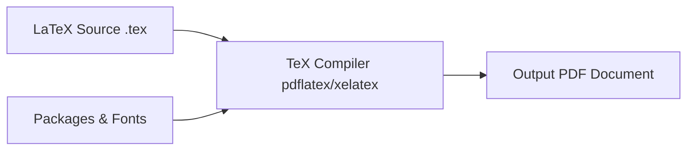

# PART 1 — Introduction to LaTeX
## ផ្នែកទី ១ — សេចក្ដីផ្ដើមអំពីប្រព័ន្ធ LaTeX

---

# Chapter 1: What is LaTeX?
## ជំពូកទី ១: តើ LaTeX ជាអ្វី?

### 1. Learning Objectives / គោលបំណងមេរៀន
By the end of this chapter, you will be able to:
- Understand what LaTeX and TeX are, including their historical origins and architectural purpose.
- Contrast the document preparation paradigm of LaTeX (WYSIWYM) with word processors like Microsoft Word (WYSIWYG).
- Evaluate the advantages and trade-offs of using LaTeX for university and research work.
- Identify common industry and academic use cases where LaTeX is the de facto standard.

បន្ទាប់ពីបញ្ចប់ជំពូកនេះ អ្នកនឹងអាច៖
- យល់ច្បាស់ថាអ្វីទៅជា LaTeX និង TeX ព្រមទាំងប្រវត្តិនិងគោលបំណងនៃការបង្កើតវាឡើង។
- ប្រៀបធៀបភាពខុសគ្នារវាងទស្សនទាននៃការរៀបចំឯកសាររបស់ LaTeX (WYSIWYM) និងកម្មវិធី Word (WYSIWYG)។
- វាយតម្លៃពីគុណសម្បត្តិ និងគុណវិបត្តិនៃការប្រើប្រាស់ LaTeX ក្នុងកិច្ចការសិក្សានិងស្រាវជ្រាវ។
- កំណត់វិស័យ និងការងារជាក់ស្ដែងដែលចាំបាច់ត្រូវប្រើប្រាស់ LaTeX។

---

### 2. English Explanation
LaTeX (pronounced **"Lay-tech"** or **"Lah-tech"**) is a high-quality document preparation and typesetting system designed by Leslie Lamport in 1984, built on top of Donald Knuth's TeX typesetting engine (created in 1978).

Unlike typical desktop word processors such as Microsoft Word or Google Docs, which follow the **WYSIWYG** (*"What You See Is What You Get"*) model, LaTeX operates on the **WYSIWYM** (*"What You See Is What You Mean"*) paradigm. In LaTeX, you write plain text combined with declarative markup instructions. You describe the logical structure of your document—such as titles, sections, footnotes, equations, and citations—while an automated compiler handles all aesthetic layout details, kerning, line-breaking algorithms, and mathematical typography.

#### Why Use LaTeX?
1. **Mathematical Perfection**: Knuth designed TeX specifically to typeset mathematical equations with peerless aesthetic balance, consistent spacing, and precise typographic rules.
2. **Structural Consistency**: Formatting rules are defined globally. Modifying an entire book's font or margin takes a single command line change in the preamble.
3. **Automated Document Architecture**: Cross-references, citations, lists of figures, tables of contents, and indices are generated deterministically without manual numbering.
4. **Longevity & Portability**: Documents are written in standard UTF-8 plain text files (`.tex`). They will remain readable and compilable decades into the future and integrate seamlessly with Git version control.

#### LaTeX vs. Microsoft Word
| Feature | LaTeX | Microsoft Word |
| :--- | :--- | :--- |
| **Philosophy** | WYSIWYM (Focus on content & logic) | WYSIWYG (Focus on immediate appearance) |
| **Math Formatting** | Industry standard, native, elegant | Clunky equation editor, variable spacing |
| **Large Documents** | Effortlessly handles 500+ page books/theses | Prone to lag, corruption, formatting shifts |
| **Reference Management** | Seamless with BibTeX & biblatex | Requires clunky third-party plugins |
| **File Format** | Plain text (`.tex`) tracked with Git | Binary / zipped XML (`.docx`) |
| **Learning Curve** | Steeper initially; rapid mastery | Low barrier initially; hard to maintain consistency |

[NOTE]
LaTeX was built so that the author can focus 100% on **writing content**, while typography algorithms created by master printers handle document aesthetics.

---

### 3. Khmer Explanation (ការពន្យល់ជាភាសាខ្មែរ)
**LaTeX** (អានថា «ឡាតិច» ឬ «ឡាថិក») គឺជាប្រព័ន្ធរៀបចំនិងបោះពុម្ពឯកសារកម្រិតវិជ្ជាជីវៈខ្ពស់ (Typesetting System) ដែលត្រូវបានបង្កើតឡើងដោយលោក Leslie Lamport ក្នុងឆ្នាំ ១៩៨៤ ដោយផ្អែកលើម៉ាស៊ីន TeX របស់សាស្ត្រាចារ្យ Donald Knuth។

ភាពខុសគ្នាដ៏ធំបំផុតរវាង LaTeX និងកម្មវិធី Microsoft Word ឬ Google Docs គឺ៖
- **Microsoft Word** ដំណើរការតាមបែប **WYSIWYG** (*What You See Is What You Get* ឬ «ឃើញយ៉ាងណា បានលទ្ធផលយ៉ាងនោះ»)៖ អ្នកត្រូវចុច Mouse ដើម្បីកែប្រែទំហំអក្សរ ដាក់ពណ៌ ឬតម្រឹមបន្ទាត់ដោយដៃភ្លាមៗ។ នៅពេលឯកសារមានទំព័រច្រើន (៥០ ទៅ ១០០+ ទំព័រ) ទម្រង់ឯកសារច្រើនតែរត់ខុសជួរ ឬពិបាកគ្រប់គ្រង។
- **LaTeX** ដំណើរការតាមបែប **WYSIWYM** (*What You See Is What You Mean* ឬ «សរសេរតាមអត្ថន័យនៃរចនាសម្ព័ន្ធ»)៖ អ្នកសរសេរអត្ថបទធម្មតា (Plain Text) ជាមួយពាក្យបញ្ជា (Commands) ដើម្បីប្រាប់ម៉ាស៊ីនថាតើផ្នែកណាជាចំណងជើងធំ ផ្នែកណាជាសមីការ ផ្នែកណាជារូបភាព ឬជាឯកសារយោង។ បន្ទាប់មក កម្មវិធី Compiler នឹងគណនាទំហំចន្លោះបន្ទាត់ តម្រឹមអក្សរ និងរៀបចំទំព័រ PDF ចេញមកប្រកបដោយភាពប្រណីតកម្រិតសៀវភៅបោះពុម្ពអន្តរជាតិ។

#### ហេតុអ្វីបានជាត្រូវរៀន និងប្រើប្រាស់ LaTeX?
1. **រូបមន្តគណិតវិទ្យាឥតខ្ចោះ**៖ LaTeX គឺជាស្តង់ដារពិភពលោកលេខ ១ សម្រាប់សរសេររូបមន្តគណិតវិទ្យា រូបវិទ្យា និងវិស្វកម្ម។
2. **ការគ្រប់គ្រងឯកសារធំៗ**៖ សម្រាប់សារណា (Thesis) ឬសៀវភៅដែលមានរាប់រយទំព័រ LaTeX មិនដែលគាំង ឬរត់ទម្រង់ឡើយ។
3. **ការភ្ជាប់យោងស្វ័យប្រវត្តិ**៖ លេខជំពូក លេខសមីការ លេខរូបភាព និងឯកសារយោង (Citations) ត្រូវបានបង្កើតនិងធ្វើបច្ចុប្បន្នភាពដោយស្វ័យប្រវត្តិ។
4. **ឯកសារមានស្ថេរភាពខ្ពស់**៖ ឯកសារកូដ `.tex` ជាអត្ថបទសុទ្ធ ងាយស្រួលរក្សាទុក មិនខូច format និងអាចប្រើប្រាស់ជាមួយ Git និង GitHub បានយ៉ាងងាយស្រួល។

---

### 4. Syntax & Mental Model
In LaTeX, all instructions begin with a backslash `\`.
- **Command structure**: `\commandname[optional_arguments]{mandatory_arguments}`
- **Environment structure**:
  ```latex
  \begin{environment_name}
      ... contents ...
  \end{environment_name}
  ```

---

### 5. Code Example
Here is a minimal conceptual comparison of how an author declares a document in LaTeX:

```latex
\documentclass{article}

\title{Introduction to Modern Science}
\author{Sokha Chan}
\date{\today}

\begin{document}
\maketitle

\section{Introduction}
Science is the systematic study of the physical world. 
Einstein expressed the equivalence of mass and energy as:
\begin{equation}
    E = mc^2
\end{equation}

\end{document}
```

---

### 6. Line-by-Line Explanation
1. `\documentclass{article}`: Declares that the document is an academic article.
2. `\title{...}`, `\author{...}`, `\date{\today}`: Define document metadata in the preamble.
3. `\begin{document}`: The boundary marker where printable content begins.
4. `\maketitle`: Instructs LaTeX to format and print the title banner automatically.
5. `\section{Introduction}`: Automatically generates a numbered section heading.
6. `\begin{equation} ... \end{equation}`: Centers the math equation and numbers it `(1)`.
7. `\end{document}`: Terminates the document; any text after this is ignored.

---

### 7. Expected Output
The compiled document displays:
- A beautifully centered title header: **Introduction to Modern Science**, with author name and current date.
- A bold, numbered section heading: **1 Introduction**.
- A paragraph of justified text with professional hyphenation and kerning.
- A centered mathematical formula with a right-aligned equation number `(1)`:
$$E = mc^2$$

---

### 8. Common Mistakes / កំហុសទូទៅ
[WARNING]
- **Treating LaTeX like Microsoft Word**: Trying to manually press `Enter` ten times to create vertical space or pressing `Spacebar` repeatedly. LaTeX collapses multiple spaces into a single space and uses commands like `\vspace{1cm}` for spacing.
- **Mispronouncing LaTeX**: It is not pronounced "Lay-teks" like rubber latex; the final "X" is the Greek letter Chi ($\chi$).

---

### 9. Best Practices / ការអនុវត្តល្អបំផុត
[TIP]
- Always separate your document's **content** from its **styling**. Do not manually format every paragraph; define document styles in the preamble and let LaTeX enforce them across the document.
- Use meaningful section titles and label your equations logically right from day one.

---

### 10. Practical Example: Who Uses LaTeX?
- **Computer Scientists & Software Engineers**: Writing research papers for IEEE, ACM conferences, or documentation with syntax-highlighted code.
- **Mathematicians & Physicists**: Publishing equations, proofs, and matrices.
- **University Students**: Writing lab reports, graduation theses, and academic assignments.
- **Authors & Publishers**: Typesetting entire technical books and manuals.

---

### 11. Exercises / លំហាត់អនុវត្ត
1. Explain in your own words the difference between WYSIWYG and WYSIWYM.
2. (*ជាភាសាខ្មែរ*) ចូរពន្យល់ពីអត្ថប្រយោជន៍ចម្បង ៣ យ៉ាងដែលធ្វើឱ្យនិស្សិតគួរជ្រើសរើសប្រើប្រាស់ LaTeX ក្នុងការសរសេរសារណាបញ្ចប់ការសិក្សា។
3. Identify three types of documents for which Microsoft Word is sufficient, and three types for which LaTeX is strictly superior.

---

### 12. Chapter Summary / សង្ខេបជំពូក
- LaTeX is a programmatic typesetting engine prioritizing structure, typography, and automated referencing.
- In LaTeX, the writer writes plain text and declares what the text represents; the compiler handles professional formatting.
- LaTeX is the universal standard for technical, scientific, and mathematical publication.

---
---

# Chapter 2: Installing and Setting Up LaTeX
## ជំពូកទី ២: ការដំឡើង និងការកំណត់បរិស្ថាន LaTeX

### 1. Learning Objectives / គោលបំណងមេរៀន
By the end of this chapter, you will be able to:
- Distinguish between a **TeX Distribution** (the compiler engine) and a **LaTeX Editor** (the IDE).
- Install and configure LaTeX on Windows, macOS, and Linux.
- Use **Overleaf**, the cloud-based LaTeX collaborative editor, for zero-installation setup.
- Select the optimal workflow tailored to your computational environment.

---

### 2. English Explanation
To work with LaTeX on your computer, you need two complementary components:
1. **TeX Distribution**: The compiler engine containing TeX binaries, fonts, hyphenation patterns, and thousands of LaTeX packages (e.g., TeX Live, MiKTeX, MacTeX).
2. **LaTeX Editor (IDE)**: The application where you write code, preview PDFs, and inspect compilation logs (e.g., TeXstudio, VS Code, Overleaf).



#### Option A: Cloud-Based Setup (Overleaf) — Recommended for Absolute Beginners
- **What it is**: A browser-based LaTeX editor with real-time PDF compilation, automatic package management, and Google Docs-style collaboration.
- **Website**: [https://www.overleaf.com](https://www.overleaf.com)
- **Advantage**: Zero installation required, access from any computer or tablet, zero package conflict headaches.

#### Option B: Windows Setup
1. **Install TeX Distribution**: Download and install **MiKTeX** ([miktex.org](https://miktex.org/)) or **TeX Live** ([tug.org/texlive/](https://tug.org/texlive/)). MiKTeX is popular on Windows because it downloads missing packages on-the-fly.
2. **Install Editor**: Install **TeXstudio** ([texstudio.org](https://www.texstudio.org/)) or install **Visual Studio Code** with the *LaTeX Workshop* extension.

#### Option C: macOS Setup
1. Download **MacTeX** from [tug.org/mactex/](https://tug.org/mactex/) (approx. 5 GB full distribution).
2. Use the bundled **TeXShop** or install **TeXstudio** / **VS Code**.

#### Option D: Linux / Ubuntu Setup
Open your terminal and install TeX Live and TeXstudio:
```bash
sudo apt update
sudo apt install texlive-latex-base texlive-latex-extra texlive-fonts-recommended texlive-science
sudo apt install texstudio
```
For complete package availability without missing file warnings:
```bash
sudo apt install texlive-full
```

---

### 3. Khmer Explanation (ការពន្យល់ជាភាសាខ្មែរ)
ដើម្បីអាចប្រើប្រាស់ LaTeX នៅលើកុំព្យូទ័របាន យើងត្រូវស្គាល់សមាសភាគសំខាន់ពីរ៖
1. **TeX Distribution (កញ្ចប់ម៉ាស៊ីនបកប្រែ)**៖ ជាបណ្ដុំកម្មវិធី Compiler រួមមានពុម្ពអក្សរ ក្បួនវេយ្យាករណ៍ និង packages រាប់ពាន់សម្រាប់បំលែងកូដ `.tex` ទៅជាឯកសារ `.pdf`។
2. **LaTeX Editor (កម្មវិធីសរសេរកូដ)**៖ ជាផ្ទាំងសរសេរកូដ (Editor) ដែលមានប៊ូតុង Run/Compile និងផ្ទាំងមើលលទ្ធផល PDF ភ្លាមៗ។

#### ១. ជម្រើសងាយស្រួលបំផុតសម្រាប់អ្នកទើបចាប់ផ្ដើម៖ ប្រើប្រាស់ Overleaf (Cloud)
- អ្នកមិនចាំបាច់ដំឡើងអ្វីទាំងអស់លើកុំព្យូទ័រ!
- គ្រាន់តែចូលទៅកាន់ [www.overleaf.com](https://www.overleaf.com) រួចចុះឈ្មោះដោយឥតគិតថ្លៃ។
- អ្នកអាចសរសេរកូដពីគ្រប់ទីកន្លែង រក្សាទុកលើ Cloud ដោយសុវត្ថិភាព និងអាចធ្វើការរួមគ្នា (Collaborate) ជាមួយមិត្តភក្ដិក្នុងពេលដំណាលគ្នាបាន។

#### ២. ការដំឡើងលើ Windows
- ទាញយក **MiKTeX** ពី [miktex.org](https://miktex.org) ហើយដំឡើងវា (វាមានសមត្ថភាពទាញយក package ដោយស្វ័យប្រវត្តិនៅពេលកូដត្រូវការ)។
- ទាញយកកម្មវិធីសរសេរកូដ **TeXstudio** ពី [texstudio.org](https://www.texstudio.org)។

#### ៣. ការដំឡើងលើ macOS
- ទាញយកកញ្ចប់ **MacTeX** ពី [tug.org/mactex](https://tug.org/mactex)។

#### ៤. ការដំឡើងលើ Linux (Ubuntu/Debian)
- វាយពាក្យបញ្ជាក្នុង Terminal៖
```bash
sudo apt update && sudo apt install texlive-full texstudio -y
```

[IMPORTANT]
ប្រសិនបើអ្នកទើបតែរៀន LaTeX ជាលើកដំបូង សូមប្រើប្រាស់ **Overleaf** ជាមុនសិន។ វិធីនេះជួយឱ្យអ្នកផ្ដោតលើការរៀនកូដ ដោយមិនបាច់បារម្ភរឿងបញ្ហាដំឡើងលើប្រព័ន្ធប្រតិបត្តិការឡើយ!

---

### 4. Comparison of Popular Editors
| Editor | Platform | Cost | Best For |
| :--- | :--- | :--- | :--- |
| **Overleaf** | Web Browser | Free / Paid tier | Beginners, collaboration, zero-setup |
| **TeXstudio** | Windows, Mac, Linux | Free (Open Source) | Dedicated LaTeX authoring, offline work |
| **VS Code + LaTeX Workshop**| Windows, Mac, Linux | Free | Programmers, Git integration, power users |
| **TeXShop** | macOS | Free (Bundled) | Mac users wanting lightweight native app |

---

### 5. Exercises / លំហាត់អនុវត្ត
1. Create a free account on [Overleaf.com](https://www.overleaf.com).
2. Create your first "Blank Project" named `My-First-LaTeX`.
3. Locate the `main.tex` editor pane, the compilation log pane, and the PDF preview pane.

---

### 6. Chapter Summary / សង្ខេបជំពូក
- Working with LaTeX requires a compiler (TeX distribution) and an editor.
- Overleaf provides an instant, zero-configuration cloud environment ideal for learning.
- Offline desktop power users typically install TeX Live / MiKTeX alongside TeXstudio or VS Code.

---
---

# Chapter 3: Your First LaTeX Document
## ជំពូកទី ៣: ឯកសារ LaTeX ដំបូងរបស់អ្នក

### 1. Learning Objectives / គោលបំណងមេរៀន
By the end of this chapter, you will be able to:
- Identify and construct the two fundamental sections of every LaTeX file: the **Preamble** and the **Document Body**.
- Select the appropriate document class (`article`, `report`, `book`).
- Compile your first `.tex` file into a pristine PDF document.
- Read and interpret compiler messages and output logs.

---

### 2. English Explanation
Every LaTeX source file (`.tex`) is divided into two distinct zones:
1. **The Preamble**: Everything from line 1 up to `\begin{document}`. Here, you define global document configurations, import packages with `\usepackage`, define custom macros, and declare document metadata (title, author, date).
2. **The Document Body**: Everything enclosed within the `\begin{document} ... \end{document}` environment. This is the printable content of your work.

```
+-------------------------------------------------------+
|  \documentclass{article}                              |
|  \usepackage{amsmath}         <-- PREAMBLE            |
|  \title{My Title}                 (Setup & Settings)  |
|  \author{My Name}                                     |
+-------------------------------------------------------+
|  \begin{document}                                     |
|  \maketitle                                           |
|                               <-- DOCUMENT BODY       |
|  Content, sections, formulas      (Printable Content) |
|  and text appear here...                              |
|                                                       |
|  \end{document}                                       |
+-------------------------------------------------------+
```

#### Standard Document Classes
- `article`: For short academic papers, journal submissions, assignment solutions, and reports without separate chapters.
- `report`: For longer university documents, lab reports, and bachelor/master theses containing `\chapter` divisions.
- `book`: For complete published books, including two-sided page layouts, front matter, main matter, and back matter.
- `beamer`: For digital slide presentations and conference lectures.

---

### 3. Khmer Explanation (ការពន្យល់ជាភាសាខ្មែរ)
រាល់ឯកសារកូដ LaTeX ទាំងអស់ត្រូវបានបែងចែកជាពីរផ្នែកដាច់ដោយឡែកពីគ្នា៖

1. **Preamble (ផ្នែកក្បាលឯកសារ)**៖
   - គឺជាបន្ទាត់កូដទាំងអស់ដែលនៅពីលើ `\begin{document}`។
   - ផ្នែកនេះមិនបង្ហាញអក្សរលើក្រដាស PDF ផ្ទាល់ទេ ប៉ុន្តែវាជាកន្លែងកំណត់ទំហំក្រដាស ប្រភេទឯកសារ (`\documentclass`) ការទាញយកកញ្ចប់បន្ថែម (`\usepackage`) ព្រមទាំងការកំណត់ឈ្មោះអ្នកនិពន្ធនិងចំណងជើង។
2. **Document Body (តួឯកសារ)**៖
   - គឺជាខ្លឹមសារដែលស្ថិតនៅចន្លោះ `\begin{document}` និង `\end{document}`។
   - អ្វីទាំងអស់ដែលអ្នកសរសេរនៅត្រង់នេះ នឹងត្រូវបានបំប្លែងទៅជាទំព័រ PDF សម្រាប់អាន ឬបោះពុម្ព។

#### ប្រភេទឯកសារទូទៅ (Document Classes)
- `article`៖ ប្រើសម្រាប់អត្ថបទស្រាវជ្រាវខ្លីៗ កិច្ចការសាលា ឬរបាយការណ៍ដែលគ្មានជំពូក (`\chapter`)។
- `report`៖ ប្រើសម្រាប់របាយការណ៍ធំៗ សារណាបញ្ចប់ការសិក្សា (Theses) ដែលមានការបែងចែកជាជំពូកធំៗ។
- `book`៖ ប្រើសម្រាប់សៀវភៅពេញលេញដែលមានទំព័រមុខ ទំព័រមាតិកា និងសន្ទស្សន៍។
- `beamer`៖ ប្រើសម្រាប់ធ្វើស្លាយបទបង្ហាញ (Presentation Slides)។

---

### 4. Syntax Specification
```latex
\documentclass[options]{class_name}
% Preamble commands go here
\usepackage{package_name}

\begin{document}
% Content goes here
\end{document}
```

---

### 5. Code Example: Hello World in LaTeX
Save this file as `first_document.tex`:

```latex
\documentclass[12pt, a4paper]{article}

% Preamble: Package imports and metadata
\usepackage[utf8]{inputenc}
\usepackage{amsmath}

\title{My Very First LaTeX Document}
\author{Borey Sok}
\date{\today}

\begin{document}

\maketitle

\section{Introduction}
Welcome to the world of professional typesetting! LaTeX allows us to write structured 
documents with ease.

Here is an inline mathematical expression: $a^2 + b^2 = c^2$.

\section{Conclusion}
Learning LaTeX step by step makes academic writing fast, precise, and enjoyable.

\end{document}
```

---

### 6. Line-by-Line Breakdown
- `\documentclass[12pt, a4paper]{article}`: Tells LaTeX to format this as an `article`, setting the base font size to 12 points on standard international A4 paper.
- `\usepackage[utf8]{inputenc}`: Ensures full UTF-8 character encoding support.
- `\usepackage{amsmath}`: Loads the American Mathematical Society's standard math enhancement suite.
- `\title{...}`, `\author{...}`, `\date{\today}`: Prepares the title information. `\today` automatically evaluates to the current date of compilation.
- `\begin{document}`: Signals the start of the visible PDF output.
- `\maketitle`: Typesets the title, author, and date cleanly at the top of the page.
- `\section{Introduction}`: Creates a bold, numbered section header (`1 Introduction`).
- `$a^2 + b^2 = c^2$`: The dollar signs `$...$` switch into inline mathematics mode.
- `\end{document}`: Finalizes the PDF output generation.

---

### 7. Expected Output
When compiled, the resulting document will display:
- A standardized university-grade title block:
  - Title: **My Very First LaTeX Document** (Large bold text)
  - Author: Borey Sok
  - Date: (Current system date, e.g., September 13, 2026)
- **1 Introduction**
- A justified paragraph describing the document.
- The Pythagorean theorem typeset in mathematical italic typography ($a^2 + b^2 = c^2$).
- **2 Conclusion**
- A final concluding statement.

---

### 8. Common Mistakes / កំហុសទូទៅ
[WARNING]
1. **Missing `\end{document}`**: If you omit `\end{document}`, the compiler will throw an `Emergency stop: unexpected end of file` error.
2. **Writing text before `\begin{document}`**: Placing regular text in the preamble causes a fatal compilation error: `LaTeX Error: Missing \begin{document}`.
3. **Mismatched curly braces `{}`**: Every opening brace `{` must have a corresponding closing brace `}`.

---

### 9. Best Practices / ការអនុវត្តល្អបំផុត
[TIP]
- Always specify your document paper size explicitly (`a4paper` or `letterpaper`) in `\documentclass[...]`.
- Keep the preamble tidy. Group package imports by category (e.g., math packages, graphics packages, layout packages).

---

### 10. Practical Exercises / លំហាត់អនុវត្ត
1. Create a new document in Overleaf or your local editor using the `report` document class instead of `article`. Add a `\chapter{Getting Started}` before the first section. Observe how LaTeX numbers and renders the chapter.
2. Change the font size in `\documentclass` from `12pt` to `11pt` or `10pt`. Recompile and observe the automatic recalculation of margins and line heights.
3. Add a third section titled `Acknowledgments` expressing thanks to your university advisor.

---

### 11. Chapter Summary / សង្ខេបជំពូក
- A `.tex` file is divided into the **Preamble** (configuration before `\begin{document}`) and the **Body** (printable content between `\begin{document}` and `\end{document}`).
- Document classes determine the overall layout rules (`article`, `report`, `book`).
- Inline mathematics is written between dollar signs `$ ... $`.
